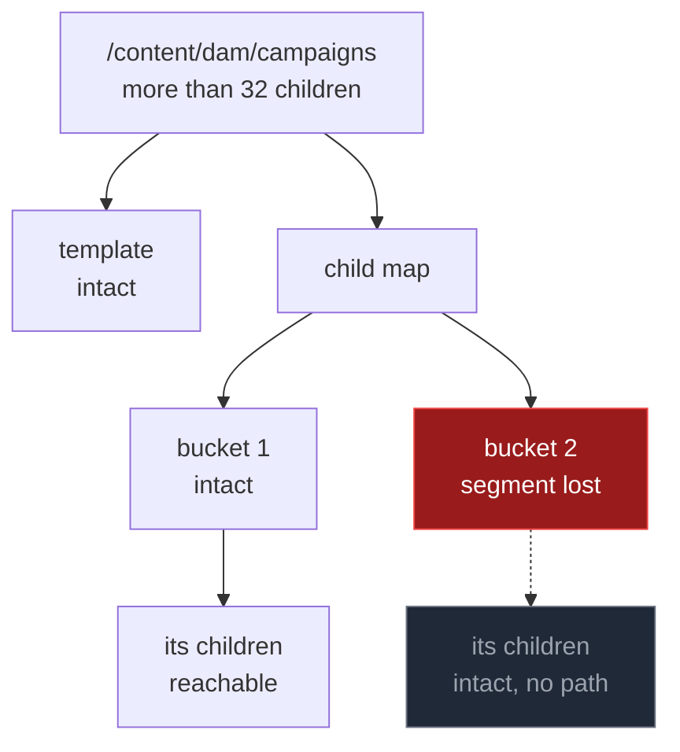
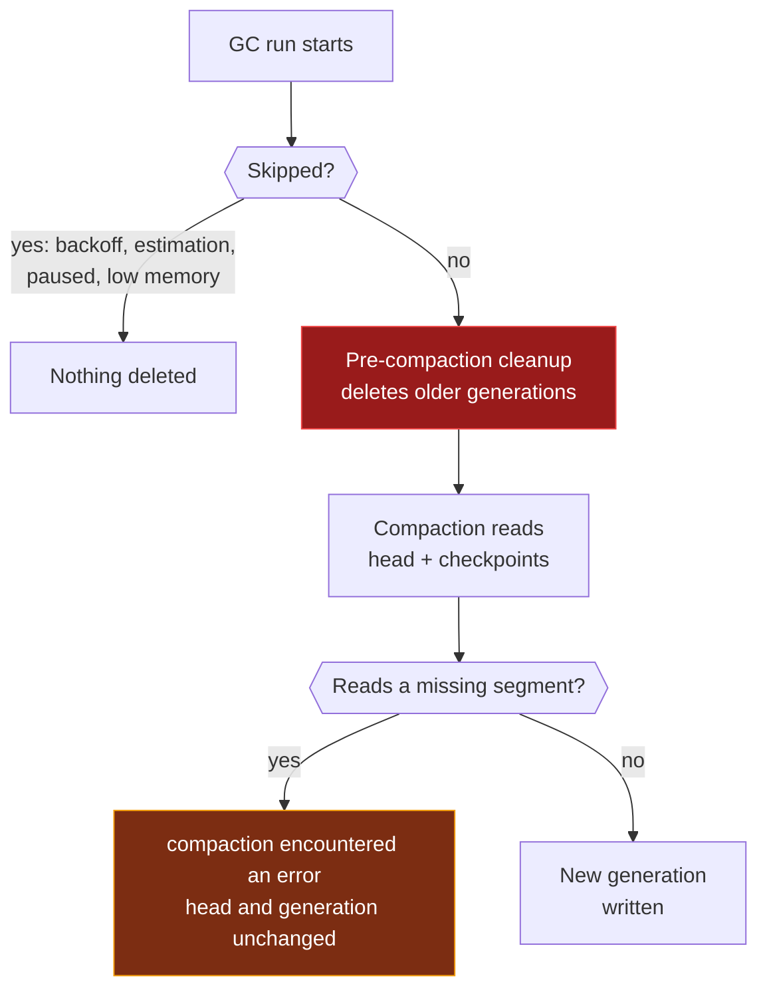

# 🧱 Why Repositories Get Bricked

::: info 🎯 Scope
SegmentStore (TarMK) • Oak 1.22.x – 2.4.0 ([version scope](/reference/oak-versions)) • **Not for AEMaaCS**

Every mechanism on this page is taken from the Oak 1.22.24 and 2.4.0 sources. The two releases behave the same unless a difference is called out.
:::

A repository is rarely bricked by one event. It is bricked by a sequence:

1. A segment goes missing.
2. Nobody reads the damaged path for days or weeks, so nothing fails loudly.
3. The repository's normal maintenance deletes, one GC run at a time, every intact copy that recovery would have needed.
4. The backups taken during those weeks copy the damage faithfully, and the last clean one rotates out.

By the time someone runs `oak-run check`, there is nothing left to roll back to.

The first step can be a disk fault, a human error or, rarely, a software defect. Steps 2 to 4 are Oak doing exactly what it was designed to do. That is what makes these incidents so hard on the business: the system behaved as designed, and the data is gone anyway. This page explains each step, so that the next time a `SegmentNotFoundException` shows up, someone recognises that the clock has already started.

## Where a Damaged Repository Ends Up

`oak-run check` sorts a damaged repository into one of four states. [Check: "Bricked" vs "Recoverable"](/recovery/check#🚨-critical-bricked-vs-recoverable-distinction) shows example output for the last two.

| Outcome | What `check` prints | What it means | Way out |
|---------|---------------------|---------------|---------|
| ✅ **Recoverable** | `Latest good revision for paths and checkpoints checked is <revision> from <date>` | An intact revision still exists in the store | Roll back to it ([crisis Step 4](/crisis/#✅-step-4-choose-recovery-path)) |
| 🟡 **Checkpoint broken** | Overall `… is none from unknown time`, but the Head line shows a revision | The content is readable; a checkpoint is not | Remove that checkpoint on a copy ([below](#only-a-checkpoint-is-broken)) |
| ⚠️ **Partially recoverable** | `No good revision found`, or Head and Overall both `none` | The store opens, but no revision is intact | A backup, or [crisis Step 5](/crisis/#✅-step-5-last-resort-no-good-revision); some data stays lost |
| ❌ **Bricked** | A stack trace instead of a result | Usually: the store cannot be opened at all (one [exception](#what-makes-check-fail-before-printing-anything)) | A backup. Nothing else |

There is one more state that `check` cannot name: **logically bricked**. The store opens, but the damage sits in content AEM depends on, such as `/jcr:system` (the namespace and node type registry), `/home` or `/libs`. The [crisis checklist](/crisis/#option-b-surgical-removal-preserves-more-data-slower) lists the paths that must never be removed. Cutting them out doesn't give you a working AEM back, so in practice this usually ends the same way as bricked.

::: warning "is none" is not a good result
`check` exits `0` and prints an Overall line even when that line says `… checked is none from unknown time`. It means head and checkpoints were never all good at the same revision. Read the Head and Checkpoints lines above it to see which failed, and read the revision, not the exit code. (Oak 2.4's `--fail-fast` prints `No good revision found` and exits `1` instead.)
:::

### What makes `check` fail before printing anything

These are the conditions in both releases that end `check` with a stack trace and exit code `1`:

- The directory isn't a valid segment store, or its manifest fails the version check.
- A TAR file can't be opened, even after read-only index recovery (`Failed to open tar file …`).
- No journal entry points at a head segment that still exists: `Cannot start readonly store from empty journal`.
- With the default `--checkpoints all`, listing the head's checkpoints reads a missing segment. This one is not necessarily the end: the store did open, and `check --head` skips the checkpoint listing and can still test the head.

### Only a checkpoint is broken

A checkpoint is a frozen root, mostly held for async indexing. When the Head line shows a good revision and only a checkpoint shows `none`, the content tree is intact and the damage sits in that checkpoint. Every full compaction reads every checkpoint, so it will keep failing on it, each time after its pre-compaction cleanup has already run ([fact 4](#_4-cleanup-deletes-by-generation-and-by-default-it-runs-first)).

Upstream Oak has a way out, on a **cold copy** of the store (the tool opens it writable):

```bash
java -jar oak-run-*.jar checkpoints /path/to/copy/segmentstore rm <checkpoint-id>
```

If an async index lane used it, that lane then logs `Failed to retrieve previously indexed checkpoint …; re-running the initial index update` and reindexes ([Async Indexing](/checkpoints/async-indexing)). Remove only the broken checkpoint, never `rm-all` ([Checkpoints](/checkpoints/)), and run `check` again afterwards.

## Five Facts That Make Bricking Possible

### 1. A missing segment is silent until something reads it

A reference to another segment is just its UUID. Oak loads a segment the first time a record in it is read, and only then throws `SegmentNotFoundException`. The writable store used by AEM logs every such miss:

```
*ERROR* [...] org.apache.jackrabbit.oak.segment.SegmentNotFoundExceptionListener
  Segment not found: 4f2a9c1e-7b3d-4e8a-9c2f-1a2b3c4d5e6f. SegmentId age=…ms
```

If GC in the same JVM removed that segment, the line carries the GC's tag after the age, for example `…ms,[pre-compaction cleanup]`. That points to a session that outlived its GC cycle ([GC](/architecture/gc#long-lived-sessions-tail-compaction)), not to lost storage.

At startup Oak checks only that the head record's segment exists. Nothing else in the tree is validated. A repository can serve traffic for weeks with a hole under a path nobody opens: an old DAM folder, archived content, an index nobody queries. The only signals are an occasional `Segment not found` in `error.log` and, if a full compaction runs, its failure.

### 2. Records only point down

A record refers to another record by segment and record number. There is no pointer back to the parent and no index from path to record. The index, graph and binary-reference entries at the end of each TAR file map segment IDs to offsets, to the segments they reference and to binary references: all in the forward direction. The only structural link to a child node is in its parent: the child map, or the template for a node with a single child.



What a lost record takes with it:

- **A node record or its template:** every property and every descendant of that node. Their own segments can be perfectly intact and still have no path leading to them.
- **One bucket of a child map** (a map splits into buckets above 32 children): the children hashed into that bucket. A sibling in an intact bucket can still be opened by name, but anything that **lists** the children fails: the AEM folder view, `check`, compaction, sidegrade.

Orphaned records are not invisible. `oak-run search-nodes` scans every node record in every segment, but it prints record IDs and timestamps. It can't tell you what a record was called or where it belonged, and nothing in Oak can reattach it.

### 3. There is no redundancy, only generations

Every segment in a TAR file carries a CRC32 checksum, but it is only checked when a TAR file's index has to be rebuilt, and a segment that fails it is dropped: damage turns into a missing segment. There is no parity, no replica and no second copy written for safety. Segments are immutable, so a damaged one can't be patched either ([Segments](/architecture/segments)).

The only other copy of a record is the older generation that compaction copied it from, and only until cleanup removes that generation. How many copies exist depends on where the record sits:

| Record | Copies in the store |
|--------|---------------------|
| Written by a commit since the last compaction | One |
| Just rewritten by a compaction | Two: the old one and the compacted one, until the next GC run cleans up |
| Unchanged since the last full compaction (the compacted **base**) | One. Tail compaction reuses it in place and never rewrites it |

Under tail compaction, most content in a mature repository is in the last row: the store holds exactly one copy of it. Under nightly full compaction everything is rewritten each run, so content sits in the second row between runs.

### 4. Cleanup deletes by generation, and by default it runs first

Cleanup decides what to delete from GC generation numbers alone. It never checks whether a segment is still reachable, whether the store is healthy, or whether the compaction about to run will succeed. Data segments go purely by generation; bulk (binary) segments go when no retained segment references them. Online, the number of retained generations is fixed at 2: any other configured value is ignored with a WARN. Offline compaction and cold standby keep 1.

Oak's default GC strategy, used unless the JVM runs with `-Dgc.classic=true`, starts every GC run that isn't skipped with a **pre-compaction cleanup**, and only then starts compacting:



What the pre-compaction cleanup deletes:

| GC type | Deleted before compaction starts |
|---------|----------------------------------|
| Full | Every data segment of an older full generation, and every non-compacted segment written before the last compaction |
| Tail | The same, except that the previous full generation's compacted segments are kept |

Under **full** GC, every journal revision committed before the last successful compaction keeps its root in one of those deleted segments. **At the start of the next GC run, those revisions lose their segments, whatever that run's compaction then does.** Under **tail** GC the same happens to ordinary commits, but the roots written by earlier tail compactions since the last full compaction are kept until the next full compaction, and each of them can still be a rollback point.

The log shows it as:

```
TarMK GC #12: pre-compaction cleanup started
TarMK GC #12: cleanup marking files for deletion: data00041a.tar,data00042a.tar
TarMK GC #12: pre-compaction cleanup completed in … Post cleanup size is … and space reclaimed …
…
TarMK GC #12: compaction encountered an error
TarMK GC #12: cleaning up after failed compaction
```

What the cleanup after a *failed* compaction removes: in Oak 1.22 only the failed run's own half-written generation, in Oak 2.4 no data segments at all (its leftovers go at the next run's pre-compaction cleanup). The older generations were already gone.

::: tip Deleted is not always gone yet
Cleanup removes a TAR file when nothing in it is kept, and rewrites a file when more than 25% of it is reclaimable. A file with less to reclaim is left untouched, segments and all. That is why `check` sometimes still finds a revision that "should" have been cleaned up. Treat it as luck, not a guarantee.
:::

With `-Dgc.classic=true` there is no pre-compaction cleanup: old generations are deleted only after a compaction succeeds, and a failing compaction leaves them in place. Path 1 below then doesn't happen; Paths 2 to 4 still do.

### 5. Compaction reads only what it must

| | Full compaction | Tail compaction |
|---|---|---|
| **Reads** | Head and every checkpoint: every node, template, child map, list and property value | Only what changed since the last compaction's root (from `gc.log`) |
| **Does not read** | DataStore binaries (copies their IDs); bulk segments of binaries stored in the segment store (re-links them) | The unchanged base. It is reused by reference; only the base's root record is checked |
| **Missing segment in what it reads** | Aborts: `compaction encountered an error`. Nothing is silently skipped | Aborts the same way |
| **Missing segment in what it doesn't read** | Carried forward (bulk segments only) | Carried forward. Compaction succeeds |

If the base's root record itself is unreadable, tail compaction logs `base state … is not accessible` and falls back to a full compaction.

A successful full compaction is therefore real evidence: every record reachable from head and checkpoints was readable at that moment, except binaries kept in the DataStore or in bulk segments. A successful tail compaction proves nothing about the base.

## How Compaction Bakes Corruption In

### Path 1: The failing compaction that still deletes

Default strategy, a full compaction every night at 02:00, and a segment written by Monday's compaction is lost on Monday morning. Every run is assumed to get past the estimation phase (growth above `compaction.sizeDeltaEstimation`, default 1 GiB); a skipped run deletes nothing and only moves the same events to a later night.

| When | What happens | `check` would report |
|------|--------------|----------------------|
| **Mon 02:00** | GC run. Compaction succeeds and writes a new generation | Healthy |
| **Mon 10:00** | One segment of that new generation is lost. `/content/dam/campaigns` now has a hole. Every revision since 02:00 shares it | ✅ Recoverable: the newest revision from before Monday 02:00 is intact |
| **Mon 10:00 – Tue 02:00** | AEM serves everything else. Nobody opens the folder | ✅ Still recoverable. Rolling back loses Monday's work |
| **Tue 02:00** | GC run. **Pre-compaction cleanup deletes every revision from before Monday 02:00, and the intact copy of the folder with them.** Then compaction reads the head, hits the hole, and fails | ⚠️ `No good revision found` |
| **Every night after** | Nothing older is left to delete. Compaction fails again: `compaction encountered an error` | ⚠️ Unchanged; disk keeps growing |
| **Weeks later** | Someone opens the folder, or the disk fills up. The incident starts. Every backup still in retention was taken after Monday 10:00 | ⚠️ Partially recoverable at best |

The window between the loss and the deletion was **sixteen hours**. The first sign of trouble came weeks later.

### Path 2: Tail compaction succeeds over the damage

The hole is in the compacted base: content that hasn't changed since the last full compaction, such as a two-year-old DAM folder. There is only one copy of it ([fact 3](#_3-there-is-no-redundancy-only-generations)), so no revision in the store has ever been intact since the segment was lost. History can't help from the first minute.

Tail compaction reads only what changed since the last compaction and checks only the base's root record. It **succeeds** every night, as long as no change touches the damaged records, and the logs look healthy. If a full compaction runs at all, it is the only GC run that reads the base. Its `compaction encountered an error` is often the only signal, and it is easy to miss next to a week of successful runs.

This is also why TAR files must never be deleted by hand because they look old. The oldest files are often the compacted base that tail compaction keeps until the next full compaction: they hold most of the repository.

### Path 3: Repair first, then compact

Someone removes the damaged nodes ([surgical removal](/recovery/surgical)), and the head no longer references the hole. Now compaction succeeds, and normal maintenance runs its course:

1. **Online GC:** the next runs' cleanups delete the generations from before the repair, including the last copies of what was removed.
2. **Offline `oak-run compact`:** worse. On success it keeps only one generation and truncates `journal.log` to a single line ([Compaction](/recovery/compaction#🔥-critical-offline-compact-truncates-journal-log)).
3. **DataStore GC:** it marks binaries by reading the binary references of segments from generations that are still kept; it does not walk the tree. Binaries referenced only from deleted segments become eligible for deletion once they are older than `blobGcMaxAgeInSecs` (default 24 hours).

That is the right trade once the business has accepted the loss. Done before anyone has taken a copy of the store, it is the moment the loss becomes permanent.

### Path 4: Starting AEM on a store `check` can't open

On startup, the writable store walks `journal.log` from newest to oldest and takes the first entry whose head segment exists. Every entry it skips is logged as `Unable to access revision …, rewinding...`. AEM then starts on that older head, and new commits pile on top of it.

If no entry works, the writable store doesn't refuse to start. It writes a **new, empty root** and carries on from there.

That is not always final, as long as the old segments are still in the store: `recover-journal` scans every segment and can find the old roots again. In a lab on Oak 1.22.24 and 2.4.0 it did; when the new repository had already written roots of its own, the recovered journal listed them last, and truncating it to the entry before them brought the content back ([Journal](/architecture/journal#journal-truncation)). Every write after that empty start makes the way back harder.

A writable open also repairs what it can before serving anything: a TAR file without a valid index is recovered, the original renamed to `.bak` and a regenerated file written in its place ([TAR Files](/architecture/tar-files#the-tar-bak-files)). Never start AEM on a store that `check` can't open, and never start it on a damaged store before you have copied it.

## Why Nothing Can Bring It Back

**The lost bytes exist nowhere else in the current store.** A segment holds up to 256 KiB of records: node records, templates, child maps, property values. Other records point into it by record number. Nothing else encodes that content, so there is nothing to recompute it from. At most an older generation still holds a copy ([fact 3](#_3-there-is-no-redundancy-only-generations)), or a cold standby that synced before the loss, or a backup.

**The tree can't be rebuilt around the hole.** References only point down, and names live only in the parent. Orphaned descendants can be found by brute force but never placed back.

**Every recovery tool walks the tree:**

| Tool | Why it stops at the hole |
|------|--------------------------|
| `oak-run check` | Judges whole journal revisions. It never scans segments |
| `oak-run recover-journal` | Needs a store that opens (a journal entry whose head segment exists). Scans segments, but only for root records and only among segments that still exist; the newest root it keeps must have a valid head and valid checkpoints. It can't bring back a revision whose segments cleanup removed ([Journal Recovery](/recovery/journal)) |
| `oak-upgrade` sidegrade | Copies by traversal and aborts at the first unreadable node. `--exclude-paths` keeps it out of a damaged subtree, but the parent's child map is still listed ([Sidegrade](/recovery/sidegrade)) |
| Surgical removal | Deletes damaged paths. It restores nothing, and its commands are fork-only ([Oak versions](/reference/oak-versions#fork-only-console-commands)) |
| `oak-run repair`, `recovery` | DocumentNodeStore only. Apache Oak has no repair tool for segment stores |

**The DataStore doesn't save you.** Binaries live in the DataStore, but the only map from a path to a blob ID was in the lost records. DataStore GC keeps only what retained segments still reference.

**Backups inherit the hole.** A file-level backup copies TAR files exactly as they are. It can't tell that a segment is missing. Every backup taken after the damage carries it, and retention eventually rotates out the last one taken before.

**And sometimes the hole is in the open path itself.** No journal entry with an existing head segment, or a TAR file that can't be opened: then no tool gets as far as the tree.

## The Window: How Long You Have

From the moment a segment is lost, your rollback options depend on what the lost segment held:

| What was lost | Intact copy in the store | Window closes |
|---------------|--------------------------|---------------|
| Records written by a commit since the last compaction | Yes: the revisions before that commit | When a later compaction succeeds and the next GC run cleans up. While compaction keeps failing on the hole, these revisions stay |
| Records written by the last compaction | Yes: the revisions before that compaction | **Full GC:** at the next GC run that isn't skipped, **even if its compaction fails.** **Tail GC:** ordinary commits go the same way; roots of earlier tail compactions stay until the next full compaction |
| The compacted base (unchanged since an earlier compaction) | No | Already closed |

## Signs the Window Is Still Open

Any of these means the clock is running:

- `Segment not found: <id>. SegmentId age=…ms` in `error.log`
- `compaction encountered an error` in a GC run
- `Unable to access revision …, rewinding...` at startup
- `check` reports a latest good revision older than the head

**Act in this order:**

1. **Stop GC from running.** In the JMX console, set `PausedCompaction` to `true` on the `SegmentRevisionGarbageCollection` MBean, and call `cancelRevisionGC` if a run is in progress. A paused run is skipped entirely, including the pre-compaction cleanup. The JMX setting lasts until the repository restarts. Changing the OSGi property `pauseCompaction` (PID `org.apache.jackrabbit.oak.segment.SegmentNodeStoreService`) instead makes the segment store reopen, because the service restarts on any configuration change; make it permanent there only before AEM starts on this store again. Don't run DataStore GC either until recovery is finished.
2. **Stop AEM and copy `segmentstore/`.** A cold copy preserves every generation that still exists, whatever happens next.
3. **Run `check` on the copy** and follow the [crisis checklist](/crisis/) from Step 3.
4. **Don't start AEM** on a store `check` can't open (Path 4).
5. **Don't remove nodes or compact** until the business has decided what it can lose, and only after step 2.

## Preventing It

- **Treat a single `Segment not found` as a sev-1**, not as noise. It is the only early signal most repositories ever give.
- **Read everything, somewhere safe, on a schedule.** Run `oak-run check` against a restored backup on another machine. A successful full compaction is also evidence; a failed one is an alarm, not a retry.
- **Keep backup retention longer than your detection time,** and test restores with `oak-run check` on the restored copy. A backup nobody has checked may be a faithful copy of the damage.
- **Never delete TAR files by hand.** Old files are usually the compacted base.
- **Copy before you cut.** Take a cold copy of the store before any surgical removal, offline compaction or sidegrade.

## Key Takeaways

::: tip Remember
1. **Corruption is silent until read**, so the damage usually comes long before the incident
2. **History is a window, not an archive:** two generations online, one offline
3. **By default every GC run deletes first and compacts second.** A failed compaction doesn't protect the generations its cleanup already deleted
4. **Tail compaction succeeds over damage in the base** without ever reading it
5. **Under tail compaction, content unchanged since the last full compaction exists exactly once**
6. **No Oak tool rebuilds a lost segment.** Only an older generation or a backup holds another copy
7. **On the first `Segment not found`:** pause compaction, stop AEM, copy the store
:::

::: info 📅 Last Updated
Content last reviewed: October 2026 • Verified against Oak 1.22.24 (AEM 6.5) and Oak 2.4.0 (AEM 6.5 LTS SP3)
:::
