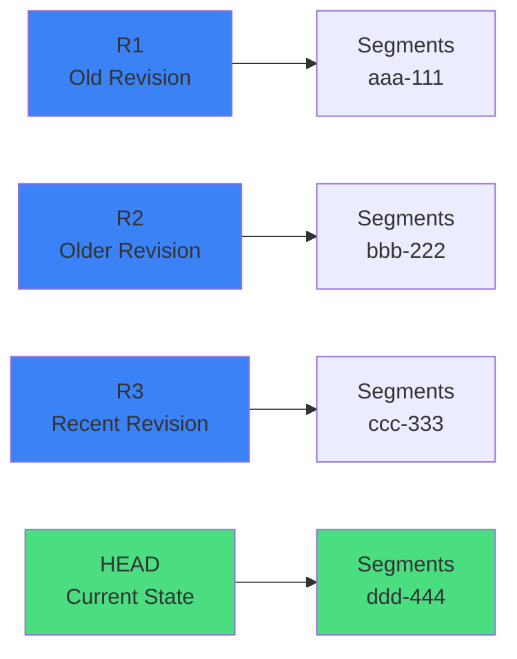

# Generational Garbage Collection

Oak uses a generational garbage collection algorithm based on **revision roots**.

## Understanding Revision Roots

Each commit creates a new **root** (revision) that references segments containing that commit's state:



**How Roots Work:**
- **R1, R2, R3**: Old revisions - Each points to segments containing historical state
- **HEAD**: Current revision - Points to segments with current repository state
- **Garbage Collection**: Walks from HEAD backwards, marks all reachable segments as "live"
- **Cleanup**: Deletes segments NOT reachable from any kept root

## The GC Cycle

<OakFlowGraph flow="gc-cycle" :height="450" />

### Three Phases

1. **Estimation Phase**
   - Calculate how much garbage exists
   - Determine if compaction is worthwhile (threshold: 25%)
   - Estimate time and resources needed

2. **Compaction Phase**
   - Traverse content tree from root
   - Mark all reachable segments as "live"
   - Copy live segments to new generation
   - Skip unreachable (garbage) segments

3. **Cleanup Phase**
   - Rename old generation files to `.tar.bak`
   - Verify new generation is healthy
   - Delete old generation files (in theory - see note below)

::: warning .tar.bak Cleanup Reality
Despite the design intent, `.tar.bak` files often **linger indefinitely** and must be manually deleted after verifying the new generation is healthy. See [TAR Files](/architecture/tar-files) for details.
:::

## Offline vs Online GC

### Offline GC (AEM Stopped)

```bash
# Stop AEM first!
java -jar oak-run-*.jar compact /path/to/segmentstore
```

| Aspect | Value |
|--------|-------|
| **Speed** | ⚡ Fast |
| **Resource Contention** | None |
| **Risk** | Lower |
| **Downtime** | Required |

### Online GC (AEM Running)

```
org.apache.jackrabbit.oak.plugins.segment.SegmentNodeStoreService
  pauseCompaction = false
  compaction.mode = "tail" or "full"
```

| Aspect | Value |
|--------|-------|
| **Speed** | 🐌 Slower |
| **Resource Contention** | High |
| **Risk** | Higher |
| **Downtime** | None |

::: warning ⚠️ Online GC is Expensive
- Concurrent writes cause lock contention
- CPU competition with application
- IO competition with normal operations
- Cache coherence overhead
:::

## Tail vs Full Compaction

### Tail Compaction (Default)

```
What it does:
- Only compacts the MOST RECENT segments (the "tail")
- Leaves older segments untouched
- Faster, less resource intensive

When to use:
✅ Normal operations (daily/weekly)
✅ Repository is healthy
✅ Want minimal performance impact

Tradeoffs:
- Reclaims less disk space
- Doesn't clean up old garbage
- Accumulates over time
```

### Full Compaction (Aggressive)

```
What it does:
- Compacts ALL generations (entire history)
- Rewrites everything to new generation
- Maximum disk space reclamation

When to use:
⚠️ Rarely (monthly/quarterly)
⚠️ During maintenance windows
⚠️ After major content deletions

Tradeoffs:
- VERY resource intensive
- Can take hours on large repositories
- High risk if corruption exists
```

### Visual Comparison

```
Repository State:
┌──────┬──────┬──────┬──────┬──────┐
│ Gen0 │ Gen1 │ Gen2 │ Gen3 │ HEAD │
│ 50GB │ 30GB │ 20GB │ 10GB │ 5GB  │
└──────┴──────┴──────┴──────┴──────┘

Tail Compaction:
┌──────┬──────┬──────┬────────────┐
│ Gen0 │ Gen1 │ Gen2 │   Gen4     │  ← Only compacted Gen3 + HEAD
│ 50GB │ 30GB │ 20GB │    12GB    │
└──────┴──────┴──────┴────────────┘
  ↑      ↑      ↑
  Untouched (old garbage remains)

Full Compaction:
┌─────────────────────────────────┐
│           Gen5                  │  ← Compacted EVERYTHING
│           85GB                  │     (removed 30GB garbage)
└─────────────────────────────────┘
```

## 🔥 CRITICAL: Long-Lived Sessions + Tail Compaction = SegmentNotFoundException

This is a **race condition**, NOT corruption. Understanding this prevents misdiagnosis.

### The Scenario

```
1. Application opens JCR session (e.g., workflow, scheduled job, servlet)
2. Session reads segments from Gen0 (old generation)
3. Session stays open for hours/days (long-lived)
4. Tail compaction runs → creates Gen4, deletes Gen0-Gen2
5. Session tries to read more data from Gen0
6. Result: SegmentNotFoundException (Gen0 segments deleted while session active)
```

### Real-World Examples

- **Workflow sessions**: Long-running DAM workflows that process thousands of assets
- **Scheduled jobs**: Nightly jobs that iterate over large content trees
- **Servlet sessions**: Admin servlets that keep sessions open during bulk operations
- **Replication agents**: Sessions held open during large replication queues
- **Custom integrations**: Third-party tools that don't properly close sessions

### Why This Happens

```
Session lifecycle:
1. Session opens → reads from revision R100 (references Gen0 segments)
2. Session holds reference to R100 (prevents GC... in theory)
3. Tail compaction runs:
   - Compacts Gen3 + HEAD → creates Gen4
   - Cleanup phase: Deletes Gen0, Gen1, Gen2 (assumes no active sessions)
4. Session tries to traverse from R100 → Gen0 segments
5. Gen0 segments are GONE → SegmentNotFoundException
```

### Why Session References Don't Prevent Cleanup

- ❌ Tail compaction doesn't track active sessions (performance optimization)
- ❌ Assumes sessions are short-lived (minutes, not hours)
- ❌ Cleanup phase is aggressive (deletes old generations immediately)
- ❌ No "pinning" mechanism for segments referenced by active sessions

### How to Detect This Pattern

```bash
# Look for SNFE in logs with specific pattern
$ grep -A 5 "SegmentNotFoundException" error.log | grep -B 5 "Segment.*not found"

# If you see:
# - SNFE during workflow execution
# - SNFE during scheduled job runs
# - SNFE correlating with compaction timestamps
# - SNFE that "fixes itself" after session refresh

# → This is the long-lived session + tail compaction pattern
```

### Example Log Pattern

```
2025-10-06 02:15:00 *INFO* [FelixStartLevel] Tail compaction started
2025-10-06 02:45:00 *INFO* [FelixStartLevel] Tail compaction completed
2025-10-06 02:46:00 *INFO* [FelixStartLevel] Cleanup: Deleted Gen0, Gen1, Gen2
2025-10-06 03:10:00 *ERROR* [DAM Update Asset Workflow] 
  org.apache.jackrabbit.oak.segment.SegmentNotFoundException: 
  Segment aaa-bbb-ccc-111 not found
  at com.day.cq.dam.core.impl.AssetHandler.processAsset()
  
→ Workflow started at 01:00 (before compaction)
→ Compaction deleted Gen0 at 02:46
→ Workflow tried to read Gen0 segment at 03:10
→ SNFE because Gen0 was deleted while workflow still active
```

### Solutions

**Option 1: Increase Revision Retention** (Safest)
```
org.apache.jackrabbit.oak.plugins.segment.SegmentNodeStoreService
  revisionGcMaxAgeInSecs = 259200 (3 days instead of 24 hours)
  
→ Keeps old revisions longer
→ Gives long-lived sessions more time
→ Tradeoff: More disk space used, slower compaction
```

**Option 2: Disable Tail Compaction, Use Full Compaction Only** (Most Aggressive)
```
org.apache.jackrabbit.oak.plugins.segment.SegmentNodeStoreService
  pauseCompaction = true (disable online tail compaction)
  
Then schedule offline full compaction during maintenance windows:
$ java -jar oak-run.jar compact /path/to/segmentstore
  
→ No surprise compaction during business hours
→ Sessions won't be active during maintenance window
→ Tradeoff: Manual scheduling required, disk space grows between compactions
```

**Option 3: Fix Application Code** (Best Long-Term)
```java
// BAD: Long-lived session
Session session = repository.login();
for (int i = 0; i < 100000; i++) {
    processAsset(session, assets[i]); // Hours of processing
}
session.logout(); // Finally closes after hours

// GOOD: Refresh session periodically
Session session = repository.login();
for (int i = 0; i < 100000; i++) {
    processAsset(session, assets[i]);
    
    if (i % 1000 == 0) {
        session.refresh(false); // Refresh to latest revision
        // OR: Close and reopen session
        session.logout();
        session = repository.login();
    }
}
session.logout();
```

**Option 4: Schedule Compaction Around Known Long Jobs**
```
If you know:
- DAM workflows run 01:00-05:00
- Tail compaction runs 02:00

Then:
- Reschedule tail compaction to 06:00 (after workflows complete)
- OR: Increase retention to cover workflow duration
```

### Key Takeaways

- 💡 Tail compaction assumes **short-lived sessions** (minutes, not hours)
- 💡 Long-lived sessions + tail compaction = **SegmentNotFoundException risk**
- 💡 This is **NOT corruption** - it's a race condition between session lifecycle and GC
- 💡 Increasing `revisionGcMaxAgeInSecs` is the **safest mitigation**
- 💡 Fixing application code to refresh/reopen sessions is the **best long-term solution**
- 💡 This pattern is **hard to diagnose** because it's intermittent (only happens when timing aligns)

## Why GC is Risky During Corruption

::: danger ⚠️ NEVER Run Compaction on Corrupted Repository
If corruption exists **before** compaction runs:
1. Compaction attempts to copy corrupted data
2. Copy fails (segments unreadable)
3. Cleanup phase **permanently deletes** the corrupted segments
4. **Result**: Segments are now unrecoverable (not just corrupted, but gone)
:::

| Scenario | Tail Compaction Risk | Full Compaction Risk |
|----------|---------------------|---------------------|
| Corruption in recent data | ❌ HIGH | ❌ CRITICAL |
| Corruption in old data | ✅ LOW | ❌ CRITICAL |
| Unknown corruption location | ⚠️ MEDIUM | ❌ CRITICAL |

**Operator Guidance:**
- 🔴 If corruption suspected: Disable BOTH tail and full compaction
- 🔴 Never run full compaction without `oak-run check` first
- ⚠️ Tail compaction is safer but can still hit recent corruption
- ✅ After recovery: Re-enable tail first, test for weeks before full

## When Deleted Content Gets Reclaimed

**The Question**: "I deleted 100GB on Tuesday. When does disk space come back?"

**The Answer**: It depends on compaction strategy and revision retention.

### Timeline Example

```
Monday 9:00 AM:   Delete page → Disk: 0GB freed
                  (segments still referenced by old revisions)

Tuesday 9:00 AM:  Revision expires (24h default) → Disk: 0GB freed
                  (segments eligible for GC, but not deleted yet)

Wednesday 2:00 AM: Compaction runs → Disk: -100GB (grows!)
                   (new generation created, old still exists)

Wednesday 3:00 AM: Cleanup completes → Disk: +100GB freed
                   (old generation deleted)

Total time: ~42 hours
```

### Why Space Might NEVER Be Reclaimed

- ❌ Only tail compaction scheduled (never touches old segments)
- ❌ Compaction disabled (common after incidents, then forgotten)
- ❌ Revision retention set too high
- ❌ DataStore GC never scheduled (binaries accumulate)

### Best Practices

- ✅ Schedule full compaction monthly/quarterly
- ✅ Monitor TAR file ages (old files = full compaction not running)
- ✅ Schedule DataStore GC after major deletions
- ✅ Understand "delete" ≠ "disk space freed"
- ✅ Plan for temporary disk growth during compaction (needs 2x space)
