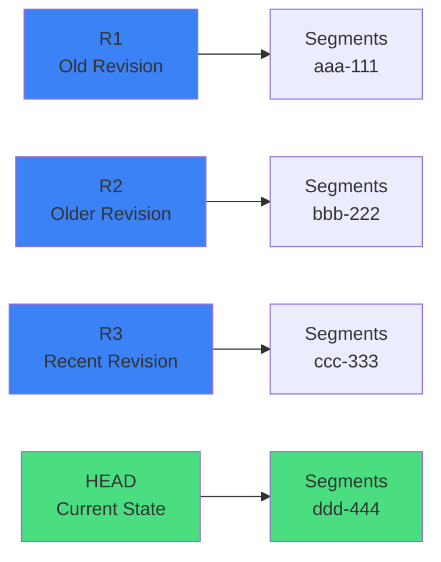

# Generational Garbage Collection

Oak uses a generational garbage collection algorithm based on **revision roots**.

## Understanding Revision Roots

Each commit creates a new **root** (revision) that references segments containing that commit's state:



**How Roots Work:**
- **R1, R2, R3**: Old revisions - Each points to segments containing historical state
- **HEAD**: Current revision - Points to segments with current repository state
- **Garbage Collection**: Walks from HEAD backwards, marks all reachable segments as "live"
- **Cleanup**: Deletes segments NOT reachable from any kept root

## The GC Cycle

<OakFlowGraph flow="gc-cycle" :height="450" />

### Three Phases

1. **Estimation Phase**
   - Calculate how much garbage exists
   - Determine if compaction is worthwhile (threshold: 25%)
   - Estimate time and resources needed

2. **Compaction Phase**
   - Traverse content tree from root
   - Mark all reachable segments as "live"
   - Copy live segments to new generation
   - Skip unreachable (garbage) segments

3. **Cleanup Phase**
   - Rename old generation files to `.tar.bak`
   - Verify new generation is healthy
   - Delete old generation files

## Offline vs Online GC

### Offline GC (AEM Stopped)

```bash
# Stop AEM first!
java -jar oak-run-*.jar compact /path/to/segmentstore
```

| Aspect | Value |
|--------|-------|
| **Speed** | ⚡ Fast |
| **Resource Contention** | None |
| **Risk** | Lower |
| **Downtime** | Required |

### Online GC (AEM Running)

```
org.apache.jackrabbit.oak.plugins.segment.SegmentNodeStoreService
  pauseCompaction = false
  compaction.mode = "tail" or "full"
```

| Aspect | Value |
|--------|-------|
| **Speed** | 🐌 Slower |
| **Resource Contention** | High |
| **Risk** | Higher |
| **Downtime** | None |

::: warning ⚠️ Online GC is Expensive
- Concurrent writes cause lock contention
- CPU competition with application
- IO competition with normal operations
- Cache coherence overhead
:::

## Tail vs Full Compaction

### Tail Compaction (Default)

```
What it does:
- Only compacts the MOST RECENT segments (the "tail")
- Leaves older segments untouched
- Faster, less resource intensive

When to use:
✅ Normal operations (daily/weekly)
✅ Repository is healthy
✅ Want minimal performance impact

Tradeoffs:
- Reclaims less disk space
- Doesn't clean up old garbage
- Accumulates over time
```

### Full Compaction (Aggressive)

```
What it does:
- Compacts ALL generations (entire history)
- Rewrites everything to new generation
- Maximum disk space reclamation

When to use:
⚠️ Rarely (monthly/quarterly)
⚠️ During maintenance windows
⚠️ After major content deletions

Tradeoffs:
- VERY resource intensive
- Can take hours on large repositories
- High risk if corruption exists
```

### Visual Comparison

```
Repository State:
┌──────┬──────┬──────┬──────┬──────┐
│ Gen0 │ Gen1 │ Gen2 │ Gen3 │ HEAD │
│ 50GB │ 30GB │ 20GB │ 10GB │ 5GB  │
└──────┴──────┴──────┴──────┴──────┘

Tail Compaction:
┌──────┬──────┬──────┬────────────┐
│ Gen0 │ Gen1 │ Gen2 │   Gen4     │  ← Only compacted Gen3 + HEAD
│ 50GB │ 30GB │ 20GB │    12GB    │
└──────┴──────┴──────┴────────────┘
  ↑      ↑      ↑
  Untouched (old garbage remains)

Full Compaction:
┌─────────────────────────────────┐
│           Gen5                  │  ← Compacted EVERYTHING
│           85GB                  │     (removed 30GB garbage)
└─────────────────────────────────┘
```

## Why GC is Risky During Corruption

::: danger ⚠️ NEVER Run Compaction on Corrupted Repository
If corruption exists **before** compaction runs:
1. Compaction attempts to copy corrupted data
2. Copy fails (segments unreadable)
3. Cleanup phase **permanently deletes** the corrupted segments
4. **Result**: Segments are now unrecoverable (not just corrupted, but gone)
:::

| Scenario | Tail Compaction Risk | Full Compaction Risk |
|----------|---------------------|---------------------|
| Corruption in recent data | ❌ HIGH | ❌ CRITICAL |
| Corruption in old data | ✅ LOW | ❌ CRITICAL |
| Unknown corruption location | ⚠️ MEDIUM | ❌ CRITICAL |

**Operator Guidance:**
- 🔴 If corruption suspected: Disable BOTH tail and full compaction
- 🔴 Never run full compaction without `oak-run check` first
- ⚠️ Tail compaction is safer but can still hit recent corruption
- ✅ After recovery: Re-enable tail first, test for weeks before full

## When Deleted Content Gets Reclaimed

**The Question**: "I deleted 100GB on Tuesday. When does disk space come back?"

**The Answer**: It depends on compaction strategy and revision retention.

### Timeline Example

```
Monday 9:00 AM:   Delete page → Disk: 0GB freed
                  (segments still referenced by old revisions)

Tuesday 9:00 AM:  Revision expires (24h default) → Disk: 0GB freed
                  (segments eligible for GC, but not deleted yet)

Wednesday 2:00 AM: Compaction runs → Disk: -100GB (grows!)
                   (new generation created, old still exists)

Wednesday 3:00 AM: Cleanup completes → Disk: +100GB freed
                   (old generation deleted)

Total time: ~42 hours
```

### Why Space Might NEVER Be Reclaimed

- ❌ Only tail compaction scheduled (never touches old segments)
- ❌ Compaction disabled (common after incidents, then forgotten)
- ❌ Revision retention set too high
- ❌ DataStore GC never scheduled (binaries accumulate)

### Best Practices

- ✅ Schedule full compaction monthly/quarterly
- ✅ Monitor TAR file ages (old files = full compaction not running)
- ✅ Schedule DataStore GC after major deletions
- ✅ Understand "delete" ≠ "disk space freed"
- ✅ Plan for temporary disk growth during compaction (needs 2x space)
