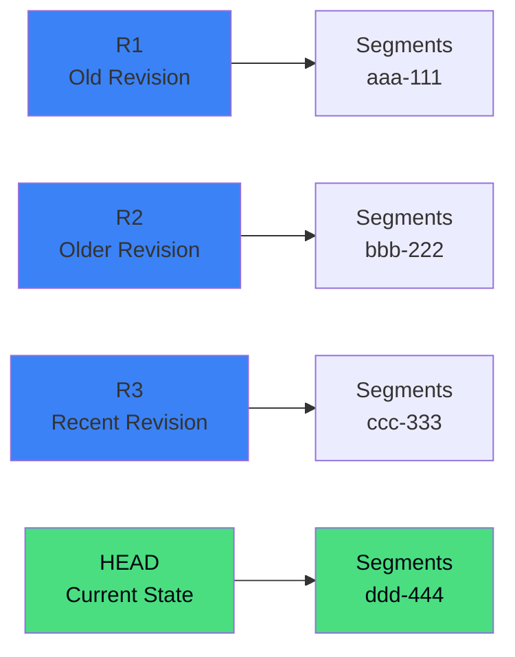

# Generational Garbage Collection

::: info 🎯 Scope
SegmentStore (TarMK) • Oak 1.22.x – 2.4.0 ([version scope](/reference/oak-versions))  
**Not for AEMaaCS**
:::

Oak uses a generational garbage collection algorithm: compaction copies the **current root** into a new **GC generation**, and cleanup drops segments of old generations.

## Understanding Revision Roots

Each commit creates a new **root** (revision) that references segments containing that commit's state:


```mermaid
graph LR
    R1[R1<br/>Old Revision] --> S1[Segments<br/>aaa-111]
    R2[R2<br/>Older Revision] --> S2[Segments<br/>bbb-222]
    R3[R3<br/>Recent Revision] --> S3[Segments<br/>ccc-333]
    HEAD[HEAD<br/>Current State] --> S4[Segments<br/>ddd-444]
    
    style R1 fill:#3b82f6
    style R2 fill:#3b82f6
    style R3 fill:#3b82f6
    style HEAD fill:#4ade80,color:#030712
    style S4 fill:#4ade80,color:#030712
```

**How Roots Work:**
- **R1, R2, R3**: Old revisions - Each points to segments containing historical state; GC does **not** keep them as roots
- **HEAD**: Current revision - Points to segments with current repository state
- **Compaction**: Rewrites HEAD **and all checkpoints** into new segments of a new GC generation (old revisions are never copied)
- **Cleanup**: Deletes data segments whose GC generation is 2 or more generations old (retained generations are fixed at 2); bulk (binary) segments go when no retained segment references them

## The GC Cycle

<OakFlowGraph flow="gc-cycle" />

### Three Phases

1. **Estimation Phase**
   - Compare repository growth since the last GC (full GC: since the last full one; size recorded in `gc.log`) with `compaction.sizeDeltaEstimation` (default 1 GiB; `0` = always run)
   - Skip GC if it grew less (`... so skipping garbage collection`); always run when `gc.log` has no data yet; a full GC also always runs right after a tail GC
   - Skipped entirely with `compaction.disableEstimation=true`

2. **Compaction Phase**
   - Traverse content tree from root (HEAD and every checkpoint)
   - Rewrite every reachable record into new segments of the new generation
   - Garbage is simply never copied
   - Concurrent commits: up to `compaction.retryCount` (5) catch-up cycles, then force-compact while blocking writes for up to `compaction.force.timeout` (60 s); cancelled if free heap drops below `compaction.memoryThreshold` (15%)

::: warning Default strategy: cleanup runs first
Unless the JVM runs with `-Dgc.classic=true`, a run that gets past estimation starts the compaction phase with a **pre-compaction cleanup** (`pre-compaction cleanup started`). It deletes older generations before anything is read (under full GC, everything from before the last successful compaction), and a failed compaction doesn't undo it. See [Why Repositories Get Bricked](/architecture/bricked#_4-cleanup-deletes-by-generation-and-by-default-it-runs-first).
:::

3. **Cleanup Phase**
   - Mark segments of old generations as reclaimable
   - Rewrite TAR files with more than 25% reclaimable as the next letter; drop TAR files with nothing left
   - The file reaper deletes the replaced files (`Removed files ...`)

::: warning .tar.bak Cleanup Reality
GC never creates `.tar.bak` files. They come from automatic TAR index recovery, **linger indefinitely**, and must be manually deleted after verifying the store is healthy. See [TAR Files](/architecture/tar-files) for details.
:::

## Offline vs Online GC

### Offline GC (AEM Stopped)

```bash
# Stop AEM first!
java -jar oak-run-*.jar compact /path/to/segmentstore
```

| Aspect | Value |
|--------|-------|
| **Speed** | ⚡ Fast |
| **Resource Contention** | None |
| **Risk** | Lower |
| **Downtime** | Required |

::: info Oak 1.22 vs 2.4
- **AEM 6.5 (Oak 1.22.x):** `oak-run compact` always runs a **full** compaction with the `CheckpointCompactor`; only `--mmap` and `--force` are accepted.
- **AEM 6.5 LTS SP3 (Oak 2.4.0):** full by default; `--tail` *(since Oak 1.60)*, `--compactor classic|diff|parallel` *(since Oak 1.28; `parallel` since Oak 1.58, now the default)*, `--threads N` for `parallel` *(since Oak 1.58, default 1)*. See [which LTS SP has which Oak](/reference/oak-versions).
:::

### Online GC (AEM Running)

```
org.apache.jackrabbit.oak.segment.SegmentNodeStoreService
  pauseCompaction = false
  (no OSGi property for the GC type: it is the GCType attribute (FULL / TAIL)
   of the SegmentRevisionGarbageCollection MBean; Oak's own default is FULL)
```

| Aspect | Value |
|--------|-------|
| **Speed** | 🐌 Slower |
| **Resource Contention** | High |
| **Risk** | Higher |
| **Downtime** | None |

::: warning ⚠️ Online GC is Expensive
- Concurrent writes cause lock contention
- CPU competition with application
- IO competition with normal operations
- Cache coherence overhead
:::

::: info Oak 1.22 vs 2.4 — online compactor
- **AEM 6.5 (Oak 1.22.x):** online compaction always uses `CheckpointCompactor`.
- **AEM 6.5 LTS SP3 (Oak 2.4.0):** online compaction uses the `parallel` compactor type *(since Oak 1.58)*, but with 1 thread (`SegmentGCOptions.DEFAULT_CONCURRENCY`), so it runs sequentially (`using sequential compaction.`); there is no OSGi property for the compactor type or thread count.
:::

## Tail vs Full Compaction

### Tail Compaction

```
What it does:
- Only compacts the changes made since the previous compaction (the "tail"),
  on top of the base written by that compaction
- Leaves the already-compacted base untouched
- Falls back to full compaction when there is no usable base
- Faster, less resource intensive

When to use:
✅ Normal operations (daily/weekly)
✅ Repository is healthy
✅ Want minimal performance impact

Tradeoffs:
- Reclaims less disk space
- Doesn't clean up garbage inside the compacted base (needs a full compaction)
- Accumulates over time
```

### Full Compaction (Aggressive)

```
What it does:
- Compacts the complete current HEAD and all checkpoints (not the history)
- Rewrites everything to new generation (new "full generation")
- Maximum disk space reclamation

When to use:
⚠️ Rarely (monthly/quarterly)
⚠️ During maintenance windows
⚠️ After major content deletions

Tradeoffs:
- VERY resource intensive
- Can take hours on large repositories
- High risk if corruption exists
```

### Visual Comparison

```
Repository State:
┌──────────────────────┬──────────────┬──────┐
│ Base (last full GC)  │ Later writes │ HEAD │
│ 50GB (incl. garbage) │ 30GB         │      │
└──────────────────────┴──────────────┴──────┘

Tail Compaction:
┌──────────────────────┬────────────┐
│ Base (last full GC)  │  New gen   │  ← Only the changes since the
│ 50GB (incl. garbage) │    12GB    │     last compaction were rewritten
└──────────────────────┴────────────┘
  ↑
  Kept as-is (garbage inside it remains)

Full Compaction:
┌─────────────────────────────────┐
│        New full gen             │  ← Rewrote the whole current HEAD
│           50GB                  │     (old generations reclaimed after cleanup)
└─────────────────────────────────┘
```

## Long-Lived Sessions and GC: SNFE Without Corruption {#long-lived-sessions-tail-compaction}

A reader that keeps an old revision open across a GC run can hit a `SegmentNotFoundException` although nothing is damaged: cleanup reclaims by GC generation, not by what is still being read. This applies to full and tail compaction alike. It is rare, and it has one reliable signature: a GC tag on the log line ([below](#how-to-detect-this-pattern)). Without that tag, treat the SNFE as corruption.

### The Scenario

```
1. Application opens JCR session (e.g., workflow, scheduled job, servlet)
2. Session reads segments from Gen0 (old generation)
3. Session stays open for hours/days (long-lived)
4. Tail compaction runs → creates Gen4, deletes Gen0-Gen2
5. Session tries to read more data from Gen0
6. Result: SegmentNotFoundException (Gen0 segments deleted while session active)
```

### Real-World Examples

- **Workflow sessions**: Long-running DAM workflows that process thousands of assets
- **Scheduled jobs**: Nightly jobs that iterate over large content trees
- **Servlet sessions**: Admin servlets that keep sessions open during bulk operations
- **Replication agents**: Sessions held open during large replication queues
- **Custom integrations**: Third-party tools that don't properly close sessions

### Why This Happens

```
Session lifecycle:
1. Session opens → reads from revision R100 (references Gen0 segments)
2. Session holds reference to R100 (prevents GC... in theory)
3. Tail compaction runs:
   - Compacts Gen3 + HEAD → creates Gen4
   - Cleanup phase: Deletes Gen0, Gen1, Gen2 (assumes no active sessions)
4. Session tries to traverse from R100 → Gen0 segments
5. Gen0 segments are GONE → SegmentNotFoundException
```

### Why Session References Don't Prevent Cleanup

- ❌ Tail compaction doesn't track active sessions (performance optimization)
- ❌ Assumes sessions are short-lived (minutes, not hours)
- ❌ Cleanup reclaims every generation 2+ GC cycles old — a session survives one GC cycle, not two
- ❌ No "pinning" mechanism for segments referenced by active sessions

### How to Detect This Pattern

When cleanup reclaims a segment that something in the same JVM still references, Oak tags that segment ID. The `Segment not found` line then carries the tag after the age:

| Tag after `SegmentId age=…ms,` | Written by |
|--------------------------------|------------|
| `[pre-compaction cleanup]` | The cleanup at the start of a GC run (Oak's default strategy) |
| `gc-count=…,gc-status=…,store-generation=…,reclaim-predicate=…` | The cleanup after compaction |

```bash
# Only tagged lines are this pattern
grep "Segment not found" error.log | grep -E "pre-compaction cleanup|gc-count="
```

No tag means the segment is missing from storage: follow the [SNFE Playbook](/recovery/snfe-playbook).

### Example Log Pattern

```
02:00:00 *INFO*  [...] TarMK GC #12: pre-compaction cleanup started
02:00:41 *INFO*  [...] TarMK GC #12: cleanup marking files for deletion: data00010a.tar,data00011a.tar
02:45:10 *INFO*  [...] TarMK GC #12: compaction succeeded in …
03:10:00 *ERROR* [workflow job thread] org.apache.jackrabbit.oak.segment.SegmentNotFoundExceptionListener
  Segment not found: 4f2a9c1e-7b3d-4e8a-9c2f-1a2b3c4d5e6f. SegmentId age=7800000ms,[pre-compaction cleanup]

→ The job had been reading the same old revision since before 02:00
→ The cleanup at 02:00 deleted that revision's segments
→ At 03:10 the job reached one of them: SNFE, tagged by the cleanup that removed it
```

### Solutions

**Option 1: Increase Revision Retention** (Not available on TarMK)
```
org.apache.jackrabbit.oak.segment.SegmentNodeStoreService
  compaction.retainedGenerations = 2 (fixed: other values are ignored with a WARN
                                      "... can't be changed ...")

→ There is no age-based revision retention in the segment store
→ A session can only outlive ONE GC cycle
→ Use Options 2-4 instead
```

**Option 2: Disable Tail Compaction, Use Full Compaction Only** (Most Aggressive)
```
org.apache.jackrabbit.oak.segment.SegmentNodeStoreService
  pauseCompaction = true (skips online compaction - tail and full - and its cleanup)
  
Then schedule offline full compaction during maintenance windows:
$ java -jar oak-run.jar compact /path/to/segmentstore
  
→ No surprise compaction during business hours
→ Sessions won't be active during maintenance window
→ Tradeoff: Manual scheduling required, disk space grows between compactions
```

**Option 3: Fix Application Code** (Best Long-Term)
```java
// BAD: Long-lived session
Session session = repository.login();
for (int i = 0; i < 100000; i++) {
    processAsset(session, assets[i]); // Hours of processing
}
session.logout(); // Finally closes after hours

// GOOD: Refresh session periodically
Session session = repository.login();
for (int i = 0; i < 100000; i++) {
    processAsset(session, assets[i]);
    
    if (i % 1000 == 0) {
        session.refresh(false); // Refresh to latest revision
        // OR: Close and reopen session
        session.logout();
        session = repository.login();
    }
}
session.logout();
```

**Option 4: Schedule Compaction Around Known Long Jobs**
```
If you know:
- DAM workflows run 01:00-05:00
- Tail compaction runs 02:00

Then:
- Reschedule tail compaction to 06:00 (after workflows complete)
- OR: Make sure no session spans two GC runs
```

### Key Takeaways

- 💡 GC assumes **short-lived sessions**: cleanup reclaims by generation, full or tail
- 💡 A session reading one old revision across a GC run risks a **SegmentNotFoundException**
- 💡 This is **NOT corruption**, but only when the SNFE line carries a GC tag
- 💡 Retention can't be increased on TarMK (`compaction.retainedGenerations` is fixed at 2) - **scheduling GC around long jobs** is the safest mitigation
- 💡 Fixing application code to refresh/reopen sessions is the **best long-term solution**
- 💡 It is **easy to confirm**: the GC tag on the `Segment not found` line. No tag means the segment is missing from storage

## Why GC is Risky During Corruption

::: danger ⚠️ NEVER Let GC Run on a Corrupted Repository
If corruption exists **before** a GC run:
1. The run starts with the **pre-compaction cleanup**: older generations are deleted before anything is read (under full GC, everything from before the last successful compaction)
2. Compaction then reads head and every checkpoint (tail compaction: only what changed since the last compaction)
3. If it hits a missing segment, the run **aborts**, but the deletion in step 1 has already happened
4. If it doesn't read the damage (older revisions only, or the unchanged base under tail compaction), it **succeeds**, and the next run deletes the generations before it
5. **Result**: either way, the revisions from before the last successful compaction, which you could have rolled back to with `recover-journal`, are gone

See [Why Repositories Get Bricked](/architecture/bricked) and [Compaction and Corruption](/recovery/compaction#compaction-and-corruption).
:::

| Where the damage is | Tail compaction | Full compaction |
|---------------------|-----------------|-----------------|
| Recent writes (changed since the last compaction) | ❌ Aborts, after its pre-compaction cleanup already ran | ❌ Same |
| Unchanged base | ❌ Succeeds without reading it: the damage stays hidden | ⚠️ Aborts; often the only signal you get |
| Older revisions only | ❌ Succeeds; cleanup deletes those revisions | ❌ Same |

**Operator Guidance:**
- 🔴 If corruption suspected: pause GC in JMX (`SegmentRevisionGarbageCollection` → `PausedCompaction=true`, plus `cancelRevisionGC` for a running run). A paused run is skipped entirely, including the pre-compaction cleanup. Changing the OSGi `pauseCompaction` property instead reopens the segment store
- 🔴 Never run full compaction without `oak-run check` first
- ⚠️ A successful tail compaction proves nothing about the base; only a full compaction reads it
- ✅ After recovery: a successful full compaction is the evidence that head and checkpoints are readable again

## When Deleted Content Gets Reclaimed

**The Question**: "I deleted 100GB on Tuesday. When does disk space come back?"

**The Answer**: It depends on compaction strategy and the 2 retained GC generations.

### Timeline Example

```
Monday 9:00 AM:   Delete page → Disk: 0GB freed
                  (old segments still hold the content)

Tuesday 2:00 AM:  GC #1: compaction writes a new generation without it → Disk grows
                  (cleanup keeps the previous generation: 2 are retained)

Wednesday 2:00 AM: GC #2: compaction → next generation
                   Cleanup reclaims the generation holding the deleted content
                   → Disk: +100GB freed (files removed by the file reaper)

Total time: two successful GC cycles (~41 hours with a daily 2 AM run)
(Each run happens only if the estimation phase doesn't skip it - growth must
 exceed compaction.sizeDeltaEstimation, default 1 GiB)
```

### Why Space Might NEVER Be Reclaimed

- ❌ Only tail compaction scheduled (never rewrites the base from the last full compaction)
- ❌ Compaction disabled (common after incidents, then forgotten)
- ❌ Stale checkpoints (compacted along with HEAD, they keep old content alive)
- ❌ DataStore GC never scheduled (binaries accumulate). AEM puts it in the weekly window by default, so check that it is still there and that it actually deletes: on a shared DataStore a refused sweep still reports success ([reading the log](/datastore/gc#reading-the-log))

### Best Practices

- ✅ Schedule full compaction monthly/quarterly
- ✅ Monitor TAR file ages (old files = full compaction not running)
- ✅ Schedule DataStore GC after major deletions, once the revision GC cycles above have released them ([why](/datastore/gc#why-deleted-content-doesnt-free-space))
- ✅ Understand "delete" ≠ "disk space freed"
- ✅ Plan for temporary disk growth during compaction (needs 2x space)

::: info 📅 Last Updated
Content last reviewed: October 2026 • Verified against Oak 1.22.24 (AEM 6.5) and Oak 2.4.0 (AEM 6.5 LTS SP3)
:::
