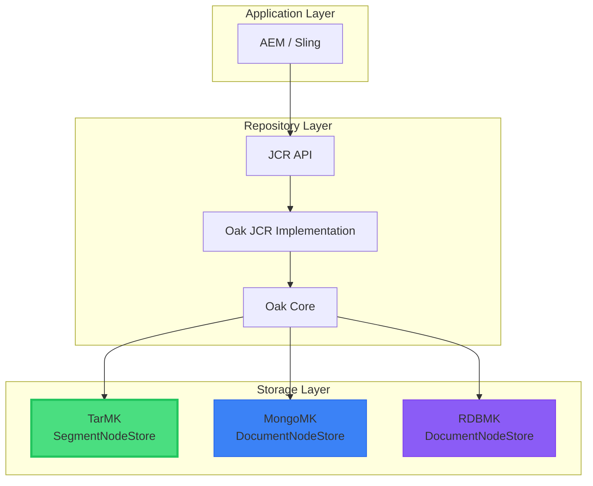

# 🏗️ Oak Segment Store Architecture

Understanding Oak's segment store architecture explains **why** certain recovery options work and others don't.

## Core Principles

Oak Segment Tar storage is built on three key principles:

1. **Immutability** - Segments are immutable once written. This makes caching easy but means **corrupted segments cannot be repaired in place**.

2. **Compactness** - Records are optimized for size to reduce IO and maximize cache efficiency.

3. **Locality** - Related nodes (parent + children) are stored in the same segment for fast tree traversal.

## The Architecture Stack



**Key Takeaway**: TarMK (SegmentNodeStore) is the most common deployment. This guide focuses on TarMK.

## Key Components

### Segments: The Fundamental Unit

<OakFlowGraph flow="segment-structure" :height="380" />

A segment is the **atomic unit of storage** in Oak Segment Tar:

| Property | Value |
|----------|-------|
| **Size** | Up to 256KiB (262,144 bytes) |
| **Identification** | Unique UUID |
| **Location** | Stored in TAR files |
| **Mutability** | **Immutable** once written |

**What's Inside a Segment:**

- **Node Records** - JCR node structure
- **Property Records** - Node property values
- **Value Records** - Property values (strings, numbers, dates)
- **Blob References** - Pointers to external binaries
- **List Records** - Multi-value properties
- **Map Records** - Large property sets
- **Template Records** - Shared node type definitions

### Why 256KiB?

- **Cache-friendly** - Fits in L2/L3 CPU cache
- **IO-efficient** - Single disk read fetches entire segment
- **Locality** - Related nodes fit in same segment
- **Compaction-efficient** - Small enough to copy quickly

### Segment References (The Graph Structure)

Segments reference each other to build the repository tree:

```
Segment A (UUID: aaa-111)
  └─ Contains: /content/dam
      └─ References Segment B for child nodes

Segment B (UUID: bbb-222)
  └─ Contains: /content/dam/2024
      └─ References Segment C for child nodes

Segment C (UUID: ccc-333)
  └─ Contains: /content/dam/2024/Q3
      └─ References Segment D for assets
```

::: danger ⚠️ CRITICAL IMPLICATION
If Segment C is corrupted/missing:
- ❌ Cannot access `/content/dam/2024/Q3`
- ❌ Cannot access any children under Q3
- ✅ CAN still access `/content/dam` and `/content/dam/2024`

**One missing segment can make entire subtrees inaccessible**
:::

### Immutability: The Double-Edged Sword

**Why Immutable?**
- ✅ Fast reads - No locking needed
- ✅ Safe caching - Cache forever
- ✅ Crash-safe - Partial writes don't corrupt
- ✅ Simple concurrency - Multiple readers, no conflicts

**Why This Hurts During Corruption?**
- ❌ Cannot repair corrupted segment in place
- ❌ Cannot patch with corrected data
- ❌ Only options: Skip it, delete it, or replace entire store

### Segment Lifecycle

```
1. WRITE:    Content changes → New segment created → Written to TAR
2. READ:     Repository access → Segment UUID lookup → Read from TAR
3. COMPACT:  GC runs → Live segments copied to new generation → Old deleted
4. CORRUPT:  Disk error → Segment unreadable → SegmentNotFoundException
5. RECOVERY: Cannot fix → Must skip (sidegrade) or remove (surgical) or restore
```

## TAR Files

TAR files are containers that store segments along with metadata.

### Naming Convention

```
crx-quickstart/repository/segmentstore/
├── data00000a.tar          ← Sequence 0, Generation 'a'
├── data00001a.tar          ← Sequence 1, Generation 'a'
├── data00002a.tar          ← Sequence 2, Generation 'a'
├── data00003b.tar          ← Sequence 3, Generation 'b' (after compaction)
├── data00004b.tar          ← Sequence 4, Generation 'b'
├── data00003a.tar.bak      ← Backup of old generation
├── journal.log             ← Current journal
└── repo.lock               ← Repository lock file
```

**Pattern**: `data[SEQUENCE][GENERATION].tar`
- **SEQUENCE**: 5-digit number (00000, 00001...)
- **GENERATION**: Single letter (a, b, c, d...)
- **Extension**: `.tar` (active), `.tar.bak` (backup)

### TAR File Lifecycle

<OakFlowGraph flow="tar-lifecycle" :height="420" />

### TAR File Structure

```
TAR File Structure:
┌─────────────────────────────────────┐
│ Segment 1 data (up to 256KB)       │ ← Immutable content
├─────────────────────────────────────┤
│ Segment 2 data (up to 256KB)       │
├─────────────────────────────────────┤
│ ...more segments...                 │
├─────────────────────────────────────┤
│ TAR INDEX (footer)                  │ ← Rebuildable metadata
│ - Segment offsets and UUIDs        │
│ - Segment reference graph           │
│ - Binary reference index            │
└─────────────────────────────────────┘
```

**Recovery Implication:**
- ✅ TAR index corruption = **recoverable** (metadata can be rebuilt)
- ❌ Segment data corruption = **NOT recoverable** (data is immutable)

## Journal (`journal.log`)

The journal tracks the latest state of the repository:

- **Purpose**: Records sequence of root node references
- **Atomicity**: Only updated after segments are flushed to disk
- **GC Role**: Most recent root is starting point for garbage collection
- **Recovery**: ✅ Can be rebuilt by scanning segments

## Why This Matters for Recovery

| Concept | Recovery Implication |
|---------|---------------------|
| **Immutability** | Corrupted segments cannot be fixed; recovery is about **skipping** bad data |
| **TAR Index** | Footer corruption is recoverable; segment data corruption is not |
| **Journal** | Can be rebuilt; doesn't fix missing segments |
| **Generational GC** | Compaction after corruption = segments permanently deleted |
| **Segment Dependencies** | Missing one segment can make entire subtrees inaccessible |
| **256KiB Size** | Corruption of one segment affects multiple nodes |

## Recovery Strategy Implications

| Strategy | What It Does | Why It Works |
|----------|-------------|--------------|
| **Backup Restore** | Replaces entire store | Bypasses immutability |
| **TAR Index Recovery** | Rebuilds footer | Metadata is mutable |
| **Journal Recovery** | Rebuilds journal.log | Doesn't fix missing segments |
| **Sidegrade** | Copies accessible content | Skips corrupted segments |
| **Surgical Removal** | Deletes corrupted paths | Works by skipping |
| **Compaction** | Creates new generation | ❌ Cannot copy corrupted segments |

::: tip Key Insight
Oak's immutability makes it fast and consistent, but means **corruption cannot be repaired**. All recovery strategies work by:
1. **Replacing** corrupted data (backup)
2. **Skipping** corrupted data (sidegrade, surgical)
3. **Rebuilding metadata** (TAR index, journal)

There is **no tool** that can "fix" corrupted segment data.
:::
