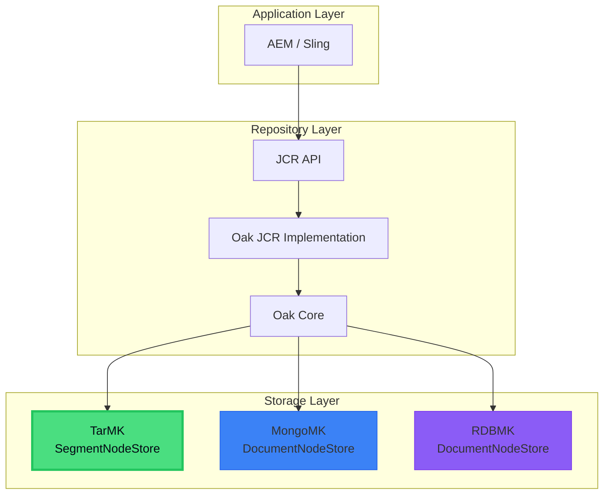

# 🏗️ Oak Segment Store Architecture

::: info 🎯 Scope
SegmentStore (TarMK) • Oak 1.22.x – 2.4.0 ([version scope](/reference/oak-versions))  
**Not for AEMaaCS**
:::

Understanding Oak's segment store architecture explains **why** certain recovery options work and others don't.

## Core Principles

Oak Segment Tar storage is built on three key principles:

1. **Immutability** - Segments are immutable once written. This makes caching easy but means **corrupted segments cannot be repaired in place**.

2. **Compactness** - Records are optimized for size to reduce IO and maximize cache efficiency.

3. **Locality** - Related nodes (parent + children) usually end up in the same segment for fast tree traversal (*usually*: when a segment fills up, writing simply continues in the next one).

## The Architecture Stack


```mermaid
graph TB
    subgraph "Application Layer"
        AEM[AEM / Sling]
    end
    
    subgraph "Repository Layer"
        JCR[JCR API]
        OakJCR[Oak JCR Implementation]
        OakCore[Oak Core]
    end
    
    subgraph "Storage Layer"
        TarMK[TarMK<br/>SegmentNodeStore]
        MongoMK[MongoMK<br/>DocumentNodeStore]
        RDBMK[RDBMK<br/>DocumentNodeStore]
    end
    
    AEM --> JCR
    JCR --> OakJCR
    OakJCR --> OakCore
    OakCore --> TarMK
    OakCore --> MongoMK
    OakCore --> RDBMK
    
    style TarMK fill:#4ade80,stroke:#22c55e,stroke-width:3px,color:#030712
    style MongoMK fill:#3b82f6,stroke:#2563eb
    style RDBMK fill:#8b5cf6,stroke:#7c3aed
```

**Key Takeaway**: TarMK (SegmentNodeStore) is the most common deployment. This guide focuses on TarMK.

## Key Components

### Segments: The Fundamental Unit

<OakFlowGraph flow="segment-structure" />

A segment is the **atomic unit of storage** in Oak Segment Tar:

| Property | Value |
|----------|-------|
| **Size** | Up to 256KiB (262,144 bytes) |
| **Identification** | Unique UUID |
| **Location** | Stored in TAR files |
| **Mutability** | **Immutable** once written |

**What's Inside a Segment:**

- **Node Records** - JCR node structure (template + child nodes + property values)
- **Value Records** - Property values (strings, numbers, dates), and binaries smaller than 16,512 bytes: those are inlined here even when a DataStore is configured
- **Block Records** - Raw chunks of binaries/long strings stored in the segment store
- **Blob ID Records** - Pointers to external binaries (DataStore)
- **List / Bucket Records** - Multi-value properties and lists of record ids
- **Map Records** (Leaf/Branch) - Child node entries (name → node)
- **Template Records** - Shared node "shape": primary type, mixins, property names and types

There is no separate "property record": property names/types live in the template, values hang off the node record (`RecordType`: `LEAF`, `BRANCH`, `BUCKET`, `LIST`, `VALUE`, `BLOCK`, `TEMPLATE`, `NODE`, `BLOB_ID`).

### Why 256KiB?

- **Cache-friendly** - Fits in L2/L3 CPU cache
- **IO-efficient** - Single disk read fetches entire segment
- **Locality** - Related nodes fit in same segment
- **Compaction-efficient** - Small enough to copy quickly

### Segment References (The Graph Structure)

Segments reference each other to build the repository tree:

```
Segment A (UUID: aaa-111)
  └─ Contains: /content/dam
      └─ References Segment B for child nodes

Segment B (UUID: bbb-222)
  └─ Contains: /content/dam/2024
      └─ References Segment C for child nodes

Segment C (UUID: ccc-333)
  └─ Contains: /content/dam/2024/Q3
      └─ References Segment D for assets
```

::: danger ⚠️ CRITICAL IMPLICATION
If Segment C is corrupted/missing:
- ❌ Cannot access `/content/dam/2024/Q3`
- ❌ Cannot access any children under Q3
- ✅ CAN still access `/content/dam` and `/content/dam/2024`

**One missing segment can make entire subtrees inaccessible**
:::

### Immutability: The Double-Edged Sword

**Why Immutable?**
- ✅ Fast reads - No locking needed
- ✅ Safe caching - Cache forever
- ✅ Crash-safe - Partial writes don't corrupt
- ✅ Simple concurrency - Multiple readers, no conflicts

**Why This Hurts During Corruption?**
- ❌ Cannot repair corrupted segment in place
- ❌ Cannot patch with corrected data
- ❌ Only options: Skip it, delete it, or replace entire store

### Segment Lifecycle

```
1. WRITE:    Content changes → New segment created → Written to TAR
2. READ:     Repository access → Segment UUID lookup → Read from TAR
3. COMPACT:  GC runs → Live content (head + checkpoints) rewritten into new-generation segments → Old generations reclaimed by cleanup
4. CORRUPT:  Disk error → Segment unreadable → SegmentNotFoundException
5. RECOVERY: Cannot fix → Must skip (sidegrade) or remove (surgical) or restore
```

## TAR Files

TAR files are containers that store segments along with metadata.

### Naming Convention

```
crx-quickstart/repository/segmentstore/
├── data00000a.tar          ← Sequence 0, Generation 'a'
├── data00001b.tar          ← Sequence 1, Generation 'b' (rewritten once by GC cleanup)
├── data00002a.tar          ← Sequence 2, Generation 'a'
├── data00003a.tar          ← Sequence 3, Generation 'a' (new writes, incl. compaction output)
├── data00002a.tar.bak      ← Damaged original kept by TAR recovery (see TAR Files)
├── journal.log             ← Current journal
├── gc.log                  ← GC history (one line per successful compaction)
├── manifest                ← Store version (store.version=2)
└── repo.lock               ← Repository lock file
```

**Pattern**: `data[SEQUENCE][GENERATION].tar`
- **SEQUENCE**: number zero-padded to 5 digits (00000, 00001...; `data%05d%s.tar`)
- **GENERATION**: Single letter (a, b, c, d... z) — bumped only when GC cleanup rewrites *that* file (more than 25% reclaimable); new files always start at 'a'; a file at 'z' is never rewritten again
- **Extension**: `.tar` (active), `.tar.bak` (damaged original, renamed by a read-write open) / `.tar.ro.bak` (recovered copy written by a read-only open such as oak-run; the original stays untouched) — `.2.bak`, `.2.ro.bak`, … when the name is taken. All left behind by TAR index recovery; details in [TAR Files](/architecture/tar-files)

**Next to `segmentstore/`** in `crx-quickstart/repository/`: `datastore/` (the FileDataStore, when one is configured; see [DataStore](/datastore/)), `index/` (local copies of the Lucene indexes; Oak's `localIndexDir` defaults to `<repository.home>/index`) and `blobids/` (the blob ID tracker). Oak 2.4.0 turns blob ID tracking off by default (`blobTrackSnapshotIntervalInSecs` = 0), so an AEM 6.5 LTS SP3 install has no `blobids/` *(since Oak 2.4.0)*.

### TAR File Lifecycle

<OakFlowGraph flow="tar-lifecycle" />

### TAR File Structure

```
TAR File Structure:
┌─────────────────────────────────────┐
│ Segment 1 data (up to 256KB)        │ ← Immutable content
│   tar entry name: <uuid>.<crc32>    │
├─────────────────────────────────────┤
│ Segment 2 data (up to 256KB)        │
├─────────────────────────────────────┤
│ ...more segments...                 │
├─────────────────────────────────────┤
│ Footer entries                      │ ← Rebuildable metadata
│ - Binary reference index (.brf)     │
│ - Segment reference graph (.gph)    │
│ - TAR index (.idx): UUIDs, offsets, │
│   sizes, GC generation, plus one    │
│   CRC32 over the index itself       │
└─────────────────────────────────────┘
```

Each segment's CRC32 sits in its tar entry name, but Oak only checks it when it has to rebuild a TAR index; normal reads don't verify it ([Why Repositories Get Bricked](/architecture/bricked)).

**Recovery Implication:**
- ✅ TAR index corruption = **recoverable** (metadata can be rebuilt)
- ❌ Segment data corruption = **NOT recoverable** (data is immutable)

## Journal (`journal.log`)

The journal tracks the latest state of the repository:

- **Purpose**: Records sequence of root node references (one line per flush, at most every 5 seconds, not one per commit; see [Journal](/architecture/journal))
- **Atomicity**: Only updated after segments are flushed to disk
- **GC Role**: Most recent root is starting point for garbage collection
- **Recovery**: ✅ Can be rebuilt by scanning segments, as long as `journal.log` still has one entry whose segment exists ([Journal Recovery](/recovery/journal))

## Why This Matters for Recovery

| Concept | Recovery Implication |
|---------|---------------------|
| **Immutability** | Corrupted segments cannot be fixed; recovery is about **skipping** bad data |
| **TAR Index** | Footer corruption is recoverable; segment data corruption is not |
| **Journal** | Can be rebuilt; doesn't fix missing segments |
| **Generational GC** | Compaction after corruption = segments permanently deleted |
| **Segment Dependencies** | Missing one segment can make entire subtrees inaccessible |
| **256KiB Size** | Corruption of one segment affects multiple nodes |

## Recovery Strategy Implications

| Strategy | What It Does | Why It Works |
|----------|-------------|--------------|
| **Backup Restore** | Replaces entire store | Bypasses immutability |
| **TAR Index Recovery** | Rebuilds footer | Metadata is mutable |
| **Journal Recovery** | Rebuilds journal.log | Doesn't fix missing segments |
| **Sidegrade** | Copies the paths you choose | Known-corrupt paths are excluded up front (`--exclude-paths`); it aborts on any unreadable node |
| **Surgical Removal** | Deletes corrupted paths | Works by skipping |
| **Compaction** | Creates new generation | ❌ Cannot copy corrupted segments |

::: tip Key Insight
Oak's immutability makes it fast and consistent, but means **corruption cannot be repaired**. All recovery strategies work by:
1. **Replacing** corrupted data (backup)
2. **Skipping** corrupted data (sidegrade, surgical)
3. **Rebuilding metadata** (TAR index, journal)

There is **no tool** that can "fix" corrupted segment data.
:::

::: info 📅 Last Updated
Content last reviewed: October 2026 • Verified against Oak 1.22.24 (AEM 6.5) and Oak 2.4.0 (AEM 6.5 LTS SP3)
:::
