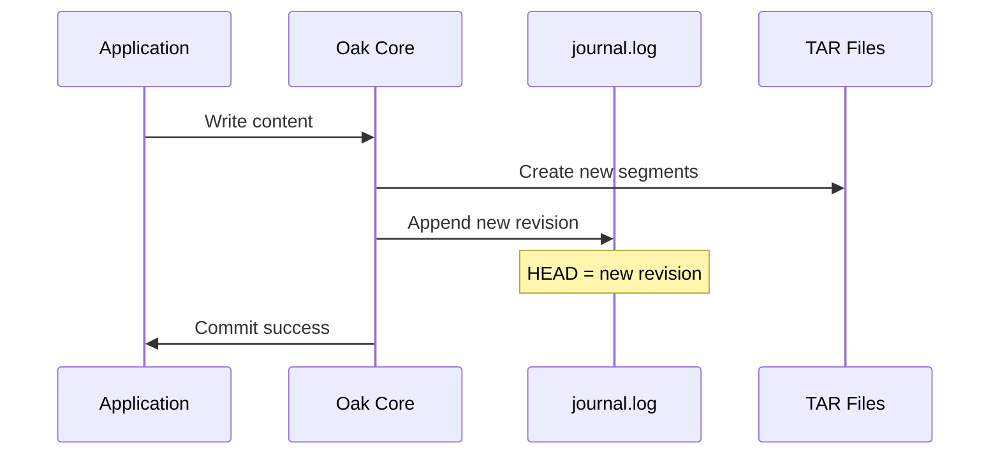

# 📜 Journal: The Commit History

The `journal.log` file is the **commit history** of your repository. It tracks every revision and points to the current HEAD state.

## What is the Journal?

```
segmentstore/
├── data00000a.tar
├── data00001a.tar
├── journal.log        ← This file
└── ...
```

The journal is a simple text file containing revision references:

```
# journal.log contents (newest first)
d2afc549-c5a2-4475-a2d1-7257dabba2fd root 1704067200000
a1b2c3d4-e5f6-7890-abcd-ef1234567890 root 1704067190000
...
```

### Format

```
[SEGMENT_UUID] [TYPE] [TIMESTAMP]
```

| Field | Description |
|-------|-------------|
| **SEGMENT_UUID** | Points to root segment for this revision |
| **TYPE** | Usually "root" |
| **TIMESTAMP** | Unix timestamp (milliseconds) |

## How the Journal Works



### On Startup

1. Oak reads `journal.log`
2. Finds the **first valid revision** (newest)
3. Uses that as HEAD
4. Repository is ready

### On Commit

1. New segments written to TAR
2. New revision appended to journal
3. HEAD updated atomically

## Journal Recovery

The journal can be **rebuilt** from segments:

```bash
$ java -jar oak-run-*.jar recover-journal /path/to/segmentstore
```

### What `recover-journal` Does

1. Scans all TAR files for segments
2. Finds segments that look like "root" nodes
3. Validates each candidate
4. Builds new journal with valid revisions

### When to Use

- Journal file corrupted or missing
- Journal points to missing segments
- After unexpected shutdown

## Journal vs. Segments

| Aspect | Journal | Segments |
|--------|---------|----------|
| **Content** | Revision pointers | Actual data |
| **Rebuildable** | ✅ Yes | ❌ No |
| **Size** | Small (KB-MB) | Large (GB-TB) |
| **Format** | Text file | Binary TAR |

::: tip Key Insight
Losing the journal is **recoverable**. Losing segments is **not**.
:::

## Viewing the Journal

```bash
# View recent entries
$ tail -20 /path/to/segmentstore/journal.log

# Count entries
$ wc -l /path/to/segmentstore/journal.log

# Find entries from specific date
$ grep "1704067" /path/to/segmentstore/journal.log
```

## Journal Truncation

In some recovery scenarios, you might manually truncate the journal:

```bash
# Backup first!
$ cp journal.log journal.log.backup

# Keep only entries up to known good revision
$ head -n 100 journal.log > journal.log.new
$ mv journal.log.new journal.log
```

::: danger ⚠️ Expert Only
Manual journal truncation should only be done if you know the exact good revision from `oak-run check` output.
:::

## Common Journal Issues

| Issue | Symptom | Solution |
|-------|---------|----------|
| **Corrupted** | "Invalid journal entry" | `recover-journal` |
| **Missing** | "journal.log not found" | `recover-journal` |
| **Points to bad segment** | `SegmentNotFoundException` on startup | `recover-journal` or truncate |
| **Empty** | Repository appears empty | `recover-journal` |

## Key Takeaways

::: tip Remember
1. **Journal = commit history** - points to revisions
2. **Rebuildable** - can be reconstructed from segments
3. **Text format** - human readable, simple structure
4. **HEAD = first entry** - newest valid revision
5. **Recovery is possible** - `recover-journal` scans all segments
:::
