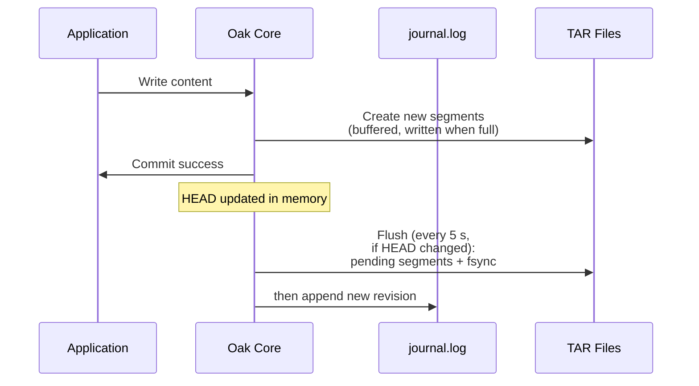

# 📜 Journal: The Commit History

::: info 🎯 Scope
SegmentStore (TarMK) • Oak 1.22.x – 2.4.0 ([version scope](/reference/oak-versions))  
**Not for AEMaaCS**
:::

The `journal.log` file is the **commit history** of your repository. It records the HEAD revision at every flush (at most every 5 seconds, so many commits share one line) and points to the current HEAD state.

## What is the Journal?

```
segmentstore/
├── data00000a.tar
├── data00001a.tar
├── journal.log        ← This file
└── ...
```

The journal is a simple text file containing revision references:

```
# journal.log contents (appended — newest LAST)
...
a1b2c3d4-e5f6-7890-abcd-ef1234567890:180 root 1704067190000
d2afc549-c5a2-4475-a2d1-7257dabba2fd:78 root 1704067200000
```

### Format

```
[SEGMENT_UUID]:[RECORD_NUMBER] root [TIMESTAMP]
```

| Field | Description |
|-------|-------------|
| **SEGMENT_UUID:RECORD_NUMBER** | Record id of the super-root node state (the node holding `root` and `checkpoints`): segment UUID + record number (decimal) |
| **TYPE** | Always "root" |
| **TIMESTAMP** | Unix timestamp (milliseconds) of the flush that wrote the line |

::: warning What the Oak code actually does (Oak 1.22 and 2.4)
The number after the colon is a **record number**, not a byte offset: an index into the segment's record table (`TarRevisions` writes `RecordId.toString10()` = `"%s:%d"`, and record numbers are handed out sequentially per segment). That's why real lines carry small numbers, e.g. `0d035c3a-2168-4544-af97-3e084d1b5401:78 root 1764892395647` on a local AEM 6.5.23. Oak's log messages print the same id in hex with a dot: `:78` in the journal is `.0000004e` in `Unable to access revision …` — grep for the UUID, not the whole id.
:::

## How the Journal Works


```mermaid
sequenceDiagram
    participant App as Application
    participant Oak as Oak Core
    participant Journal as journal.log
    participant TAR as TAR Files
    
    App->>Oak: Write content
    Oak->>TAR: Create new segments<br/>(buffered, written when full)
    Oak->>App: Commit success
    Note over Oak: HEAD updated in memory
    Oak->>TAR: Flush (every 5 s,<br/>if HEAD changed):<br/>pending segments + fsync
    Oak->>Journal: then append new revision
```

### On Startup

1. Oak reads `journal.log` **backwards** (last line first)
2. Picks the newest entry whose segment exists in the store, i.e. is listed in a TAR index; the segment isn't read yet (skipped entries log `Unable to access revision ..., rewinding...` or `Skipping invalid record id ...`)
3. Uses that as HEAD
4. Repository is ready

::: warning Missing or unusable journal
If no usable entry is found (journal missing, empty, or every entry points to a missing segment), Oak does **not** fail: it writes a fresh, empty initial node state as HEAD. The repository then *appears empty*.

That is the read-write open (AEM, `oak-run console --read-write`), and at the next flush it appends that empty HEAD to `journal.log` (creating the file if it was missing). Read-only opens refuse instead: `oak-run check`, `debug` and `recover-journal` stop with `IllegalStateException: Cannot start readonly store from empty journal`, and `recover-journal` without any `journal.log` stops with `Invalid FileStore directory` (both reproduced on 1.22.24 and 2.4.0). So don't start AEM on such a store; put a copy of `journal.log` back first. An older copy works as long as one of its entries still points at an existing segment. If AEM already ran on the empty HEAD, `recover-journal` sorts its new, almost empty roots last; see [Journal Truncation](#journal-truncation).
:::

### On Commit

1. New records written to segments (buffered, then flushed to TAR)
2. HEAD updated atomically in memory
3. On the next flush (scheduled every 5 seconds), segments are flushed to TAR **first**, then the new HEAD is appended to the journal

## Journal Recovery

The journal can be **rebuilt** from segments:

```bash
$ java -jar oak-run-*.jar recover-journal /path/to/segmentstore
```

### What `recover-journal` Does

1. Opens the store read-only (so `journal.log` must still have one entry whose segment exists, see above) and scans all data segments
2. Finds node records that look like a super-root (have both `root` and `checkpoints` children); timestamps come from the segment info
3. Sorts candidates by time and, starting from the newest, drops candidates whose head or checkpoints fail a consistency check until the newest one is consistent
4. Renames the old journal to `journal.log.bak.000` (`.001`, …) and writes the new journal

### When to Use

- Journal file corrupted or missing (missing or empty: put a copy back first, see [On Startup](#on-startup))
- Journal points to missing segments (Oak already rewinds past those by itself on startup, see [On Startup](#on-startup); details in [Journal Recovery](/recovery/journal))
- After unexpected shutdown

## Journal vs. Segments

| Aspect | Journal | Segments |
|--------|---------|----------|
| **Content** | Revision pointers | Actual data |
| **Rebuildable** | ✅ Yes | ❌ No |
| **Size** | Small (KB-MB) | Large (GB-TB) |
| **Format** | Text file | Binary TAR |

::: tip Key Insight
Losing the journal is **recoverable**. Losing segments is **not**. (Recoverable, but not from nothing: `recover-journal` needs one journal entry whose segment still exists, see [On Startup](#on-startup).)
:::

## Viewing the Journal

```bash
# View recent entries
$ tail -20 /path/to/segmentstore/journal.log

# Count entries
$ wc -l /path/to/segmentstore/journal.log

# Find entries from specific date
$ grep "1704067" /path/to/segmentstore/journal.log
```

## Journal Truncation

In some recovery scenarios, you might manually truncate the journal:

```bash
# Backup first!
$ cp journal.log journal.log.backup

# Keep only entries up to known good revision
$ head -n 100 journal.log > journal.log.new
$ mv journal.log.new journal.log
```

Two cases worth knowing:

- **Offline `oak-run compact`** truncates `journal.log` to a single line on success, followed by an empty line that later logs a harmless `WARN ... Skipping invalid journal entry:` ([Compaction](/recovery/compaction#🔥-critical-offline-compact-truncates-journal-log)).
- **AEM was started on a missing or empty journal**, then `recover-journal` was run: the recovered journal ends with the roots of the new, almost empty repository. Truncate to the last entry before them. Timestamps in a recovered journal are segment write times, not flush times (lab: the recovered journal had 4 entries, `head -n 2` brought the content back on 1.22.24 and 2.4.0).

::: danger ⚠️ Expert Only
Manual journal truncation should only be done if you know the exact good revision from `oak-run check` output.
:::

## Common Journal Issues

| Issue | Symptom | Solution |
|-------|---------|----------|
| **Corrupted** | WARN `Skipping invalid record id ...`, or `Skipping invalid journal entry: ...` for a line without a space | `recover-journal` |
| **Missing** | No error — repository appears empty (read-write start writes a new empty HEAD; read-only tools fail) | Put a copy of `journal.log` back, then `recover-journal` if needed: it can't open a store without one |
| **Points to bad segment** | WARN `Unable to access revision ..., rewinding...`, or `SegmentNotFoundException` once a deeper segment is read | `recover-journal` or truncate |
| **Empty** | Repository appears empty; read-only tools: `Cannot start readonly store from empty journal` | Same as missing |

## Key Takeaways

::: tip Remember
1. **Journal = commit history** - points to revisions (one line per flush, not per commit)
2. **Rebuildable** - can be reconstructed from segments, as long as one usable entry is left
3. **Text format** - human readable, simple structure
4. **HEAD = last entry** - newest valid revision (read from the end of the file)
5. **Recovery is possible** - `recover-journal` scans all segments
:::

::: info 📅 Last Updated
Content last reviewed: October 2026 • Verified against Oak 1.22.24 (AEM 6.5) and Oak 2.4.0 (AEM 6.5 LTS SP3)
:::
