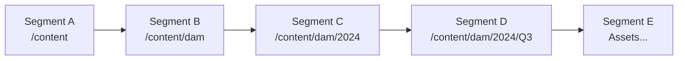
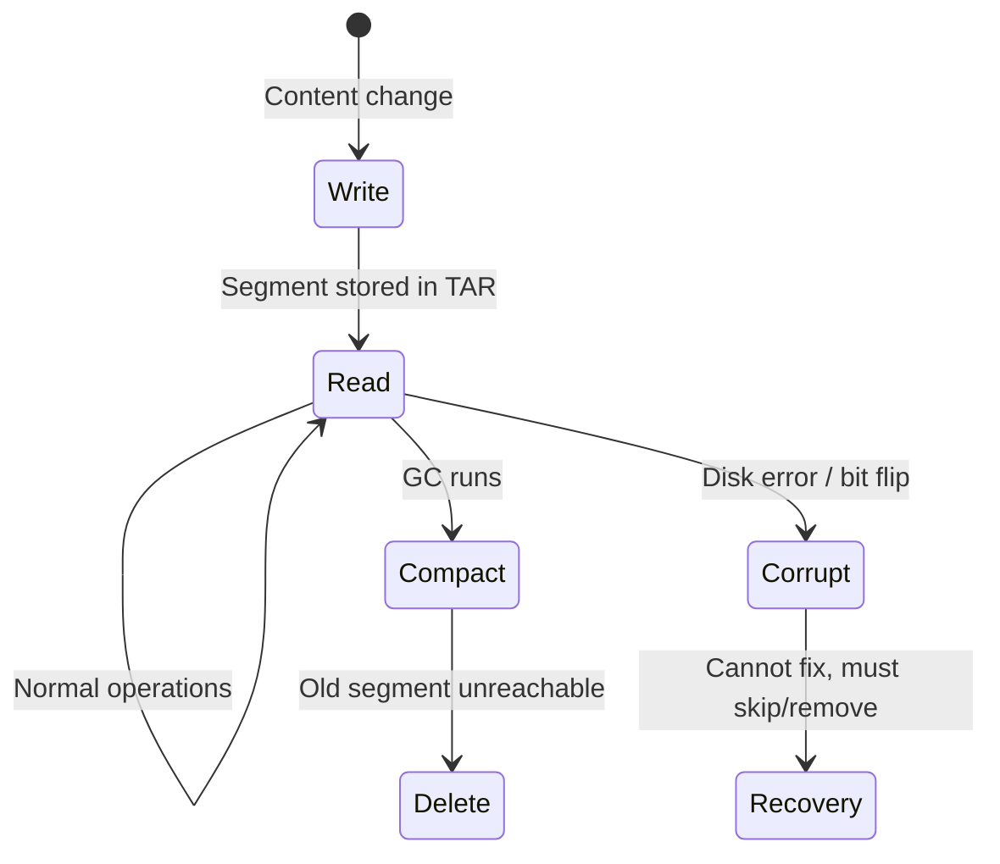

# 📦 Segments: The Atomic Unit

Segments are the **fundamental building blocks** of Oak's SegmentStore. Understanding them is key to understanding why corruption behaves the way it does.

## What is a Segment?

A segment is a self-contained block of repository data with these properties:

| Property | Value | Why It Matters |
|----------|-------|----------------|
| **Size** | Up to 256 KiB | Cache-friendly, efficient I/O |
| **ID** | UUID (e.g., `a1b2c3d4-...`) | Unique identifier for lookups |
| **Immutable** | Once written, never changed | Fast reads, but can't repair corruption |
| **Location** | Inside TAR files | Sequential storage for efficiency |

## Segment Contents

A single segment can contain multiple record types:

```
Segment UUID: a1b2c3d4-e5f6-7890-abcd-ef1234567890
Size: 187 KiB
Contents:
  ├── Node Record: /content/dam/2024/report.pdf
  │   ├── jcr:primaryType = dam:Asset
  │   └── jcr:created = 2024-10-01T10:30:00
  ├── Property Records
  │   ├── dc:title = "Q3 Financial Report"
  │   └── dam:size = 2457600
  ├── Blob Reference → DataStore: abc123def456
  └── Template Record (shared node type definition)
```

### Record Types

| Type | Purpose | Example |
|------|---------|---------|
| **Node Record** | JCR node structure | `/content/dam/myasset` |
| **Property Record** | Node properties | `jcr:title="My Doc"` |
| **Value Record** | Property values | Strings, numbers, dates |
| **Blob Reference** | Pointer to DataStore | Large binary content |
| **List Record** | Multi-value properties | Tags, categories |
| **Map Record** | Large property sets | Efficient storage |
| **Template Record** | Node type definitions | Deduplication |

## Segment References (The Graph)

Segments reference each other to form the repository tree:



**Critical implication**: If Segment C is corrupted:
- ❌ Cannot access `/content/dam/2024` 
- ❌ Cannot access anything under `/content/dam/2024/`
- ✅ CAN still access `/content/dam` (different segment)

## Why 256 KiB?

The segment size is optimized for:

1. **CPU Cache**: Fits in L2/L3 cache for fast processing
2. **Disk I/O**: Single read fetches entire segment
3. **Locality**: Related nodes stored together (parent + children)
4. **Compaction**: Small enough to copy quickly during GC

## Immutability: The Double-Edged Sword

### Benefits

- ✅ **Fast reads**: No locking needed
- ✅ **Safe caching**: Cache forever, no invalidation
- ✅ **Crash-safe**: Partial writes don't corrupt existing data
- ✅ **Simple concurrency**: Multiple readers, no conflicts

### Drawbacks for Recovery

- ❌ **Cannot repair**: Corrupted segment cannot be edited
- ❌ **Cannot patch**: No way to "fix" bad data in place
- ❌ **Only options**: Skip it, delete it, or restore from backup

## Segment Lifecycle



## Viewing Segments

Use `oak-run explore` to inspect segments:

```bash
$ java -jar oak-run-*.jar explore /path/to/segmentstore

# In the explorer:
> segment <uuid>
> info
```

## Key Takeaways

::: tip Remember
1. **Segments are immutable** - corruption cannot be repaired in place
2. **One bad segment** can make entire subtrees inaccessible
3. **Recovery = skipping** bad segments, not fixing them
4. **256 KiB size** is optimized for performance, not human readability
:::
