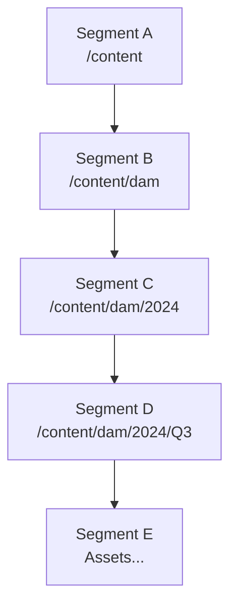
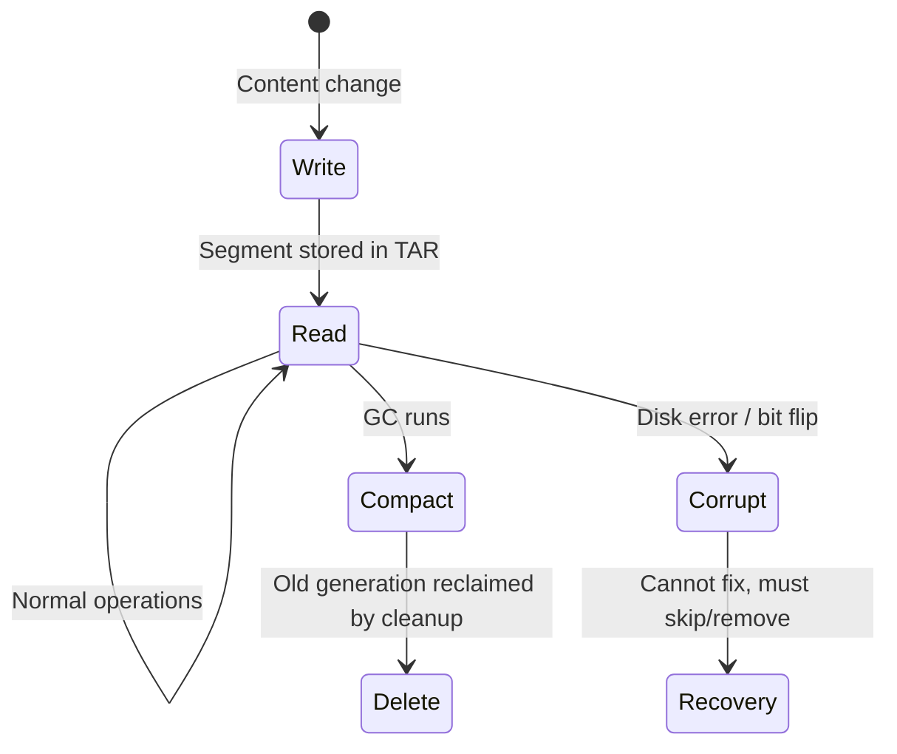

# 📦 Segments: The Atomic Unit

::: info 🎯 Scope
SegmentStore (TarMK) • Oak 1.22.x – 2.4.0 ([version scope](/reference/oak-versions))  
**Not for AEMaaCS**
:::

Segments are the **fundamental building blocks** of Oak's SegmentStore. Understanding them is key to understanding why corruption behaves the way it does.

## What is a Segment?

A segment is a self-contained block of repository data with these properties:

| Property | Value | Why It Matters |
|----------|-------|----------------|
| **Size** | Up to 256 KiB | Cache-friendly, efficient I/O |
| **ID** | UUID (e.g., `a1b2c3d4-...`) | Unique identifier for lookups; the top 4 bits of the UUID's low half mark a **data** (`0xA`) vs. **bulk**/binary-only (`0xB`) segment. It is the first hex digit of the 4th group: `…-a4e5-…` is data, `…-b651-…` is bulk |
| **Immutable** | Once written, never changed | Fast reads, but can't repair corruption |
| **Location** | Inside TAR files | Sequential storage for efficiency |

## Segment Contents

A single segment can contain multiple record types:

```
Segment UUID: a1b2c3d4-e5f6-7890-abcd-ef1234567890
Size: 187 KiB
Contents:
  ├── Node Record: /content/dam/2024/report.pdf
  │   ├── jcr:primaryType = dam:Asset
  │   └── jcr:created = 2024-10-01T10:30:00
  ├── Value Records (property values)
  │   ├── dc:title = "Q3 Financial Report"
  │   └── dam:size = 2457600
  ├── Blob ID Record → DataStore: abc123def456
  └── Template Record (shared node shape: type, mixins, property names)
```

### Record Types

| Type | Purpose | Example |
|------|---------|---------|
| **Node Record** (`NODE`) | JCR node structure: template id, child node(s), property value ids | `/content/dam/myasset` |
| **Value Record** (`VALUE`) | Property values (property names/types are in the template) | `jcr:title="My Doc"`, numbers, dates, binaries under 16,512 bytes (inlined even when a DataStore is configured) |
| **Block Record** (`BLOCK`) | Raw chunks of binaries/long strings kept in the segment store | Binaries of 16,512 bytes or more when no DataStore is configured (in bulk segments); strings of 16,512 bytes or more |
| **Blob ID Record** (`BLOB_ID`) | Pointer to DataStore | Large binary content |
| **List / Bucket Record** (`LIST`, `BUCKET`) | Multi-value properties, lists of record ids | Tags, categories |
| **Map Record** (`LEAF`, `BRANCH`) | Child node entries (name → node), as a hash tree | Folders with many children |
| **Template Record** (`TEMPLATE`) | Node "shape": primary type, mixins, property names and types | Deduplication |

## Segment References (The Graph)

Segments reference each other to form the repository tree:


```mermaid
graph TD
    A[Segment A<br/>/content] --> B[Segment B<br/>/content/dam]
    B --> C[Segment C<br/>/content/dam/2024]
    C --> D[Segment D<br/>/content/dam/2024/Q3]
    D --> E[Segment E<br/>Assets...]
```

**Critical implication**: If Segment C is corrupted:
- ❌ Cannot access `/content/dam/2024` 
- ❌ Cannot access anything under `/content/dam/2024/`
- ✅ CAN still access `/content/dam` (different segment)

## Why 256 KiB?

The segment size is optimized for:

1. **CPU Cache**: Fits in L2/L3 cache for fast processing
2. **Disk I/O**: Single read fetches entire segment
3. **Locality**: Related nodes stored together (parent + children)
4. **Compaction**: Small enough to copy quickly during GC

## Immutability: The Double-Edged Sword

### Benefits

- ✅ **Fast reads**: No locking needed
- ✅ **Safe caching**: Cache forever, no invalidation
- ✅ **Crash-safe**: Partial writes don't corrupt existing data
- ✅ **Simple concurrency**: Multiple readers, no conflicts

### Drawbacks for Recovery

- ❌ **Cannot repair**: Corrupted segment cannot be edited
- ❌ **Cannot patch**: No way to "fix" bad data in place
- ❌ **Only options**: Skip it, delete it, or restore from backup

## Segment Lifecycle


```mermaid
stateDiagram-v2
    [*] --> Write: Content change
    Write --> Read: Segment stored in TAR
    Read --> Read: Normal operations
    Read --> Compact: GC runs
    Compact --> Delete: Old generation reclaimed by cleanup
    Read --> Corrupt: Disk error / bit flip
    Corrupt --> Recovery: Cannot fix, must skip/remove
```

::: warning What the Oak code actually does (Oak 1.22 and 2.4)
- **"Not found" can mean "found but unreadable".** Any failure while loading a segment is thrown as `SegmentNotFoundException: Segment <id> not found`: a segment missing from every TAR index, but also an I/O error or a damaged segment header. Read the `Caused by:` line. A present segment with an overwritten header shows `Caused by: java.lang.IllegalArgumentException: invalid segment buffer` (`FileStore.readSegment` → `AbstractFileStore.asSegmentNotFoundException`; reproduced on both versions).
- **A bit flip inside the records is not detected on read.** The CRC32 in the TAR entry name is only checked when Oak rebuilds a TAR index ([Why Repositories Get Bricked](/architecture/bricked)).
- **"Delete" means cleanup by GC generation**, not a reachability check (data segments by generation; bulk segments once no retained segment references them). See [Why Repositories Get Bricked](/architecture/bricked) and [Generational GC](/architecture/gc).
:::

## Viewing Segments

Use `oak-run debug` (command line, opens the store read-only) or `oak-run explore` (Swing GUI, needs a display) to inspect segments:

```bash
# Dump one (or more) segments by UUID
$ java -jar oak-run-*.jar debug /path/to/segmentstore <segment-uuid>

# GUI: browse the tree; menus "Segment Refs", "Tar File Info", "Time Machine"
$ java -jar oak-run-*.jar explore /path/to/segmentstore
```

## Key Takeaways

::: tip Remember
1. **Segments are immutable** - corruption cannot be repaired in place
2. **One bad segment** can make entire subtrees inaccessible
3. **Recovery = skipping** bad segments, not fixing them
4. **256 KiB size** is optimized for performance, not human readability
:::

::: info 📅 Last Updated
Content last reviewed: October 2026 • Verified against Oak 1.22.24 (AEM 6.5) and Oak 2.4.0 (AEM 6.5 LTS SP3)
:::
