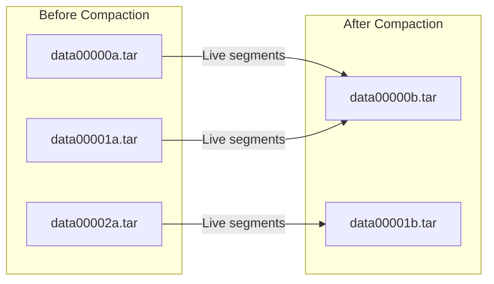

# 🗃️ TAR Files: Segment Containers

TAR files are the physical containers that store segments on disk. Understanding their structure helps diagnose and recover from corruption.

## TAR File Naming

```
segmentstore/
├── data00000a.tar    ← Generation 'a', sequence 00000
├── data00001a.tar    ← Generation 'a', sequence 00001
├── data00002a.tar
├── data00000b.tar    ← Generation 'b' (after compaction)
├── data00001b.tar
└── journal.log
```

### Naming Convention

```
data[SEQUENCE][GENERATION].tar
     │         │
     │         └── a, b, c, d... (increments after compaction)
     └── 00000, 00001, 00002... (increments as files fill up)
```

## TAR File Structure

Each TAR file contains:

```
┌─────────────────────────────────────┐
│  Segment 1 (up to 256 KiB)          │
├─────────────────────────────────────┤
│  Segment 2                          │
├─────────────────────────────────────┤
│  Segment 3                          │
├─────────────────────────────────────┤
│  ...                                │
├─────────────────────────────────────┤
│  Segment N                          │
├─────────────────────────────────────┤
│  Graph (segment references)         │
├─────────────────────────────────────┤
│  Binary References (blob pointers)  │
├─────────────────────────────────────┤
│  Index (UUID → offset mapping)      │  ← Footer
└─────────────────────────────────────┘
```

### Footer Components

| Component | Purpose | Recovery Implication |
|-----------|---------|---------------------|
| **Graph** | Segment reference relationships | Can be rebuilt |
| **Binary Refs** | Pointers to DataStore blobs | Can be rebuilt |
| **Index** | Fast UUID lookups | Can be rebuilt |

::: tip Good News
The footer (index, graph, binary refs) is **metadata** that can be rebuilt. Only segment data corruption is permanent.
:::

## TAR File Size

- **Maximum size**: ~256 MB per TAR file
- **When full**: New TAR file created with incremented sequence number
- **After compaction**: New generation letter, sequence resets

## Generations and Compaction



After compaction:
1. Live segments copied to new generation (b)
2. Old generation (a) files renamed to `.tar.bak`
3. After verification, `.tar.bak` files deleted

## The `.tar.bak` Files

```bash
# After compaction, you might see:
data00000a.tar.bak    ← Old generation, pending deletion
data00001a.tar.bak
data00000b.tar         ← New generation, active
```

::: warning ⚠️ Recovery Opportunity
If corruption is detected **before** `.tar.bak` files are deleted, you may be able to recover segments from them!
:::

## TAR Index Recovery

If the TAR index (footer) is corrupted but segment data is intact:

```bash
# Oak can rebuild the index
$ java -jar oak-run-*.jar tarmk-recovery /path/to/segmentstore
```

This rebuilds:
- Segment index (UUID → offset)
- Graph (segment references)
- Binary references

## Inspecting TAR Files

```bash
# List TAR contents
$ java -jar oak-run-*.jar tarmk /path/to/segmentstore --info

# Check specific TAR file
$ java -jar oak-run-*.jar tarmk /path/to/segmentstore/data00000a.tar --info
```

## Common TAR Issues

| Issue | Symptom | Solution |
|-------|---------|----------|
| **Corrupted index** | "Invalid TAR file" | `tarmk-recovery` |
| **Truncated file** | "Unexpected EOF" | Restore from backup |
| **Missing segments** | `SegmentNotFoundException` | Recovery procedures |
| **Disk full during write** | Partial TAR | Remove incomplete, restore |

## Key Takeaways

::: tip Remember
1. **TAR files are containers** - they hold segments sequentially
2. **Generation letters** indicate compaction cycles (a → b → c)
3. **Footer is rebuildable** - index corruption is recoverable
4. **Segment corruption is not** - data loss is permanent
5. **Check `.tar.bak` files** - they might save you during recovery
:::
