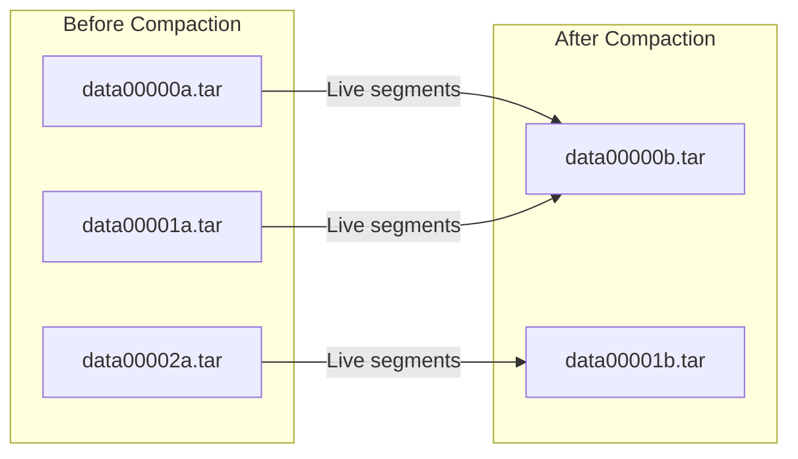

# 🗃️ TAR Files: Segment Containers

TAR files are the physical containers that store segments on disk. Understanding their structure helps diagnose and recover from corruption.

## TAR File Naming

```
segmentstore/
├── data00000a.tar    ← Generation 'a', sequence 00000
├── data00001a.tar    ← Generation 'a', sequence 00001
├── data00002a.tar
├── data00000b.tar    ← Generation 'b' (after compaction)
├── data00001b.tar
├── journal.log
└── repo.lock         ← Repository lock file
```

### Naming Convention

```
data[SEQUENCE][GENERATION].tar
     │         │
     │         └── a, b, c, d... z (increments after compaction)
     └── 00000, 00001, 00002... (increments as files fill up)
```

### Generation Letter Limits

The generation letter increments after each compaction cleanup:
- `a` → Initial/oldest generation
- `b` → After 1st compaction
- `c` → After 2nd compaction
- ...
- `z` → **Final generation** (cannot be compacted further)

::: warning Generation 'z' Limit
If a TAR file reaches generation 'z', it can **no longer be compacted**, even if it contains reclaimable space. This is a safety mechanism to prevent infinite generation chains.
:::

## TAR File Structure

Each TAR file contains:

```
┌─────────────────────────────────────┐
│  Segment 1 (up to 256 KiB)          │  ← Immutable content
├─────────────────────────────────────┤
│  Segment 2                          │
├─────────────────────────────────────┤
│  Segment 3                          │
├─────────────────────────────────────┤
│  ...                                │
├─────────────────────────────────────┤
│  Segment N                          │
├─────────────────────────────────────┤
│  Graph (segment references)         │  ← Rebuildable metadata
├─────────────────────────────────────┤
│  Binary References (blob pointers)  │
├─────────────────────────────────────┤
│  Index (UUID → offset mapping)      │  ← Footer
└─────────────────────────────────────┘
```

### Footer Components

| Component | Purpose | Recovery Implication |
|-----------|---------|---------------------|
| **Graph** | Segment reference relationships | ✅ Can be rebuilt |
| **Binary Refs** | Pointers to DataStore blobs | ✅ Can be rebuilt |
| **Index** | Fast UUID lookups | ✅ Can be rebuilt |

::: tip Recovery Distinction
- **TAR index corruption** (footer) = **RECOVERABLE** - metadata can be rebuilt by scanning segment data
- **Segment data corruption** (body) = **NOT RECOVERABLE** - immutable data is gone
:::

## The `repo.lock` File

The `repo.lock` file prevents multiple processes from opening the same repository simultaneously.

### What It Is

```
File: crx-quickstart/repository/segmentstore/repo.lock
Purpose: Prevents concurrent repository access
Contents: Process ID (PID) of the process holding the lock
Created: When AEM starts and opens the repository
Deleted: When AEM shuts down cleanly
```

### How It Works

```
1. AEM starts
2. Oak tries to create repo.lock
3. If file exists:
   - Oak reads PID from file
   - Checks if that process is still running
   - If running: REFUSES TO START (prevents corruption)
   - If not running: Removes stale lock, creates new one
4. If file doesn't exist:
   - Creates repo.lock with current PID
   - Proceeds with startup
```

### Why It Exists

- 🛡️ **Prevents catastrophic corruption**: Two processes writing to same TAR files = guaranteed corruption
- 🛡️ **Prevents data loss**: Concurrent writes would overwrite each other's segments
- 🛡️ **Prevents split-brain**: Ensures only one "truth" about repository state

### The "Just Delete It" Advice (Why It's Dangerous)

| Scenario | "Delete repo.lock" Result | Why It's Bad |
|----------|---------------------------|--------------|
| **AEM actually still running** | 🔥 **CATASTROPHIC** | Two AEM instances write to same repository → guaranteed corruption |
| **AEM crashed, lock is stale** | ✅ Usually OK | Oak should have removed it automatically anyway |
| **Repository is corrupt** | ⚠️ **MASKS PROBLEM** | AEM starts, immediately crashes on corruption |
| **Multiple AEM instances misconfigured** | 🔥 **CATASTROPHIC** | Both instances now think they own the repository |

### Proper Diagnostic Process

```bash
# Step 1: Verify AEM is actually stopped
ps aux | grep java | grep aem
# OR
ps aux | grep crx-quickstart

# Step 2: Check what PID is in the lock file
cat crx-quickstart/repository/segmentstore/repo.lock
# Example output: 12345

# Step 3: Check if that process is still running
ps -p 12345
# If "no such process": Lock is stale, safe to delete
# If process exists: STOP! That process is using the repository

# Step 4: If process exists, identify it
ps -fp 12345
# Is it AEM? Another oak-run command? Something else?

# Step 5: Only if certain process is dead AND lock is stale
rm crx-quickstart/repository/segmentstore/repo.lock

# Step 6: Check for other issues
df -h                    # Disk space
dmesg | grep -i error    # Disk errors
ls -la crx-quickstart/repository/segmentstore/  # Permissions
```

::: danger The Real Danger
```
Scenario: Clustered environment, shared NFS storage
Operator: "AEM won't start on server2, repo.lock exists"
Operator: *deletes repo.lock without checking*
Reality: Server1's AEM is still running, using that repository
Result: Server2 starts, both write to same repository
Outcome: CATASTROPHIC CORRUPTION within minutes
```
:::

### When Deleting repo.lock Is Safe

- ✅ AEM is definitely stopped (verified with `ps`)
- ✅ PID in lock file is dead (verified with `ps -p`)
- ✅ No other oak-run commands are running
- ✅ No other processes accessing the repository
- ✅ You're on the correct server (not accidentally checking wrong instance)

### When Deleting repo.lock Is Dangerous

- 🔴 You didn't check if AEM is running
- 🔴 You're in a clustered environment (multiple servers)
- 🔴 You're not sure which process the PID belongs to
- 🔴 The lock file keeps reappearing (indicates active process)
- 🔴 You're following "just delete it" advice without understanding why

::: tip Bottom Line
- 💡 **repo.lock is a safety mechanism, not a bug**
- 💡 **If Oak can't remove stale lock automatically, investigate why**
- 💡 **"Just delete it" works 90% of the time, but the 10% causes catastrophic corruption**
- 💡 **Take 30 seconds to verify, save hours of recovery work**
:::

## TAR File Size

- **Maximum size**: ~256 MB per TAR file
- **When full**: New TAR file created with incremented sequence number
- **After compaction**: New generation letter, sequence may reset

## Generations and Compaction



After compaction:
1. Live segments copied to new generation (b)
2. Old generation (a) files renamed to `.tar.bak`
3. After verification, `.tar.bak` files **should** be deleted

## The `.tar.bak` Files

```bash
# After compaction, you might see:
data00000a.tar.bak    ← Old generation, pending deletion
data00001a.tar.bak
data00000b.tar         ← New generation, active
```

::: danger ⚠️ CRITICAL: .tar.bak Files Do NOT Auto-Cleanup
Despite what you might expect, `.tar.bak` files **linger indefinitely** in production environments. It's common to find `.tar.bak` files that are **months or years old**.

**Why they accumulate:**
1. Compaction completes → gen 'a' renamed to .tar.bak
2. AEM continues running with gen 'b'
3. On next AEM restart:
   - Oak checks if gen 'b' is healthy
   - If healthy: .tar.bak files SHOULD be deleted (per design)
   - **Reality**: They often remain on disk indefinitely

**What this means:**
- ❌ Don't assume Oak will clean them up automatically
- ✅ `.tar.bak` files will consume disk space until manually removed
- ✅ Safe to delete `.tar.bak` files **AFTER** successful AEM restart with new generation
- ⚠️ **NEVER** delete `.tar.bak` files before verifying AEM starts successfully
:::

### When It's Safe to Delete .tar.bak Files

```bash
# 1. Verify AEM is running successfully with new generation
$ ls -lh crx-quickstart/repository/segmentstore/data*.tar
# Should see data00000b.tar (new generation)

# 2. Check AEM error.log for startup errors
$ tail -n 1000 crx-quickstart/logs/error.log | grep -i "segment\|repository"
# No SegmentNotFoundException or corruption errors

# 3. Verify AEM has been running for at least 24 hours without issues

# 4. NOW safe to delete .tar.bak files
$ rm crx-quickstart/repository/segmentstore/*.tar.bak
```

::: warning Recovery Opportunity
If corruption is detected **before** `.tar.bak` files are deleted, you may be able to recover segments from them! **Keep .tar.bak files during troubleshooting.**
:::

## TAR Index Recovery

### When TAR Index Corruption Happens (vs Segment Corruption)

**TAR Index Corruption** (recoverable):
- **What's broken**: Index/footer is corrupted or truncated
- **What's intact**: Segment data is still readable
- **Common causes**:
  - Process killed during tar file write (SIGKILL, OOM kill)
  - Disk full during tar file creation (index write fails)
  - Filesystem corruption affecting file tail/footer
  - Incomplete rsync/copy operation (footer not synced)
- **Symptoms**: `IOException` when opening tar, "Invalid tar index", "Corrupted footer"
- **Recovery**: **Automatic** - Oak scans segment data and rebuilds index

**Segment Data Corruption** (NOT recoverable by index rebuild):
- **What's broken**: Actual segment bytes are corrupted
- **Common causes**:
  - Disk/hardware failure (bad sectors)
  - Compaction + cleanup over corruption (segments deleted)
  - Filesystem corruption affecting file body
- **Symptoms**: `SegmentNotFoundException`, checksum failures
- **Recovery**: **NOT automatic** - requires `recovery`, `sidegrade`, or `backup restore`

### How TAR Index Recovery Works

**When it runs**: Automatically triggered when opening tar files if no valid index is found.

**How it works**:
1. Oak tries to read TAR index from footer
2. If index is corrupted/missing → triggers automatic recovery
3. Scans raw TAR file data sequentially to find all segment entries
4. Extracts segment IDs, offsets, and sizes
5. Rebuilds TAR index in memory
6. Writes new TAR file with reconstructed index
7. Backs up corrupted file to `.bak`

**This is automatic** - no special command needed:

```bash
$ java -jar oak-run-*.jar check /path/to/segmentstore

# If tar index is corrupted, you'll see:
# "Recovering tar index for data00005a.tar..."
# "Successfully recovered tar index"
# "Backup saved to data00005a.tar.bak"

# Recovery happens automatically, then check proceeds normally
```

## The 25% Cleanup Threshold

Cleanup uses a **25% threshold** to avoid thrashing:

```
If space savings >= 25% of tar file size:
  → Create new tar file with next letter (data00006a.tar → data00006b.tar)
  → Copy only non-reclaimable segments to new tar
  → Close old tar file

If space savings < 25%:
  → Keep old tar file as-is (not worth the I/O cost)
```

**Why this exists:**
- Rewriting a tar file has I/O cost
- Creating new tar generation consumes a letter (max 26 generations)
- If savings < 25%, the cost > benefit

**Example:**
```
data00006a.tar (4 GB):
- 1 GB reclaimable (25%)   → WILL rewrite to data00006b.tar (3 GB)
- 500 MB reclaimable (12.5%) → WON'T rewrite, keep data00006a.tar as-is
```

## Inspecting TAR Files

```bash
# List TAR contents
$ java -jar oak-run-*.jar tarmk /path/to/segmentstore --info

# Check specific TAR file
$ java -jar oak-run-*.jar tarmk /path/to/segmentstore/data00000a.tar --info
```

## Common TAR Issues

| Issue | Symptom | Solution |
|-------|---------|----------|
| **Corrupted index** | "Invalid TAR file" | Automatic recovery on open |
| **Truncated file** | "Unexpected EOF" | Restore from backup |
| **Missing segments** | `SegmentNotFoundException` | Recovery procedures |
| **Disk full during write** | Partial TAR | Remove incomplete, restore |
| **Generation 'z' reached** | Can't compact further | Manual intervention |

## Key Takeaways

::: tip Remember
1. **TAR files are containers** - they hold segments sequentially
2. **Generation letters** indicate compaction cycles (a → b → c → ... → z)
3. **Generation 'z' is the limit** - cannot compact further
4. **Footer is rebuildable** - index corruption is auto-recoverable
5. **Segment corruption is not** - data loss is permanent
6. **repo.lock is a safety mechanism** - don't blindly delete it
7. **.tar.bak files linger** - they don't auto-cleanup, delete manually after verification
8. **25% threshold** - cleanup only rewrites if savings exceed 25%
:::
