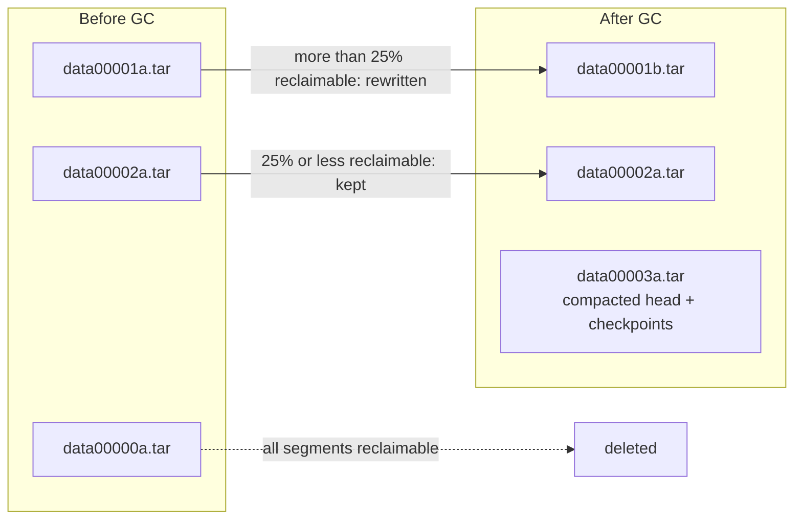

# 🗃️ TAR Files: Segment Containers

TAR files are the physical containers that store segments on disk. Understanding their structure helps diagnose and recover from corruption.

## TAR File Naming

```
segmentstore/
├── data00000a.tar    ← Generation 'a', sequence 00000
├── data00001a.tar    ← Generation 'a', sequence 00001
├── data00002b.tar    ← Generation 'b' (rewritten once by GC cleanup)
├── data00003a.tar    ← Newest file (new writes, incl. compaction output)
├── journal.log
├── gc.log            ← GC history
├── manifest          ← Store version
└── repo.lock         ← Repository lock file
```

### Naming Convention

```
data[SEQUENCE][GENERATION].tar
     │         │
     │         └── a, b, c, d... z (increments when GC cleanup rewrites this file)
     └── 00000, 00001, 00002... (increments as files fill up)
```

### Generation Letter Limits

The generation letter is **per file**, not a compaction counter. Every new TAR file starts at `a`; compaction writes its output into new `a` files with higher sequence numbers. The letter only increments when GC cleanup rewrites that particular file to drop reclaimable segments:
- `a` → As originally written
- `b` → After the 1st cleanup rewrite of this file
- `c` → After the 2nd cleanup rewrite of this file
- ...
- `z` → **Final generation** (cleanup will not rewrite it again)

::: warning Generation 'z' Limit
If a TAR file reaches generation 'z', cleanup can **no longer rewrite it**, even if it contains reclaimable space (debug log: `No garbage collection after reaching generation z`). Its content is still compacted normally, and the file is still deleted once *all* its segments are reclaimable.
:::

## TAR File Structure

Each TAR file contains:

```
┌─────────────────────────────────────┐
│  Segment 1 (up to 256 KiB)          │  ← Immutable content
├─────────────────────────────────────┤
│  Segment 2                          │
├─────────────────────────────────────┤
│  Segment 3                          │
├─────────────────────────────────────┤
│  ...                                │
├─────────────────────────────────────┤
│  Segment N                          │
├─────────────────────────────────────┤
│  Binary References (.brf)           │  ← Rebuildable metadata
├─────────────────────────────────────┤
│  Graph (.gph, segment references)   │
├─────────────────────────────────────┤
│  Index (.idx, UUID → offset, CRC32) │  ← Footer
└─────────────────────────────────────┘
```

### Footer Components

| Component | Purpose | Recovery Implication |
|-----------|---------|---------------------|
| **Graph** | Segment reference relationships | ✅ Can be rebuilt |
| **Binary Refs** | Pointers to DataStore blobs | ✅ Can be rebuilt |
| **Index** | Fast UUID lookups | ✅ Can be rebuilt |

::: tip Recovery Distinction
- **TAR index corruption** (footer) = **RECOVERABLE** - metadata can be rebuilt by scanning segment data
- **Segment data corruption** (body) = **NOT RECOVERABLE** - immutable data is gone
:::

## The `repo.lock` File

The `repo.lock` file prevents multiple processes from opening the same repository simultaneously.

### What It Is

```
File: crx-quickstart/repository/segmentstore/repo.lock
Purpose: Prevents concurrent repository access
Contents: Nothing — the protection is an OS file lock (java.nio FileChannel.lock()) on this file
Created: When AEM starts and opens the repository (if not already present)
Deleted: Never — on shutdown Oak only releases the lock; the empty file stays
```

### How It Works

```
1. AEM starts
2. Oak opens (or creates) repo.lock and requests an exclusive OS lock on it
3. If another process holds the lock:
   - Oak WAITS for it (FileChannel.lock() blocks) — startup appears to hang
   - Same JVM already has the store open: fails with "<dir> is in use by another store."
4. If no process holds the lock (incl. after a crash — the OS drops locks of dead processes):
   - Lock acquired, startup proceeds
```

Read-only tools (`oak-run check`, `debug`, `recover-journal`) open the store read-only and do **not** take this lock.

### Why It Exists

- 🛡️ **Prevents catastrophic corruption**: Two processes writing to same TAR files = guaranteed corruption
- 🛡️ **Prevents data loss**: Concurrent writes would overwrite each other's segments
- 🛡️ **Prevents split-brain**: Ensures only one "truth" about repository state

### The "Just Delete It" Advice (Why It's Dangerous)

| Scenario | "Delete repo.lock" Result | Why It's Bad |
|----------|---------------------------|--------------|
| **AEM actually still running** | 🔥 **CATASTROPHIC** | The next process creates a fresh repo.lock, locks *that*, and two AEM instances write to same repository → guaranteed corruption |
| **AEM crashed, lock is stale** | ✅ Harmless but pointless | The OS released the lock when the process died; the leftover file does not block startup |
| **Repository is corrupt** | ⚠️ **MASKS PROBLEM** | AEM starts, immediately crashes on corruption |
| **Multiple AEM instances misconfigured** | 🔥 **CATASTROPHIC** | Both instances now think they own the repository |

### Proper Diagnostic Process

```bash
# Step 1: Verify AEM is actually stopped
ps aux | grep java | grep aem
# OR
ps aux | grep crx-quickstart

# Step 2: Find which process (if any) holds the lock (the file itself is empty)
lsof crx-quickstart/repository/segmentstore/repo.lock
# Example output: java  12345 aem ... repo.lock

# Step 3: Check if that process is still running
ps -p 12345
# If "no such process" / lsof shows nothing: no lock is held — deleting the file is not needed
# If process exists: STOP! That process is using the repository

# Step 4: If process exists, identify it
ps -fp 12345
# Is it AEM? Another oak-run command? Something else?

# Step 5: If startup still hangs/fails with no lock holder, check for other issues
df -h                    # Disk space
dmesg | grep -i error    # Disk errors
ls -la crx-quickstart/repository/segmentstore/  # Permissions
```

::: danger The Real Danger
```
Scenario: Clustered environment, shared NFS storage
Operator: "AEM won't start on server2, repo.lock exists"
Operator: *deletes repo.lock without checking*
Reality: Server1's AEM is still running, using that repository
Result: Server2 starts, both write to same repository
Outcome: CATASTROPHIC CORRUPTION within minutes
```
:::

### When Deleting repo.lock Is Safe

- ✅ AEM is definitely stopped (verified with `ps`)
- ✅ No process holds the lock (verified with `lsof`)
- ✅ No other oak-run commands are running
- ✅ No other processes accessing the repository
- ✅ You're on the correct server (not accidentally checking wrong instance)

### When Deleting repo.lock Is Dangerous

- 🔴 You didn't check if AEM is running
- 🔴 You're in a clustered environment (multiple servers)
- 🔴 You're not sure which process holds the lock
- 🔴 Startup "hangs" at repository open (another process holds the lock)
- 🔴 You're following "just delete it" advice without understanding why

::: tip Bottom Line
- 💡 **repo.lock is a safety mechanism, not a bug**
- 💡 **A leftover repo.lock file never blocks startup by itself — if AEM waits on it, some live process holds the lock: find it**
- 💡 **"Just delete it" works 90% of the time, but the 10% causes catastrophic corruption**
- 💡 **Take 30 seconds to verify, save hours of recovery work**
:::

## TAR File Size

- **Maximum size**: 256 MiB per TAR file by default (OSGi `tarmk.size`, in MB); the writer rolls over after the write that reaches the limit, so a file can slightly exceed it
- **When full**: New TAR file created with incremented sequence number
- **After compaction**: Compacted content goes into new files (next sequence numbers, letter `a`); the sequence never resets

## Generations and Compaction


```mermaid
graph LR
    subgraph "Before GC"
        A1[data00000a.tar]
        A2[data00001a.tar]
        A3[data00002a.tar]
    end
    
    subgraph "After GC"
        B1[data00001b.tar]
        B2[data00002a.tar]
        B3[data00003a.tar<br/>compacted head + checkpoints]
    end
    
    A1 -.-> |all segments reclaimable| D[deleted]
    A2 --> |more than 25% reclaimable: rewritten| B1
    A3 --> |25% or less reclaimable: kept| B2
```

After compaction:
1. Compaction rewrites the current head and checkpoints into new segments (new GC generation), written to new TAR files (`data00003a.tar`)
2. Cleanup marks segments of generations older than the 2 retained ones as reclaimable, then per file: deletes it if nothing is left, rewrites it as the next letter if more than 25% is reclaimable, otherwise keeps it
3. Replaced/emptied files are deleted by the file reaper (log: `Removed files ...`) — **no `.tar.bak` is created by GC**

## The `.tar.bak` Files

```bash
# After a TAR index recovery, you might see:
data00005a.tar.bak     ← Damaged original, renamed by recovery on startup
data00005a.tar         ← Regenerated file, active
data00007a.tar.ro.bak  ← Recovered copy made by a read-only open (e.g. oak-run check)
```

::: danger ⚠️ CRITICAL: .tar.bak Files Do NOT Auto-Cleanup
`.tar.bak` files **linger indefinitely** by design. It's common to find `.tar.bak` files that are **months or years old**. They are not produced by compaction: Oak creates them only when it opens a TAR file without a valid index (see [TAR Index Recovery](#tar-index-recovery)) and keeps the damaged original "for manual inspection". Nothing ever deletes them.

**Why they accumulate:**
1. AEM/Oak opens a TAR file whose index is missing or invalid (crash, disk full, truncated copy)
2. Oak renames the damaged file to `.bak` (or `.N.bak` if that name is taken) and writes a regenerated TAR file under the original name
3. A read-only open (e.g. `oak-run check`) leaves the original untouched and writes a recovered `.ro.bak` copy instead
4. Oak never looks at `.bak` / `.ro.bak` files again

**What this means:**
- ❌ Don't assume Oak will clean them up automatically
- ✅ `.tar.bak` files will consume disk space until manually removed
- ✅ Safe to delete `.tar.bak` files **AFTER** successful AEM restart
- ⚠️ **NEVER** delete `.tar.bak` files before verifying AEM starts successfully
:::

### When It's Safe to Delete .tar.bak Files

```bash
# 1. Verify AEM is running successfully with the regenerated file
$ ls -lh crx-quickstart/repository/segmentstore/data*.tar
# Should see data00005a.tar (regenerated)

# 2. Check AEM error.log for startup errors
$ tail -n 1000 crx-quickstart/logs/error.log | grep -i "segment\|repository"
# No SegmentNotFoundException or corruption errors

# 3. Verify AEM has been running for at least 24 hours without issues

# 4. NOW safe to delete .tar.bak files
$ rm crx-quickstart/repository/segmentstore/*.tar.bak
```

::: warning Recovery Opportunity
A `.tar.bak` is the damaged original: entries that recovery skipped (e.g. `Checksum mismatch in entry ...`) may still be salvageable from it. **Keep .tar.bak files during troubleshooting.**
:::

## TAR Index Recovery

### When TAR Index Corruption Happens (vs Segment Corruption)

**TAR Index Corruption** (recoverable):
- **What's broken**: Index/footer is corrupted or truncated
- **What's intact**: Segment data is still readable
- **Common causes**:
  - Process killed during tar file write (SIGKILL, OOM kill)
  - Disk full during tar file creation (index write fails)
  - Filesystem corruption affecting file tail/footer
  - Incomplete rsync/copy operation (footer not synced)
- **Symptoms** (WARN on open): `Unable to load index of file data00005a.tar: Invalid checksum` (or `Magic number mismatch`, `File too short`, …), then `Could not find a valid tar index in [...], recovering...`
- **Recovery**: **Automatic** - Oak scans segment data and rebuilds index

**Segment Data Corruption** (NOT recoverable by index rebuild):
- **What's broken**: Actual segment bytes are corrupted
- **Common causes**:
  - Disk/hardware failure (bad sectors)
  - Compaction + cleanup over corruption (segments deleted)
  - Filesystem corruption affecting file body
- **Symptoms**: `SegmentNotFoundException`, checksum failures
- **Recovery**: **NOT automatic** - requires surgical removal, sidegrade, or backup restore (note: `oak-run recovery` is a DocumentNodeStore/MongoMK tool, not for TarMK)

### How TAR Index Recovery Works

**When it runs**: Automatically triggered when opening tar files if no generation of that file (`data00005a.tar`, `data00005b.tar`, …) has a valid index. If several generations exist and one has a valid index, Oak opens the newest valid one and deletes the others (`Removing unused tar file ...`).

**How it works**:
1. Oak tries to read TAR index from footer
2. If index is corrupted/missing → triggers automatic recovery
3. Scans raw TAR file data sequentially to find all segment entries (entries with a bad checksum or truncated at the end are skipped with a WARN)
4. Extracts segment IDs and data
5. Backs up each damaged file to `.bak` (read-write open) — a read-only open never touches the original
6. Writes a new TAR file (graph, binary references, index rebuilt) under the original name, or as `.ro.bak` for a read-only open

**This is automatic** - no special command needed:

```bash
$ java -jar oak-run-*.jar check /path/to/segmentstore

# check opens the store read-only; if a tar index is corrupted, the log shows:
# "Could not find a valid tar index in data00005a.tar, recovering read-only"
# "Recovering segments from tar file data00005a.tar"
# "Regenerating tar file data00005a.tar.ro.bak"

# Recovery happens automatically, then check proceeds normally
```

## The 25% Cleanup Threshold

Cleanup uses a **25% threshold** to avoid thrashing:

```
If space savings > 25% of tar file size:
  → Create new tar file with next letter (data00006a.tar → data00006b.tar)
  → Copy only non-reclaimable segments to new tar
  → Close old tar file (deleted afterwards by the file reaper)

If space savings <= 25%:
  → Keep old tar file as-is (not worth the I/O cost)

If nothing in the file is still needed:
  → Delete the whole file
```

Before Oak 1.86, a TAR file that lacks a segment graph (`.gph`) is rewritten regardless of savings (`Recovering ..., which is missing its graph.`) *(before Oak 1.86 — AEM 6.5, LTS GA and LTS SP1)*. See [which LTS SP has which Oak](/reference/oak-versions).

**Why this exists:**
- Rewriting a tar file has I/O cost
- Creating new tar generation consumes a letter (max 26 generations)
- If savings <= 25%, the cost > benefit

**Example:**
```
data00006a.tar (256 MB):
- 80 MB reclaimable (~31%)   → WILL rewrite to data00006b.tar (~176 MB)
- 32 MB reclaimable (12.5%) → WON'T rewrite, keep data00006a.tar as-is
```

## Inspecting TAR Files

```bash
# List raw TAR entries: segments are named <uuid>.<crc32>,
# followed by data00000a.tar.brf / .gph / .idx
$ tar -tvf /path/to/segmentstore/data00000a.tar

# Per-TAR debug info (node states referencing it, TAR graph); store is opened read-only
$ java -jar oak-run-*.jar debug /path/to/segmentstore data00000a.tar

# GUI alternative: menu "Tar File Info" (needs a display)
$ java -jar oak-run-*.jar explore /path/to/segmentstore

# Consistency of the whole store
$ java -jar oak-run-*.jar check /path/to/segmentstore
```

## Common TAR Issues

| Issue | Symptom | Solution |
|-------|---------|----------|
| **Corrupted index** | `Unable to load index of file …` | Automatic recovery on open |
| **Truncated file** | `Partial entry … ignoring...` during recovery | Recovery keeps complete entries; segments lost from the tail → recovery procedures / restore |
| **Missing segments** | `SegmentNotFoundException` | Recovery procedures |
| **Disk full during write** | Partial TAR | Remove incomplete, restore |
| **Generation 'z' reached** | Cleanup can't rewrite that file any more | Manual intervention |

## Key Takeaways

::: tip Remember
1. **TAR files are containers** - they hold segments sequentially
2. **Generation letters** count cleanup rewrites of one file (a → b → c → ... → z), not compaction cycles
3. **Generation 'z' is the limit** - cleanup can't rewrite that file further
4. **Footer is rebuildable** - index corruption is auto-recoverable
5. **Segment corruption is not** - data loss is permanent
6. **repo.lock is a safety mechanism** - don't blindly delete it
7. **.tar.bak files linger** - they come from TAR index recovery, never auto-cleanup, delete manually after verification
8. **25% threshold** - cleanup only rewrites if savings exceed 25%
:::
