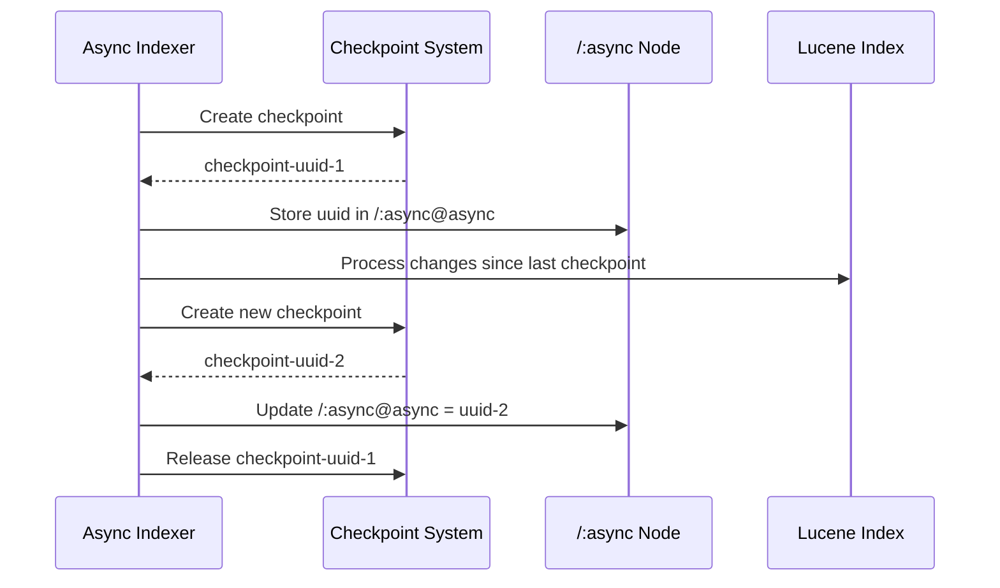

# 🔄 Async Indexing and Checkpoints

Understanding how async indexing uses checkpoints helps diagnose indexing issues and disk bloat.

## How Async Indexing Works



## The /:async Node

The `/:async` node stores indexer state:

```
/:async
├── async = "b8dbd53c-af46-4764-bd3b-df48d4a85438"
├── async-LastIndexedTo = 2025-01-13T10:30:00
├── async-temp = []
├── fulltext-async = "5be6e6eb-8875-405f-b157-a869080cb859"
├── fulltext-async-LastIndexedTo = 2025-01-13T10:30:00
└── fulltext-async-temp = []
```

### Properties Explained

| Property | Purpose |
|----------|---------|
| `async` | Current checkpoint UUID for "async" lane |
| `async-LastIndexedTo` | Timestamp of last successful index |
| `async-temp` | Temporary checkpoints during indexing |
| `fulltext-async` | Checkpoint for fulltext indexing lane |

## Indexing Lanes

AEM uses multiple indexing lanes:

| Lane | Purpose | Index Types |
|------|---------|-------------|
| `async` | General async indexes | Property indexes |
| `fulltext-async` | Full-text search | Lucene indexes |
| `elastic-async` | Elasticsearch | Elastic indexes |

## Viewing Indexer Status

### Via JMX

```
http://localhost:4502/system/console/jmx

Look for: IndexStatsMBean
```

### Via oak-run

```bash
$ java -jar oak-run-*.jar console /path/to/segmentstore

> session.getNode("/:async").getProperties()
```

## Common Issues

### Indexer Stuck

**Symptom**: `async-LastIndexedTo` not updating

**Causes**:
- Large content changes overwhelming indexer
- Index corruption
- Resource constraints

**Solution**:
```bash
# Check indexer status in JMX
# If stuck, may need to reindex
```

### Temp Checkpoints Accumulating

**Symptom**: `async-temp` has multiple entries

**Cause**: Indexer failing mid-cycle

**Solution**: See [Death Loop](/checkpoints/death-loop)

## Key Takeaways

::: tip Remember
1. **Each lane has its own checkpoint** - Multiple indexers, multiple checkpoints
2. **Checkpoints pin segments** - Until indexer releases them
3. **/:async stores state** - Check here for indexer health
4. **Temp checkpoints = problems** - Should be empty normally
:::
