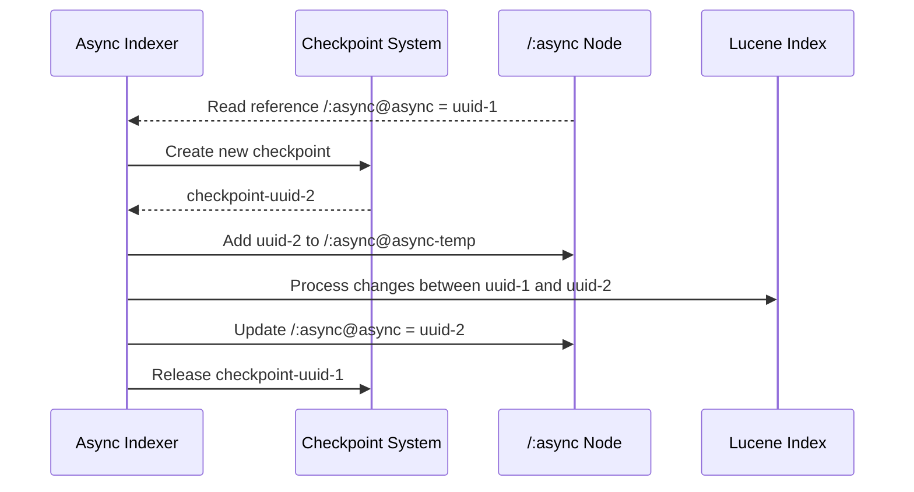

# 🔄 Async Indexing and Checkpoints

Understanding how async indexing uses checkpoints helps diagnose indexing issues and disk bloat.

## How Async Indexing Works


```mermaid
sequenceDiagram
    participant Indexer as Async Indexer
    participant CP as Checkpoint System
    participant Async as /:async Node
    participant Index as Lucene Index
    
    Async-->>Indexer: Read reference /:async@async = uuid-1
    Indexer->>CP: Create new checkpoint
    CP-->>Indexer: checkpoint-uuid-2
    Indexer->>Async: Add uuid-2 to /:async@async-temp
    Indexer->>Index: Process changes between uuid-1 and uuid-2
    Indexer->>Async: Update /:async@async = uuid-2
    Indexer->>CP: Release checkpoint-uuid-1
```

## The /:async Node

The `/:async` node stores indexer state:

```
/:async
├── async = "b8dbd53c-af46-4764-bd3b-df48d4a85438"
├── async-LastIndexedTo = 2025-01-13T10:30:00
├── async-temp = ["<previous uuid>", "b8dbd53c-af46-4764-bd3b-df48d4a85438"]
├── fulltext-async = "5be6e6eb-8875-405f-b157-a869080cb859"
├── fulltext-async-LastIndexedTo = 2025-01-13T10:30:00
└── fulltext-async-temp = ["<previous uuid>", "5be6e6eb-8875-405f-b157-a869080cb859"]
```

### Properties Explained

| Property | Purpose |
|----------|---------|
| `async` | Current checkpoint UUID for "async" lane |
| `async-LastIndexedTo` | Timestamp of last successful index |
| `async-temp` | Temporary checkpoints during indexing (1-2 entries is normal) |
| `async-lease` | Lease expiry (epoch ms) while a run is in progress, removed when the run closes (lease timeout 15 min) |
| `fulltext-async` | Checkpoint for fulltext indexing lane |

::: info Oak 1.22 vs 2.4: checkpoint lifetime
Each run creates its checkpoint with a fixed lifetime. Expired checkpoints are deleted the next time any checkpoint is created. If a lane stays stuck longer than this lifetime, it loses its reference checkpoint and logs `Failed to retrieve previously indexed checkpoint …; re-running the initial index update`.
- **AEM 6.5 (Oak 1.22.x):** 1000 days.
- **AEM 6.5 LTS SP3 (Oak 2.4.0):** 100 days *(since Oak 1.66)*. See [which LTS SP has which Oak](/reference/oak-versions).
:::

## Indexing Lanes

AEM uses multiple indexing lanes:

| Lane | Purpose | Index Types |
|------|---------|-------------|
| `async` | General async indexes | Property indexes |
| `fulltext-async` | Full-text search | Lucene indexes |

## Viewing Indexer Status

### Via JMX

```
http://localhost:4502/system/console/jmx

Look for: IndexStatsMBean (type=IndexStats, name=<lane>)
```

### Via oak-run

```bash
$ java -jar oak-run-*.jar console /path/to/segmentstore

> :cd /:async
> :pn
```

## Common Issues

### Indexer Stuck

**Symptom**: `async-LastIndexedTo` not updating

**Causes**:
- Large content changes overwhelming indexer
- Index corruption
- Resource constraints

**Solution**:
```bash
# Check indexer status in JMX
# If stuck, may need to reindex
```

### Temp Checkpoints Accumulating

**Symptom**: `async-temp` has more than 2 entries

**Cause**: Oak failing to release checkpoints (each entry whose `release()` fails is kept)

**Solution**: See [Death Loop](/checkpoints/death-loop)

## Key Takeaways

::: tip Remember
1. **Each lane has its own checkpoint** - Multiple indexers, multiple checkpoints
2. **Checkpoints pin segments** - Until indexer releases them
3. **/:async stores state** - Check here for indexer health
4. **Temp checkpoints = problems** - Normally 1-2 entries; more means releases are failing
:::
