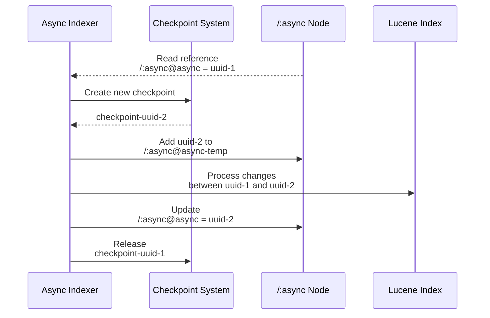

# 🔄 Async Indexing and Checkpoints

::: info 🎯 Scope
SegmentStore (TarMK) • Oak 1.22.x – 2.4.0 ([version scope](/reference/oak-versions))  
**Not for AEMaaCS**
:::

Understanding how async indexing uses checkpoints helps diagnose indexing issues and disk bloat.

## How Async Indexing Works


```mermaid
sequenceDiagram
    participant Indexer as Async Indexer
    participant CP as Checkpoint System
    participant Async as /:async Node
    participant Index as Lucene Index
    
    Async-->>Indexer: Read reference<br/>/:async@async = uuid-1
    Indexer->>CP: Create new checkpoint
    CP-->>Indexer: checkpoint-uuid-2
    Indexer->>Async: Add uuid-2 to<br/>/:async@async-temp
    Indexer->>Index: Process changes<br/>between uuid-1 and uuid-2
    Indexer->>Async: Update<br/>/:async@async = uuid-2
    Indexer->>CP: Release<br/>checkpoint-uuid-1
```

## The /:async Node

The `/:async` node stores indexer state:

```
/:async
├── async = "b8dbd53c-af46-4764-bd3b-df48d4a85438"
├── async-LastIndexedTo = 2025-01-13T10:30:00
├── async-temp = ["<previous uuid>", "b8dbd53c-af46-4764-bd3b-df48d4a85438"]
├── fulltext-async = "5be6e6eb-8875-405f-b157-a869080cb859"
├── fulltext-async-LastIndexedTo = 2025-01-13T10:30:00
└── fulltext-async-temp = ["<previous uuid>", "5be6e6eb-8875-405f-b157-a869080cb859"]
```

### Properties Explained

| Property | Purpose |
|----------|---------|
| `async` | Current checkpoint UUID for "async" lane |
| `async-LastIndexedTo` | Timestamp of last successful index |
| `async-temp` | Temporary checkpoints during indexing (1-2 entries is normal) |
| `async-lease` | Lease expiry (epoch ms) while a run is in progress, removed when the run closes (lease timeout 15 min; the value is set 2 × the timeout ahead and renewed while the run traverses) |
| `fulltext-async` | Checkpoint for fulltext indexing lane |

::: info Oak 1.22 vs 2.4: checkpoint lifetime
Each run creates its checkpoint with a fixed lifetime. Expired checkpoints are deleted the next time any checkpoint is created. If a lane stays stuck longer than this lifetime, it loses its reference checkpoint and logs `Failed to retrieve previously indexed checkpoint …; re-running the initial index update`.
- **AEM 6.5 (Oak 1.22.x):** 1000 days.
- **AEM 6.5 LTS SP3 (Oak 2.4.0):** 100 days *(since Oak 1.66)*. See [which LTS SP has which Oak](/reference/oak-versions).
:::

## Indexing Lanes

AEM uses multiple indexing lanes:

| Lane | Purpose | Index Types |
|------|---------|-------------|
| `async` | General async indexes | Almost all Lucene indexes (`damAssetLucene`, `cqPageLucene`, `ntBaseLucene`, …) and the `counter` index. Plain `type=property` indexes are synchronous and use no lane |
| `fulltext-async` | Full-text search | The generic full-text Lucene index `/oak:index/lucene` |

Checked on AEM 6.5.23 (index definitions) and AEM 6.5 LTS SP3 (reindex log). Many `async` indexes also list `nrt` (near-real-time, in memory between runs) on AEM 6.5. Only `async` and `fulltext-async` hold checkpoints.

## Viewing Indexer Status

### Via JMX

```
http://localhost:4502/system/console/jmx

Look for: IndexStatsMBean (type=IndexStats, name=<lane>)
```

Checkpoint-related attributes: `ReferenceCheckpoint`, `ProcessedCheckpoint` (the in-flight one), `TemporaryCheckpoints` (the in-memory copy of `-temp`, empty after a restart until the first run with changes), `Failing`, `FailingSince`, `ConsecutiveFailedExecutions`, `LatestError`. Operations: `pause()`, `abortAndPause()`, `resume()`.

::: info Oak 1.22 vs 2.4: IndexStats operations
- **AEM 6.5 (Oak 1.22.x):** lane control is `pause()`, `abortAndPause()`, `resume()` only. A lease left behind by a crashed run blocks the lane until it expires.
- **AEM 6.5 LTS SP3 (Oak 2.4.0):** adds `releaseLeaseForPausedLane()` *(since Oak 1.42)* and `forceIndexLaneCatchup("CONFIRM")` *(since Oak 1.66)*, which moves a failing lane to a new checkpoint at HEAD (Oak 1.66–1.82 refuse a lane that isn't failing; since Oak 1.84 it moves any lane, healthy ones included) ([Checkpoint Advancement](/checkpoints/checkpoint-advancement)).
:::

### Via oak-run

```bash
$ java -jar oak-run-*.jar console /path/to/segmentstore

# The node commands have no colon: `cd`, `ls`, `pn` (`:cd` is a Groovy syntax error)
/> cd /:async
/:async> pn
{ async-temp = [...], async = ..., fulltext-async = ..., async-LastIndexedTo = ... }
```

## Common Issues

### Indexer Stuck

**Symptom**: `async-LastIndexedTo` not updating

**Causes**:
- Large content changes overwhelming indexer
- Index corruption
- Resource constraints

**Solution**:
```bash
# Check indexer status in JMX
# If stuck, may need to reindex
```

### Temp Checkpoints Accumulating

**Symptom**: `async-temp` has more than 2 entries that still exist in `checkpoints list`, and the lane is failing (stale entries alone are normal on a busy store: [why](/checkpoints/#death-loop-detection))

**Cause**: Oak failing to release checkpoints (each entry whose `release()` fails is kept). `release()` fails whenever another commit holds the store's commit lock, so during busy write periods the list grows with IDs of checkpoints that are already gone. Compare with `oak-run checkpoints list`: only entries that still exist cost disk space

**Solution**: See [Death Loop](/checkpoints/death-loop)

## Key Takeaways

::: tip Remember
1. **Each lane has its own checkpoint** - Multiple indexers, multiple checkpoints
2. **Checkpoints pin segments** - Until indexer releases them
3. **/:async stores state** - Check here for indexer health
4. **Temp checkpoints = problems** - Normally 1-2 entries; more means releases are failing. A problem when those checkpoints still exist
:::

::: info 📅 Last Updated
Content last reviewed: October 2026 • Verified against Oak 1.22.24 (AEM 6.5) and Oak 2.4.0 (AEM 6.5 LTS SP3)
:::
