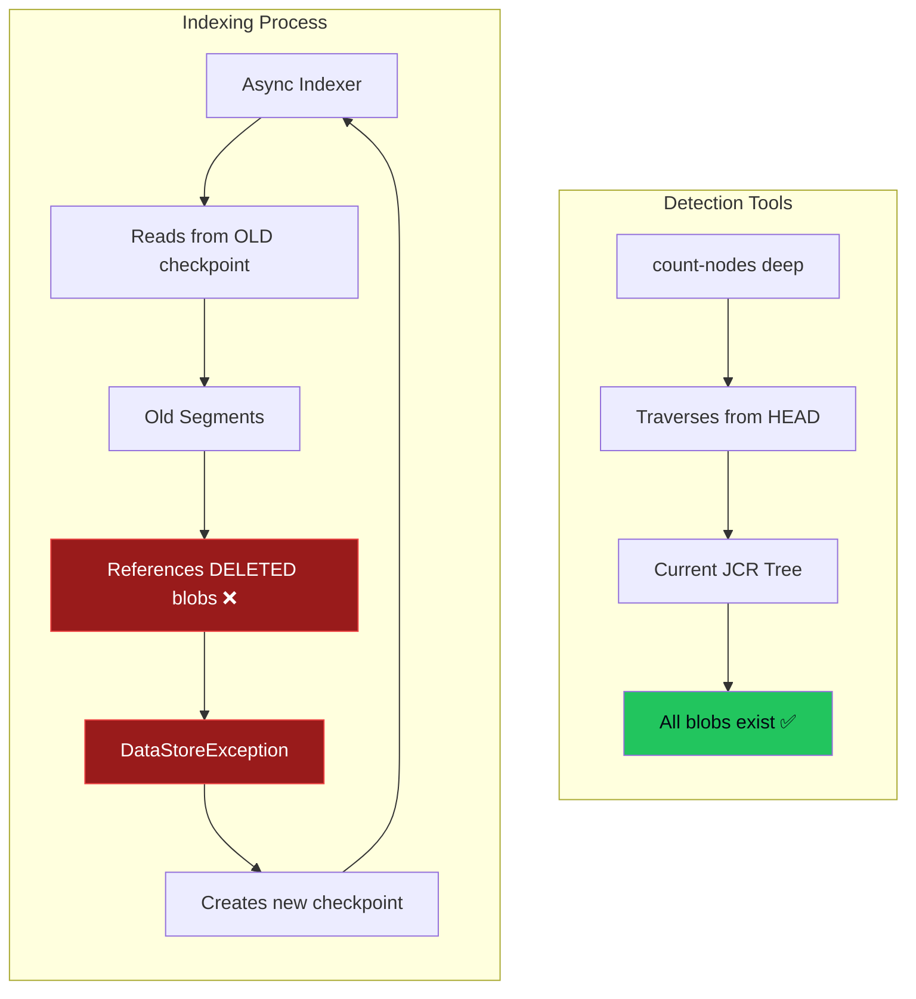

# 🔧 Checkpoint Advancement: The Nuclear Option

When async indexing is frozen for weeks/months and standard fixes don't work, **checkpoint advancement** skips the problematic historical delta and restarts indexing from current HEAD.

::: warning ⚠️ When to Use This
This is the **preferred approach** from the Oak core team for:
- ✅ Async lanes frozen for weeks/months
- ✅ Old checkpoints preventing indexing progress
- ✅ Detection tools show "0 missing blobs" but indexing still fails
- ✅ Segment store is healthy (no corruption)
- ✅ Want to avoid complete re-indexing (hours saved vs days)
:::

## The Invisible Missing Blob Problem

### Why Standard Detection Misses Them

This is the **most confusing scenario** in Oak troubleshooting:

```
✅ datastorecheck --verbose shows 0 missing blobs
✅ count-nodes deep finds no missing binaries  
✅ Segmentstore is healthy
❌ Indexing loops and fails
❌ DataStore size keeps growing
❌ Checkpoints are months old
❌ Error logs show repeated "DataStoreException: Record does not exist"
```

::: warning ⚠️ Not in Apache Oak
`:count-nodes` and `:remove-nodes` are not part of Apache Jackrabbit Oak (any version). They come from a community fork. See [Fork-only console commands](/reference/oak-versions#fork-only-console-commands) for how to get a build that matches your Oak version.
:::

**Why this happens:**


```mermaid
flowchart TD
    subgraph "Detection Tools"
        direction TB
        C[count-nodes deep] --> B[Traverses from HEAD]
        B --> D[Current JCR Tree]
        D --> E[All blobs exist ✅]
    end
    
    subgraph "Indexing Process"
        direction TB
        F[Async Indexer] --> G[Reads from OLD checkpoint]
        G --> H[Old Segments]
        H --> I[References DELETED blobs ❌]
        I --> J[DataStoreException]
        J --> K[Creates new checkpoint]
        K --> F
    end
    
    style E fill:#22c55e,color:#030712
    style I fill:#991b1b,stroke:#ef4444,color:#fff
    style J fill:#991b1b,stroke:#ef4444,color:#fff
```

### The Timeline of Invisible Blobs

```
Month 1: Normal operation
├─ Checkpoint cp1 created → references segmentA in data00001a.tar
├─ SegmentA contains blob references to DataStore blobs
├─ DataStore blobs exist and are accessible
└─ /:async@async = "cp1"

Month 2: Indexing starts failing
├─ Indexing hits missing DataStore blobs
├─ Creates checkpoint cp2, but indexing fails → cp2 is released again
├─ /:async@async stays "cp1" (only a successful run moves it)
└─ cp1 keeps its Month-1 content alive through every compaction

Month 3: DataStore GC runs
├─ Deletes blobs no longer referenced in current HEAD
├─ BUT: Old segments (pinned by checkpoints) still reference them
├─ Old segments are NOT part of current JCR tree
└─ Detection tools never see these references

Month 4-6: Death loop
├─ Indexer reads from old checkpoint
├─ Encounters blob references in old segments
├─ Blobs were deleted by DataStore GC
├─ Indexing fails, creates and releases a new checkpoint each run
├─ Repeat forever...
└─ Checkpoints whose release fails (and stay in *-temp) accumulate
```

### Why Detection Tools Miss These Blobs

| Tool | What It Does | Why It Misses Invisible Blobs |
|------|--------------|-------------------------------|
| `datastorecheck --consistency` | Without `--verbose`: reads the binary-reference index of every tar file (all retained GC generations). With `--verbose`: walks HEAD | ⚠️ Without `--verbose` it does **not** miss them on TarMK; with `--verbose` it does - see below |
| `count-nodes deep` | Reads blobs from HEAD | Old segments not traversed |
| `oak-run check` | Validates segment graph | Doesn't check DataStore blobs |

**The key insight**: Detection tools traverse the **current JCR tree** (HEAD revision). Old segments pinned by checkpoints are **not part of the current tree** - they're historical snapshots that only the indexer sees when it reads from an old checkpoint.

::: warning What the Oak code actually does (Oak 1.22 and 2.4)
On TarMK, neither `datastorecheck --consistency` without `--verbose` nor DataStore GC walks the tree from HEAD. Both collect blob IDs through `SegmentBlobReferenceRetriever`, which reads the binary-reference index of every tar file for all GC generations that are not reclaimable. Compaction rewrites every checkpoint into the current generation, so blobs that only a checkpoint references are included. DataStore GC keeps them, and `datastorecheck` reports them if they are missing. If "0 missing blobs" and `DataStoreException` occur together, something other than this repository's DataStore GC removed the blob (for example, manual deletion or a shared DataStore swept without this repository's references). Treat the "Month 3" step above as a hypothesis, not as Oak behavior. `--verbose` changes this: with it, `datastorecheck --consistency` and `datastore --check-consistency` walk HEAD from `/` and miss blobs that only a checkpoint references (tested on Oak 1.22.24 and 2.4.0). The key insight holds for `count-nodes` and for every `--verbose` run ([what each check can see](/datastore/consistency#what-each-check-can-see)).
:::

## The Solution: Checkpoint Advancement

**Concept**: Create a new checkpoint at current HEAD, update `/:async` to reference it, and release old checkpoints. The indexer then continues from current HEAD, skipping the problematic historical delta.

::: info Oak 1.22 vs 2.4
- **AEM 6.5 (Oak 1.22.x):** no built-in operation. Use the offline procedure below.
- **AEM 6.5 LTS SP3 (Oak 2.4.0):** the IndexStats MBean of each lane has `forceIndexLaneCatchup` *(since Oak 1.66)*. Pass `CONFIRM` as the argument. It runs only while the lane is failing (otherwise it returns "The lane is not failing…"). It calls `abortAndPause()` and releases the lease, creates a new checkpoint, sets `/:async@<lane>` to it, releases the old reference checkpoint, and resumes the lane, all online. Reindexing is still required afterwards (Phase 6). See [which LTS SP has which Oak](/reference/oak-versions).
:::

### Phase 1: Pre-Flight Validation

#### 1.1: Verify Segment Store Health

```bash
java -jar oak-run-*.jar check /path/to/segmentstore

# Must see:
# ✅ "Searched through X revisions and Y checkpoints"
# ✅ "Latest good revision for paths and checkpoints checked is ..."
# ✅ No "Error while traversing ..." lines

# If errors → STOP! Segment store is corrupt
# Do NOT proceed with checkpoint manipulation
```

#### 1.2: Verify Current HEAD is Clean

```bash
# Check for missing blobs in CURRENT repository state
java -jar oak-run-*.jar datastorecheck --consistency \
  --fds /path/to/FileDataStore.config \
  --store /path/to/segmentstore \
  --repoHome /path/to/crx-quickstart/repository \
  --dump /tmp/check

# --fds takes the FileDataStore config file, not the datastore directory
# --repoHome is required with --consistency
# Must see: "Consistency check found 0 missing blobs"
# If missing blobs found → Fix these first with count-nodes + remove-nodes
```

#### 1.3: Check Async Lane Status (JMX)

```
http://localhost:4502/system/console/jmx
→ org.apache.jackrabbit.oak: name=async, type=IndexStats

Look for:
├─ LastIndexedTime: OLD (weeks/months ago) ← Problem indicator
├─ FailingSince: Date when indexing started failing
├─ ConsecutiveFailedExecutions: High number (100+) ← Death loop
└─ Status: failing / running (but not progressing)
```

### Phase 2: Pause Indexing Lanes

```bash
# Via JMX:
http://localhost:4502/system/console/jmx
→ IndexStats → async → abortAndPause()
→ IndexStats → fulltext-async → abortAndPause()

# Verify: attribute "Paused" shows true
# Note: the pause flag is held in memory only - after the
# restart in Phase 5 the lanes run again even without resume()
```

### Phase 3: Create New Checkpoint

#### 3.1: Stop AEM

```bash
./crx-quickstart/bin/stop

# Wait for complete shutdown
tail -f crx-quickstart/logs/error.log
# Wait for: "TarMK closed: .../segmentstore"
```

#### 3.2: Record Existing Checkpoints

```bash
java -jar oak-run-*.jar checkpoints /path/to/segmentstore list

# Output example:
# Checkpoints /path/to/segmentstore
# - 4ce77270-a456-4b6c-b8d7-7f6e8a9b1c2d created 2025-05-26 10:12:01.123 expires 2025-09-03 10:12:01.123   (OLD!)
# - 5be6e6eb-8875-42af-a3b4-1c2d3e4f5g6h created 2025-05-26 10:12:05.456 expires 2025-09-03 10:12:05.456   (OLD!)
# Found 2 checkpoints

# SAVE these UUIDs for cleanup later
```

#### 3.3: Create New Checkpoints at HEAD (one per lane)

```bash
# --read-write is required: in read-only mode the checkpoint is not persisted
java -jar oak-run-*.jar console --read-write /path/to/segmentstore

# In console, create one checkpoint per lane, 100-day lifetime (argument is in seconds):
:checkpoint 8640000
:checkpoint 8640000

# Output: "Checkpoint created: 5e69054a-1baf-4c3f-8a0a-784e0e2c821e (expires: <date>)."
# ↑ SAVE BOTH UUIDs! (one for async, one for fulltext-async)

:exit
```

::: warning Do not share one checkpoint between lanes
After its first successful run, a lane releases its previous reference checkpoint. If `async` and `fulltext-async` point to the same checkpoint, the first lane to succeed deletes it. The other lane then logs `Failed to retrieve previously indexed checkpoint …; re-running the initial index update` and traverses the whole repository.
:::

### Phase 4: Update Async Properties

#### 4.1: Create the Groovy Script

```groovy
// update-async-checkpoint.groovy
import org.apache.jackrabbit.oak.spi.commit.CommitInfo
import org.apache.jackrabbit.oak.spi.commit.EmptyHook

// REPLACE WITH YOUR TWO NEW CHECKPOINT UUIDs FROM STEP 3.3
newAsyncCheckpoint = "5e69054a-1baf-4c3f-8a0a-784e0e2c821e"
newFulltextCheckpoint = "<second-uuid-from-step-3.3>"

store = session.getStore()
rootBuilder = store.getRoot().builder()
asyncBuilder = rootBuilder.getChildNode(":async")

if (!asyncBuilder.exists()) {
    println "ERROR: /:async node does not exist!"
    return
}

// Record old values
oldAsyncCp = asyncBuilder.getProperty("async")?.getValue(org.apache.jackrabbit.oak.api.Type.STRING) ?: "none"
oldFulltextCp = asyncBuilder.getProperty("fulltext-async")?.getValue(org.apache.jackrabbit.oak.api.Type.STRING) ?: "none"

println "=== BEFORE ==="
println "async: ${oldAsyncCp}"
println "fulltext-async: ${oldFulltextCp}"

// Update checkpoints
asyncBuilder.setProperty("async", newAsyncCheckpoint)
asyncBuilder.setProperty("fulltext-async", newFulltextCheckpoint)
println "✓ Set async to: ${newAsyncCheckpoint}"
println "✓ Set fulltext-async to: ${newFulltextCheckpoint}"

// Clean up temp arrays
if (asyncBuilder.hasProperty("async-temp")) {
    tempValues = asyncBuilder.getProperty("async-temp").getValue(org.apache.jackrabbit.oak.api.Type.STRINGS)
    asyncBuilder.removeProperty("async-temp")
    println "✓ Removed async-temp array (${tempValues.size()} orphaned checkpoints)"
}

if (asyncBuilder.hasProperty("fulltext-async-temp")) {
    tempValues = asyncBuilder.getProperty("fulltext-async-temp").getValue(org.apache.jackrabbit.oak.api.Type.STRINGS)
    asyncBuilder.removeProperty("fulltext-async-temp")
    println "✓ Removed fulltext-async-temp array (${tempValues.size()} orphaned checkpoints)"
}

// Commit changes
store.merge(rootBuilder, EmptyHook.INSTANCE, CommitInfo.EMPTY)
println "✓ Changes committed successfully"

// Verify
freshRoot = store.getRoot()
freshAsync = freshRoot.getChildNode(":async")

println "\n=== AFTER (VERIFIED) ==="
println "async: ${freshAsync.getProperty("async").getValue(org.apache.jackrabbit.oak.api.Type.STRING)}"
println "fulltext-async: ${freshAsync.getProperty("fulltext-async").getValue(org.apache.jackrabbit.oak.api.Type.STRING)}"

println "\n=== OLD CHECKPOINTS TO RELEASE ==="
println "OLD async checkpoint: ${oldAsyncCp}"
println "OLD fulltext-async checkpoint: ${oldFulltextCp}"
```

#### 4.2: Execute the Script

```bash
# Open console in read-write mode:
java -jar oak-run-*.jar console --read-write /path/to/segmentstore

# Load and execute:
:load update-async-checkpoint.groovy

:exit
```

::: danger ⚠️ IMPORTANT
Do NOT paste the script line-by-line. Always use `:load` to execute the script file.
:::

#### 4.3: Release Old Checkpoints

```bash
# Use the UUIDs from Phase 3.2
java -jar oak-run-*.jar checkpoints /path/to/segmentstore rm 4ce77270-a456-4b6c-b8d7-7f6e8a9b1c2d
java -jar oak-run-*.jar checkpoints /path/to/segmentstore rm 5be6e6eb-8875-42af-a3b4-1c2d3e4f5g6h

# Verify only new checkpoint remains:
java -jar oak-run-*.jar checkpoints /path/to/segmentstore list
# Should show only the two new checkpoints from Phase 3.3
```

### Phase 5: Start AEM and Resume

```bash
./crx-quickstart/bin/start

# Once AEM is up, resume lanes via JMX (only needed if they still show Paused=true):
→ IndexStats → async → resume()
→ IndexStats → fulltext-async → resume()

# Verify:
├─ ReferenceCheckpoint: 5e69054a-... (NEW checkpoint!) ✅
├─ LastIndexedTime: Current timestamp ✅
├─ ConsecutiveFailedExecutions: 0 ✅
├─ Status: done / running (not failing) ✅
```

### Phase 6: Index Reconciliation

::: warning ⚠️ CRITICAL: Stale Index Data
Checkpoint advancement **skips** the historical delta. Index data on disk is now **stale** - it only has content up to the old checkpoint date.
:::

#### Understanding the Gap

```
After checkpoint advancement:
├─ Checkpoint advanced: May 26 → Oct 10 ✅
├─ Lanes tracking incrementally from Oct 10 ✅
├─ No phantom blob errors ✅
├─ Index data on disk: Only has content up to May 26 ⚠️
├─ Content changes May 26 → Oct 10: NOT in indexes ⚠️
└─ Indexes will track NEW changes (Oct 10+) ✅

This means:
❌ Assets uploaded May 27 → Oct 10: NOT searchable
❌ Pages created May 27 → Oct 10: NOT searchable  
✅ New content after Oct 10: WILL be indexed correctly
```

#### Reindexing Strategy Options

| Option | Timeline | Impact | When to Use |
|--------|----------|--------|-------------|
| **A: Accept Gap** | Immediate | Some search results missing | Emergency recovery |
| **B: Selective Reindex** | Hours-days | Critical indexes rebuilt | Balanced approach |
| **C: Full Reindex** | Days-weeks | All indexes rebuilt | Complete recovery |

**Option B (Recommended)**: Selectively reindex critical indexes:

```bash
# Via CRXDE or curl:
# Set reindex=true on critical indexes one at a time

# damAssetLucene (DAM search)
curl -u admin:admin -X POST \
  --data reindex=true \
  --data reindex@TypeHint=Boolean \
  http://localhost:4502/oak:index/damAssetLucene

# Monitor progress in JMX before starting next index
```

## Prevention

### Regular Checkpoint Cleanup

```bash
# Run monthly to prevent old checkpoint accumulation
java -jar oak-run-*.jar checkpoints /path/to/segmentstore rm-unreferenced
```

### Monitor Checkpoint Age

```bash
# Alert if checkpoints older than 1 week exist
java -jar oak-run-*.jar checkpoints /path/to/segmentstore list

# Old checkpoints are a ticking time bomb for invisible blobs
```

### Monitor Indexing Health

```
# JMX: Check ConsecutiveFailedExecutions
# High numbers (100+) indicate potential invisible blob problems
```

## Key Takeaways

::: tip Remember
1. **"0 missing blobs" can still mean indexing fails** - `count-nodes` only sees current HEAD (on TarMK, `datastorecheck --consistency` without `--verbose` also covers checkpoints)
2. **Old checkpoints pin old segments** - Which may reference deleted DataStore blobs
3. **Checkpoint advancement skips the problem** - But leaves index data stale
4. **Always validate segment store first** - Don't manipulate checkpoints on corrupt repos
5. **Plan for reindexing** - Budget time for index reconciliation after advancement
6. **Prevention is key** - Regular checkpoint cleanup prevents this scenario
:::
