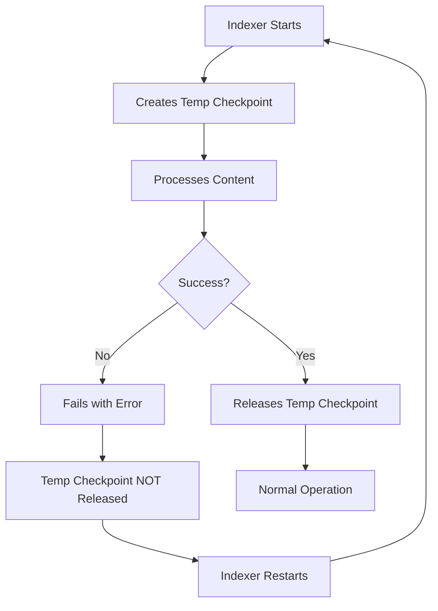

# 💀 The Indexer Death Loop

The "death loop" is when async indexing repeatedly fails, creating checkpoints on each attempt that never get cleaned up.

## Symptoms

1. **Disk space growing rapidly**
2. **Many temp checkpoints** in `/:async@async-temp`
3. **Indexer constantly restarting** in logs
4. **Search not returning recent content**

## Diagnosis

Check the `/:async` node:

```bash
$ java -jar oak-run-*.jar console /path/to/segmentstore

> :cd /:async
> :ls

async-temp = ["uuid1", "uuid2", "uuid3", "uuid4", "uuid5", ...]
```

::: danger Death Loop Indicator
If `async-temp` has **more than 2-3 entries**, you're in a death loop.
Each entry is a failed indexing cycle that created a checkpoint.
:::

## What's Happening



Each failed cycle:
1. Creates a new temp checkpoint
2. Pins segments from that point
3. Never releases the checkpoint
4. Disk usage grows

## Common Causes

| Cause | How to Identify |
|-------|-----------------|
| **Corrupted index** | Errors in `error.log` mentioning Lucene |
| **Out of memory** | OOM errors during indexing |
| **Corrupted content** | SegmentNotFoundException during indexing |
| **Index definition issues** | Errors about index configuration |

## Solution

### Step 1: Stop the Bleeding

Disable async indexing temporarily:

```bash
# In OSGi console or via config
# Set: oak.indexer.async.pauseIndexing=true
```

### Step 2: Clear Temp Checkpoints

```bash
$ java -jar oak-run-*.jar console --read-write /path/to/segmentstore

> :cd /:async
> :set async-temp []
> :commit
```

### Step 3: Fix Root Cause

**If corrupted index**:
```bash
# Delete and rebuild index
$ rm -rf crx-quickstart/repository/index/lucene/*
# Restart AEM - indexes will rebuild
```

**If corrupted content**:
```bash
# Use count-nodes to find corruption
# Remove corrupted paths
# See: Surgical Removal
```

**If OOM**:
```bash
# Increase heap size
# Or reduce index scope
```

### Step 4: Remove Orphaned Checkpoints

```bash
$ java -jar oak-run-*.jar checkpoints /path/to/segmentstore rm-unreferenced
```

### Step 5: Re-enable Indexing

```bash
# Remove pause flag
# oak.indexer.async.pauseIndexing=false
# Restart AEM
```

## Prevention

### Monitor Temp Checkpoints

```bash
# Alert script
TEMP_COUNT=$(oak-run console /path/to/segmentstore -e ":cd /:async; :pn async-temp" | grep -c "uuid")
if [ $TEMP_COUNT -gt 3 ]; then
    echo "ALERT: Death loop detected - $TEMP_COUNT temp checkpoints"
fi
```

### Set Indexing Timeouts

Configure reasonable timeouts to prevent infinite loops:

```
# OSGi config
oak.async.indexer.maxTime=3600000  # 1 hour max
```

## When Standard Fixes Don't Work

If you've tried the above and indexing still fails with "0 missing blobs" but repeated `DataStoreException` errors, you may have **invisible missing blobs** - blobs that were deleted from DataStore but are still referenced in old segments pinned by checkpoints.

**See**: [Checkpoint Advancement](/checkpoints/checkpoint-advancement) for the advanced procedure to skip the problematic historical delta.

## Key Takeaways

::: tip Remember
1. **Check async-temp** - Multiple entries = death loop
2. **Each failed cycle** creates an orphaned checkpoint
3. **Disk grows rapidly** - Can fill disk in hours/days
4. **Fix root cause** - Don't just clear symptoms
5. **Monitor regularly** - Catch early before disk fills
6. **"0 missing blobs" can still fail** - See [Checkpoint Advancement](/checkpoints/checkpoint-advancement)
:::
