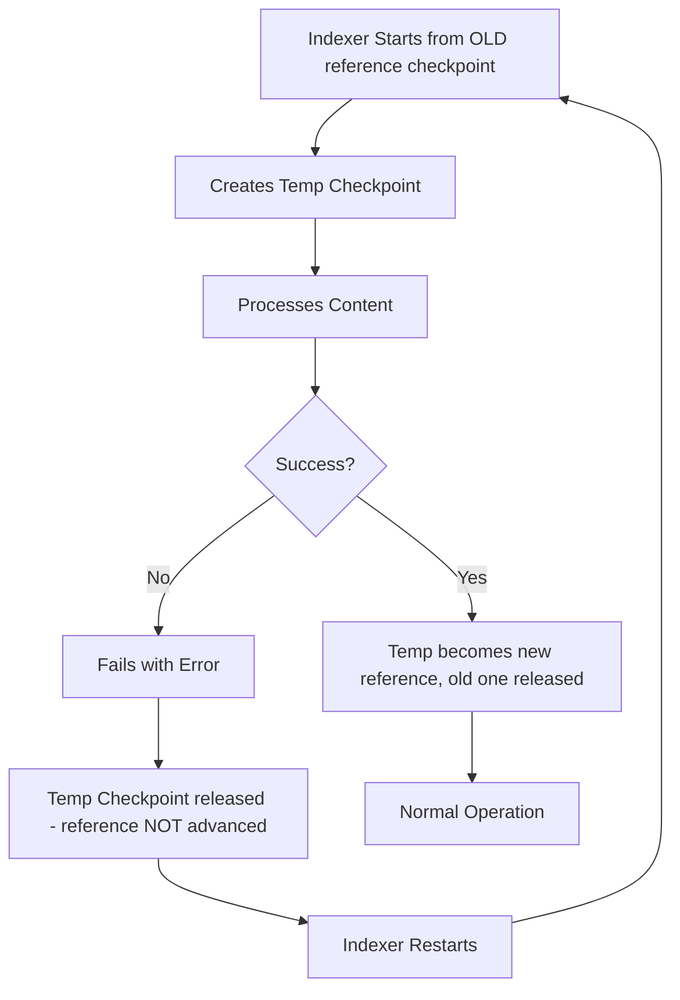

# 💀 The Indexer Death Loop

::: info 🎯 Scope
SegmentStore (TarMK) • Oak 1.22.x – 2.4.0 ([version scope](/reference/oak-versions))  
**Not for AEMaaCS**
:::

The "death loop" happens when async indexing fails over and over. The lane stays pinned to an ever-older reference checkpoint, and checkpoints that Oak fails to release pile up.

## Symptoms

1. **Disk space growing rapidly**
2. **Many temp checkpoints** in `/:async@async-temp` that still exist in `checkpoints list`
3. **Indexer constantly restarting** in logs
4. **Search not returning recent content**
5. **The lane's IndexStats MBean** shows `Failing` = true, a `FailingSince` date, a climbing `ConsecutiveFailedExecutions`, and a `LastIndexedTime` that no longer moves

## Diagnosis

Check the `/:async` node:

```bash
$ java -jar oak-run-*.jar console /path/to/segmentstore

> cd /:async
> pn

{ async = ..., async-temp = [uuid1, uuid2, uuid3, uuid4, uuid5, ...], ... }
```

::: danger Death Loop Indicator
If `async-temp` has **more than 2 entries** that still exist in `checkpoints list`, **and** the lane is failing (item 5 above), you're in a death loop.
A healthy lane keeps at most 2 entries (its reference checkpoint plus the previous or in-flight one). An extra entry is an ID whose `release()` returned `false`. That doesn't mean the checkpoint still exists: count the entries that are still in `checkpoints list`, not the array.
:::

::: warning What the Oak code actually does (Oak 1.22 and 2.4)
On TarMK, `release()` tries the store's commit lock five times without waiting and returns `false` while any other commit holds it, for an existing checkpoint and for one that is already gone alike (`LockBasedScheduler.removeCheckpoint`, identical in 1.22.24 and 2.4.0). With the lock free it returns `true`, even for an ID that no longer exists. So the array grows during busy write periods, also on a healthy lane: an idle AEM 6.5.23 store had 8 `async-temp` entries, 7 of them already gone, and only 2 checkpoints in total. A lane that fails on every run, on the other hand, keeps exactly 2 entries (its reference checkpoint and the ID of the last run's checkpoint, which that run already released). We reproduced that on Oak 1.22.24 and 2.4.0. See [Death Loop Detection](/checkpoints/#death-loop-detection).
:::

## What's Happening


```mermaid
flowchart TD
    A[Indexer Starts from OLD reference checkpoint] --> B[Creates Temp Checkpoint]
    B --> C[Processes Content]
    C --> D{Success?}
    D -->|No| E[Fails with Error]
    E --> F[Temp Checkpoint released - reference NOT advanced]
    F --> G[Indexer Restarts]
    G --> A
    D -->|Yes| H[Temp becomes new reference, old one released]
    H --> I[Normal Operation]
```

Each failed cycle:
1. Restarts from the same, ever-older reference checkpoint (`/:async@async` only moves on success)
2. Creates a new checkpoint and releases it again in a `finally` block. Its ID stays in `async-temp` until the next run drops it, even when the checkpoint itself is already gone
3. Skips the lane's periodic orphan-checkpoint cleanup (`checkpoint cleanup skipped because index stats are failing`)
4. Disk usage grows: compaction keeps copying the old reference checkpoint's content, plus any checkpoint that failed to release, forward

## Common Causes

| Cause | How to Identify |
|-------|-----------------|
| **Corrupted index** | Errors in `error.log` mentioning Lucene |
| **Out of memory** | OOM errors during indexing |
| **Corrupted content** | SegmentNotFoundException during indexing |
| **Index definition issues** | Errors about index configuration |

## Solution

### Step 1: Stop the Bleeding

Pause async indexing temporarily:

```bash
# Via JMX (/system/console/jmx):
# IndexStats → async → abortAndPause()
# IndexStats → fulltext-async → abortAndPause()
# The pause is held in memory only - it is gone after a restart.
# Then stop AEM: the oak-run steps below need exclusive access (repo.lock).
```

::: info Oak 1.22 vs 2.4: IndexStats operations
- **AEM 6.5 (Oak 1.22.x):** `pause()`, `abortAndPause()`, `resume()`. To check, read `Failing`, `FailingSince`, `ConsecutiveFailedExecutions`, `LatestError`, and `FailingIndexStats` (which index fails).
- **AEM 6.5 LTS SP3 (Oak 2.4.0):** also `releaseLeaseForPausedLane()` *(since Oak 1.42)* and `forceIndexLaneCatchup("CONFIRM")` *(since Oak 1.66)*. The second moves the lane to a new checkpoint at HEAD while AEM keeps running and skips the failing delta (Oak 1.66–1.82 only on a failing lane, since Oak 1.84 on any lane), so reindexing is needed afterwards ([Checkpoint Advancement](/checkpoints/checkpoint-advancement)).
:::

### Step 2: Clear Temp Checkpoints

```bash
$ java -jar oak-run-*.jar console --read-write /path/to/segmentstore

> b = session.store.root.builder()
> b.getChildNode(":async").removeProperty("async-temp")
> session.store.merge(b, org.apache.jackrabbit.oak.spi.commit.EmptyHook.INSTANCE, org.apache.jackrabbit.oak.spi.commit.CommitInfo.EMPTY)
```

The checkpoints that were listed there still exist. Step 4 removes them.

### Step 3: Fix Root Cause

**If corrupted index**:
```bash
# Local index copies live in crx-quickstart/repository/index/ (one folder per index).
# Deleting them only makes Oak copy them again from the repository:
$ rm -rf crx-quickstart/repository/index/*
# To actually rebuild a corrupt index, set reindex=true on its definition after restart
```

**If corrupted content**:
```bash
# Use count-nodes to find corruption
# Remove corrupted paths
# See: Surgical Removal
```

::: warning ⚠️ Not in Apache Oak
`:count-nodes` is not part of Apache Jackrabbit Oak (any version). It comes from a community fork. See [Fork-only console commands](/reference/oak-versions#fork-only-console-commands) for how to get a build that matches your Oak version.
:::

**If OOM**:
```bash
# Increase heap size
# Or reduce index scope
```

### Step 4: Remove Orphaned Checkpoints

```bash
$ java -jar oak-run-*.jar checkpoints /path/to/segmentstore rm-unreferenced
```

### Step 5: Re-enable Indexing

```bash
# Start AEM - lanes are no longer paused after a restart
# (without a restart: IndexStats → <lane> → resume())
```

## Prevention

### Monitor Temp Checkpoints

```bash
# Alert script (console arguments after the store path run as one Groovy line)
# Counts only the async-temp entries that still exist as checkpoints
# (the read-only console takes no repo.lock, so it also runs while AEM is up)
TEMP_COUNT=$(java -jar oak-run-*.jar console /path/to/segmentstore \
  "t = session.store.root.getChildNode(':async').getProperty('async-temp'); ids = session.store.checkpoints().toList(); println(t == null ? 0 : t.getValue(org.apache.jackrabbit.oak.api.Type.STRINGS).count { ids.contains(it) })" | tail -1)
if [ $TEMP_COUNT -gt 2 ]; then
    echo "ALERT: $TEMP_COUNT temp checkpoints still exist - check IndexStats (Failing, ConsecutiveFailedExecutions)"
fi
```

Counting every array entry instead would fire on the healthy AEM 6.5.23 store above (8 entries, 7 gone). On lab stores with 8 entries, 1 of them a real checkpoint, a plain count printed `8` and this one prints `1` (Oak 1.22.24 and 2.4.0). Pair it with the lane's IndexStats MBean: `Failing` with a climbing `ConsecutiveFailedExecutions` is the signal that the lane is stuck.

### Let Oak Skip Failing Indexes

Oak marks an index that keeps failing as corrupt and skips it until it is reindexed, so the rest of the lane can move on:

```
# OSGi config: org.apache.jackrabbit.oak.plugins.index.AsyncIndexerService
failingIndexTimeoutSeconds=1800   # 0 disables it
```

::: info Oak 1.22 vs 2.4
- **AEM 6.5 (Oak 1.22.x):** `failingIndexTimeoutSeconds` defaults to `1800` (30 minutes).
- **AEM 6.5 LTS SP3 (Oak 2.4.0):** defaults to `604800` (7 days) *(since Oak 1.32)*. See [which LTS SP has which Oak](/reference/oak-versions).
:::

::: warning What the Oak code actually does (Oak 1.22 and 2.4)
- **Only failures an index reports itself count.** The Lucene and fulltext editors report an `IOException` that happens while writing, deleting, or closing their index. A `SegmentNotFoundException` while reading content, an out-of-memory error, a failing commit, or a property-index error is not tied to one index. The timeout never isolates those, and the lane keeps failing until you fix the cause.
- **The clock lives in memory.** It starts at the index's first failure and starts over after a restart.
- **After the timeout,** the next run writes `corrupt` = &lt;date&gt; on the index definition, skips the index, and the lane moves on. The log shows `Marking [<index>] as corrupt` (INFO), then every `errorWarnIntervalSeconds` (default 15 minutes) `Ignoring corrupt index [...] ... MUST be reindexed` (WARN; Oak 2.4 drops the word "corrupt" from that message). Setting `reindex=true` removes the flag.
- **The lane still reports `Failing` = true** while an index is isolated, with `Status` = `failing`, an empty `FailingSince`, and `ConsecutiveFailedExecutions` = 0. Its orphan-checkpoint cleanup stays off until that index works again.

Lab (Oak 1.22.24 and 2.4.0, timeout set to 2 s): an index that reported its failure was marked `corrupt` on the second run, and the lane indexed the waiting content. The same failure thrown without the report never got the flag, and the lane kept failing on every run.
:::

## When Standard Fixes Don't Work

If you've tried the above and indexing still fails with "0 missing blobs" but repeated `DataStoreException` errors, you may have **invisible missing blobs** - blobs that were deleted from DataStore but are still referenced in old segments pinned by checkpoints. (On TarMK, `datastorecheck --consistency` without `--verbose` also reads checkpoint references - see the caveat on that page. This repository's own DataStore GC and Lucene Binaries Cleanup keep blobs that a checkpoint references. A cloned environment sharing the DataStore can still delete them: [Cloned Environments Sharing a DataStore](/datastore/gc#cloned-environments).)

**See**: [Checkpoint Advancement](/checkpoints/checkpoint-advancement) for the advanced procedure to skip the problematic historical delta.

## Key Takeaways

::: tip Remember
1. **Check async-temp** - More than 2 entries that still exist, on a failing lane = death loop
2. **Each failed cycle** keeps the lane on an old checkpoint. Only failed releases leave orphaned checkpoints
3. **Disk grows rapidly** - Can fill disk in hours/days
4. **Fix root cause** - Don't just clear symptoms
5. **Monitor regularly** - Catch early before disk fills
6. **"0 missing blobs" can still fail** - See [Checkpoint Advancement](/checkpoints/checkpoint-advancement)
:::

::: info 📅 Last Updated
Content last reviewed: October 2026 • Verified against Oak 1.22.24 (AEM 6.5) and Oak 2.4.0 (AEM 6.5 LTS SP3)
:::
