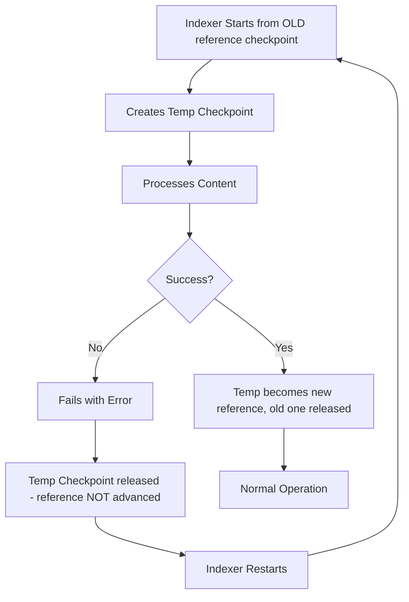

# 💀 The Indexer Death Loop

The "death loop" happens when async indexing fails over and over. The lane stays pinned to an ever-older reference checkpoint, and checkpoints that Oak fails to release pile up.

## Symptoms

1. **Disk space growing rapidly**
2. **Many temp checkpoints** in `/:async@async-temp`
3. **Indexer constantly restarting** in logs
4. **Search not returning recent content**

## Diagnosis

Check the `/:async` node:

```bash
$ java -jar oak-run-*.jar console /path/to/segmentstore

> :cd /:async
> :pn

{ async = ..., async-temp = [uuid1, uuid2, uuid3, uuid4, uuid5, ...], ... }
```

::: danger Death Loop Indicator
If `async-temp` has **more than 2 entries**, you're in a death loop.
A healthy lane keeps at most 2 entries (its reference checkpoint plus the previous or in-flight one). Every extra entry is a checkpoint whose `release()` failed, so it still exists.
:::

## What's Happening


```mermaid
flowchart TD
    A[Indexer Starts from OLD reference checkpoint] --> B[Creates Temp Checkpoint]
    B --> C[Processes Content]
    C --> D{Success?}
    D -->|No| E[Fails with Error]
    E --> F[Temp Checkpoint released - reference NOT advanced]
    F --> G[Indexer Restarts]
    G --> A
    D -->|Yes| H[Temp becomes new reference, old one released]
    H --> I[Normal Operation]
```

Each failed cycle:
1. Restarts from the same, ever-older reference checkpoint (`/:async@async` only moves on success)
2. Creates a new checkpoint and releases it again in a `finally` block. Its ID stays in `async-temp` until a later release succeeds
3. Skips the lane's periodic orphan-checkpoint cleanup (`checkpoint cleanup skipped because index stats are failing`)
4. Disk usage grows: compaction keeps copying the old reference checkpoint's content, plus any checkpoint that failed to release, forward

## Common Causes

| Cause | How to Identify |
|-------|-----------------|
| **Corrupted index** | Errors in `error.log` mentioning Lucene |
| **Out of memory** | OOM errors during indexing |
| **Corrupted content** | SegmentNotFoundException during indexing |
| **Index definition issues** | Errors about index configuration |

## Solution

### Step 1: Stop the Bleeding

Pause async indexing temporarily:

```bash
# Via JMX (/system/console/jmx):
# IndexStats → async → abortAndPause()
# IndexStats → fulltext-async → abortAndPause()
# The pause is held in memory only - it is gone after a restart.
# Then stop AEM: the oak-run steps below need exclusive access (repo.lock).
```

### Step 2: Clear Temp Checkpoints

```bash
$ java -jar oak-run-*.jar console --read-write /path/to/segmentstore

> b = session.store.root.builder()
> b.getChildNode(":async").removeProperty("async-temp")
> session.store.merge(b, org.apache.jackrabbit.oak.spi.commit.EmptyHook.INSTANCE, org.apache.jackrabbit.oak.spi.commit.CommitInfo.EMPTY)
```

The checkpoints that were listed there still exist. Step 4 removes them.

### Step 3: Fix Root Cause

**If corrupted index**:
```bash
# Local index copies live in crx-quickstart/repository/index/ (one folder per index).
# Deleting them only makes Oak copy them again from the repository:
$ rm -rf crx-quickstart/repository/index/*
# To actually rebuild a corrupt index, set reindex=true on its definition after restart
```

**If corrupted content**:
```bash
# Use count-nodes to find corruption
# Remove corrupted paths
# See: Surgical Removal
```

::: warning ⚠️ Not in Apache Oak
`:count-nodes` is not part of Apache Jackrabbit Oak (any version). It comes from a community fork. See [Fork-only console commands](/reference/oak-versions#fork-only-console-commands) for how to get a build that matches your Oak version.
:::

**If OOM**:
```bash
# Increase heap size
# Or reduce index scope
```

### Step 4: Remove Orphaned Checkpoints

```bash
$ java -jar oak-run-*.jar checkpoints /path/to/segmentstore rm-unreferenced
```

### Step 5: Re-enable Indexing

```bash
# Start AEM - lanes are no longer paused after a restart
# (without a restart: IndexStats → <lane> → resume())
```

## Prevention

### Monitor Temp Checkpoints

```bash
# Alert script (console arguments after the store path run as one Groovy line)
TEMP_COUNT=$(java -jar oak-run-*.jar console /path/to/segmentstore \
  "println(session.store.root.getChildNode(':async').getProperty('async-temp')?.count() ?: 0)" | tail -1)
if [ $TEMP_COUNT -gt 2 ]; then
    echo "ALERT: Death loop detected - $TEMP_COUNT temp checkpoints"
fi
```

### Let Oak Skip Failing Indexes

Oak marks an index that keeps failing as corrupt and skips it until it is reindexed, so the rest of the lane can move on:

```
# OSGi config: org.apache.jackrabbit.oak.plugins.index.AsyncIndexerService
failingIndexTimeoutSeconds=1800   # 0 disables it
```

::: info Oak 1.22 vs 2.4
- **AEM 6.5 (Oak 1.22.x):** `failingIndexTimeoutSeconds` defaults to `1800` (30 minutes).
- **AEM 6.5 LTS SP3 (Oak 2.4.0):** defaults to `604800` (7 days) *(since Oak 1.32)*. See [which LTS SP has which Oak](/reference/oak-versions).
:::

## When Standard Fixes Don't Work

If you've tried the above and indexing still fails with "0 missing blobs" but repeated `DataStoreException` errors, you may have **invisible missing blobs** - blobs that were deleted from DataStore but are still referenced in old segments pinned by checkpoints. (On TarMK, `datastorecheck --consistency` also reads checkpoint references - see the caveat on that page.)

**See**: [Checkpoint Advancement](/checkpoints/checkpoint-advancement) for the advanced procedure to skip the problematic historical delta.

## Key Takeaways

::: tip Remember
1. **Check async-temp** - More than 2 entries = death loop
2. **Each failed cycle** keeps the lane on an old checkpoint. Only failed releases leave orphaned checkpoints
3. **Disk grows rapidly** - Can fill disk in hours/days
4. **Fix root cause** - Don't just clear symptoms
5. **Monitor regularly** - Catch early before disk fills
6. **"0 missing blobs" can still fail** - See [Checkpoint Advancement](/checkpoints/checkpoint-advancement)
:::
