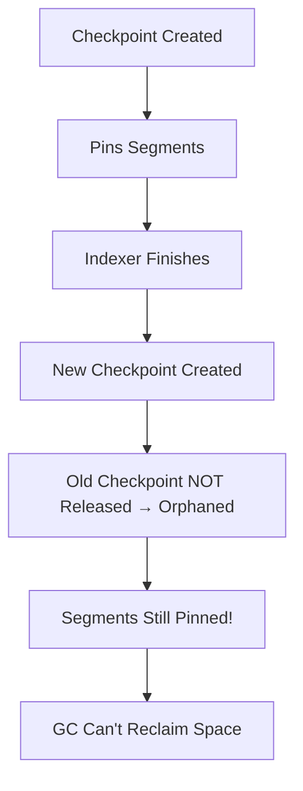

# 💾 Checkpoint Disk Bloat

::: info 🎯 Scope
SegmentStore (TarMK) • Oak 1.22.x – 2.4.0 ([version scope](/reference/oak-versions))  
**Not for AEMaaCS**
:::

Orphaned checkpoints are a common cause of disk space issues. They prevent garbage collection from reclaiming space.

## The Problem



## How It Happens

1. **Async indexer starts** → Creates checkpoint
2. **Indexer processes content** → Checkpoint pins segments
3. **Indexer finishes** → The next run creates a NEW checkpoint, indexes up to it, and moves `/:async@<lane>` to it
4. **Old checkpoint orphaned** → No longer referenced, but its release failed (or a backup/tool never released its own checkpoint)
5. **But its content is still pinned** → every compaction copies it forward

::: warning What the Oak code actually does (Oak 1.22 and 2.4)
A healthy lane cleans up after itself. A failed release is retried on every run that has changes (the ID stays in `<lane>-temp`), and every 5 minutes the lane removes its own older checkpoints (`creator AsyncIndexUpdate`, `name <lane>`). The orphans that last come from elsewhere: a **failing** lane (the 5-minute cleanup is skipped and its reference checkpoint stays put), or a checkpoint the lane doesn't own: `CheckpointManager` → `createCheckpoint`, the console `checkpoint` command, an out-of-band reindex that was never imported. `oak-run checkpoints <store> info <id>` shows the creator ([who creates them](/checkpoints/#who-creates-them)).
:::

## Symptoms

- Disk usage keeps growing
- Compaction doesn't reclaim expected space
- Many checkpoints visible in `oak-run checkpoints list`
- DataStore keeps growing although DataStore GC runs (see [the DataStore side](#the-datastore-side))

## Diagnosis

```bash
$ java -jar oak-run-*.jar checkpoints /path/to/segmentstore list

Checkpoints /path/to/segmentstore
- b8dbd53c-af46-4764-bd3b-df48d4a85438 created 2025-01-13 10:30:00.0 expires ...
- a7cac42b-bf35-3653-ac2a-ce37c3a74327 created 2024-06-02 08:11:42.0 expires ...
- 96bab31a-ae24-2542-9b19-bd26b2963216 created 2024-05-29 17:03:10.0 expires ...
- 85a9a20f-9d13-1431-8a08-ac15a1852105 created 2024-05-27 09:45:51.0 expires ...
...
Found 47 checkpoints
```

`list` does not mark checkpoints as active or orphaned, and it isn't sorted by date. Compare the IDs with the values of `/:async` (`console` → `cd /:async` → `pn`; the console's node commands have no colon). Only the `async` and `fulltext-async` values are referenced.

AEM still running? `oak-run checkpoints` would wait on `repo.lock` until AEM stops. Read the checkpoints online instead:
- JMX `CheckpointManager` → `listCheckpoints()` (with each checkpoint's metadata) and `OldestCheckpointCreationDate`
- `error.log` of the last revision GC: `TarMK GC #N: found checkpoint <id> created at <date>.` (`created on` since Oak 1.60), one line per checkpoint it compacted

## Solution

Remove orphaned checkpoints:

```bash
$ java -jar oak-run-*.jar checkpoints /path/to/segmentstore rm-unreferenced

Checkpoints /path/to/segmentstore
Referenced checkpoint from /:async@async is b8dbd53c-af46-4764-bd3b-df48d4a85438
Referenced checkpoint from /:async@fulltext-async is 5be6e6eb-8875-405f-b157-a869080cb859
Removed 45 checkpoints in 812ms.
```

Then run compaction to reclaim space:

```bash
$ java -jar oak-run-*.jar compact /path/to/segmentstore
```

## Prevention

### Regular Maintenance

Schedule periodic checkpoint cleanup:

```bash
# Weekly maintenance script
# (AEM must be stopped: the tool opens the FileStore read-write and takes repo.lock.
#  With AEM running it doesn't fail - it waits until AEM stops)
java -jar oak-run-*.jar checkpoints /path/to/segmentstore rm-unreferenced
```

### Monitor Checkpoint Count

Alert if checkpoints exceed threshold:

```bash
# Needs AEM stopped too (repo.lock) - from cron against a running AEM it just hangs.
# Online, poll the CheckpointManager MBean instead.
# Healthy AEM: about one checkpoint per lane plus in-flight ones
COUNT=$(java -jar oak-run-*.jar checkpoints /path/to/segmentstore list | grep -c '^- ')
if [ $COUNT -gt 10 ]; then
    echo "WARNING: $COUNT checkpoints"
fi
```

## Real-World Impact

| Orphaned Checkpoints | Typical Disk Bloat |
|---------------------|-------------------|
| 10 | ~2-5 GB |
| 50 | ~10-25 GB |
| 100+ | ~50+ GB |

::: tip Key Insight
Each checkpoint pins all segments reachable from that revision. Older checkpoints pin more segments because they reference older data that would otherwise be garbage collected.
:::

## The DataStore Side {#the-datastore-side}

The same checkpoint bloats the DataStore. DataStore GC marks every blob a checkpoint references, so binaries deleted after the checkpoint was taken stay. On a running AEM, the oldest checkpoint also narrows the sweep window: no blob uploaded after the oldest checkpoint (minus `maxAge`, 24 h) is deleted, even when nothing references it ([the cutoff](/datastore/gc#the-cutoff)). A six-month-old orphan checkpoint means six months of deleted binaries nobody can reclaim. Remove the orphan, run revision GC, then DataStore GC ([the order that frees space](/datastore/gc#why-deleted-content-doesnt-free-space)).

::: info 📅 Last Updated
Content last reviewed: October 2026 • Verified against Oak 1.22.24 (AEM 6.5) and Oak 2.4.0 (AEM 6.5 LTS SP3)
:::
