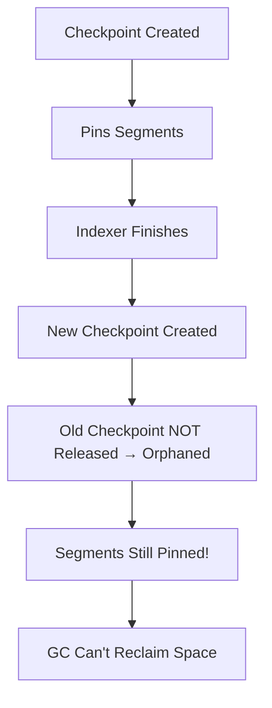

# 💾 Checkpoint Disk Bloat

Orphaned checkpoints are a common cause of disk space issues. They prevent garbage collection from reclaiming space.

## The Problem



## How It Happens

1. **Async indexer starts** → Creates checkpoint
2. **Indexer processes content** → Checkpoint pins segments
3. **Indexer finishes** → Creates NEW checkpoint
4. **Old checkpoint orphaned** → No longer referenced, but its release failed (or a backup/tool never released its own checkpoint)
5. **But its content is still pinned** → every compaction copies it forward

## Symptoms

- Disk usage keeps growing
- Compaction doesn't reclaim expected space
- Many checkpoints visible in `oak-run checkpoints list`

## Diagnosis

```bash
$ java -jar oak-run-*.jar checkpoints /path/to/segmentstore list

Checkpoints /path/to/segmentstore
- b8dbd53c-af46-4764-bd3b-df48d4a85438 created 2025-01-13 10:30:00.0 expires ...
- a7cac42b-bf35-3653-ac2a-ce37c3a74327 created 2024-06-02 08:11:42.0 expires ...
- 96bab31a-ae24-2542-9b19-bd26b2963216 created 2024-05-29 17:03:10.0 expires ...
- 85a9a20f-9d13-1431-8a08-ac15a1852105 created 2024-05-27 09:45:51.0 expires ...
...
Found 47 checkpoints
```

`list` does not mark checkpoints as active or orphaned. Compare the IDs with the values of `/:async` (`console` → `:cd /:async` → `:pn`). Only the `async` and `fulltext-async` values are referenced.

## Solution

Remove orphaned checkpoints:

```bash
$ java -jar oak-run-*.jar checkpoints /path/to/segmentstore rm-unreferenced

Checkpoints /path/to/segmentstore
Referenced checkpoint from /:async@async is b8dbd53c-af46-4764-bd3b-df48d4a85438
Referenced checkpoint from /:async@fulltext-async is 5be6e6eb-8875-405f-b157-a869080cb859
Removed 45 checkpoints in 812ms.
```

Then run compaction to reclaim space:

```bash
$ java -jar oak-run-*.jar compact /path/to/segmentstore
```

## Prevention

### Regular Maintenance

Schedule periodic checkpoint cleanup:

```bash
# Weekly maintenance script
# (AEM must be stopped: the tool opens the FileStore read-write and takes repo.lock)
java -jar oak-run-*.jar checkpoints /path/to/segmentstore rm-unreferenced
```

### Monitor Checkpoint Count

Alert if checkpoints exceed threshold:

```bash
# Needs AEM stopped too (repo.lock). Healthy AEM: about one checkpoint per lane plus in-flight ones
COUNT=$(java -jar oak-run-*.jar checkpoints /path/to/segmentstore list | grep -c '^- ')
if [ $COUNT -gt 10 ]; then
    echo "WARNING: $COUNT checkpoints"
fi
```

## Real-World Impact

| Orphaned Checkpoints | Typical Disk Bloat |
|---------------------|-------------------|
| 10 | ~2-5 GB |
| 50 | ~10-25 GB |
| 100+ | ~50+ GB |

::: tip Key Insight
Each checkpoint pins all segments reachable from that revision. Older checkpoints pin more segments because they reference older data that would otherwise be garbage collected.
:::
