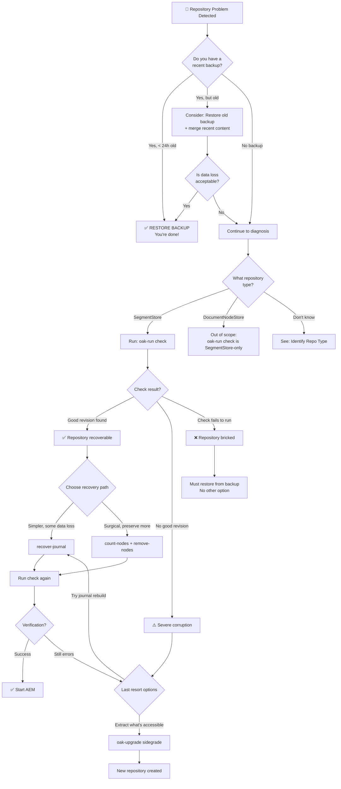

# 🌳 Recovery Decision Tree

Follow this flowchart to determine your recovery path.

```mermaid
flowchart TD
    START[🚨 Repository Problem Detected] --> BACKUP{Do you have a<br/>recent backup?}
    
    BACKUP -->|Yes, < 24h old| RESTORE[✅ RESTORE BACKUP<br/>You're done!]
    BACKUP -->|Yes, but old| OLD_BACKUP[Consider: Restore old backup<br/>+ merge recent content]
    BACKUP -->|No backup| NO_BACKUP[Continue to diagnosis]
    
    OLD_BACKUP --> ACCEPTABLE{Is data loss<br/>acceptable?}
    ACCEPTABLE -->|Yes| RESTORE
    ACCEPTABLE -->|No| NO_BACKUP
    
    NO_BACKUP --> IDENTIFY{What repository<br/>type?}
    
    IDENTIFY -->|SegmentStore| CHECK_SEG[Run: oak-run check]
    IDENTIFY -->|DocumentNodeStore| CHECK_DOC[Out of scope:<br/>oak-run check is SegmentStore-only]
    IDENTIFY -->|Don't know| IDENTIFY_HELP[See: Identify Repo Type]
    
    CHECK_SEG --> CHECK_RESULT{Check result?}
    
    CHECK_RESULT -->|Good revision found| GOOD_REV[✅ Repository recoverable]
    CHECK_RESULT -->|No good revision| NO_REV[⚠️ Severe corruption]
    CHECK_RESULT -->|Check fails to run| BRICKED[❌ Repository bricked]
    
    GOOD_REV --> RECOVERY_PATH{Choose recovery path}
    
    RECOVERY_PATH -->|Simpler, some data loss| RECOVER_JOURNAL[recover-journal]
    RECOVERY_PATH -->|Surgical, preserve more| SURGICAL[count-nodes + remove-nodes]
    
    NO_REV --> LAST_RESORT{Last resort options}
    
    LAST_RESORT -->|Try journal rebuild| RECOVER_JOURNAL
    LAST_RESORT -->|Extract what's accessible| SIDEGRADE[oak-upgrade sidegrade]
    
    BRICKED --> MUST_RESTORE[Must restore from backup<br/>No other option]
    
    RECOVER_JOURNAL --> VERIFY[Run check again]
    SURGICAL --> VERIFY
    SIDEGRADE --> NEW_REPO[New repository created]
    
    VERIFY --> VERIFY_RESULT{Verification?}
    VERIFY_RESULT -->|Success| DONE[✅ Start AEM]
    VERIFY_RESULT -->|Still errors| LAST_RESORT
```

## Decision Points Explained

### 1. Backup Assessment

**Recent backup (< 24 hours)**:
- ✅ Fastest recovery
- ✅ Known good state
- ✅ Predictable data loss
- **Action**: Restore immediately

**Old backup (days/weeks)**:
- Consider restoring, then using `oak-upgrade --merge-paths` to pull recent accessible content from corrupted repo
- Trade-off: Some data loss vs. uncertain recovery

**No backup**:
- You're committed to recovery procedures
- Prepare for potential total data loss

### 2. Repository Type

**SegmentStore (TarMK)**:
- Most common for AEM on-premise
- Uses `segmentstore/` directory with TAR files
- Commands: `check`, `recover-journal`, `compact`

**DocumentNodeStore (MongoDB/RDB)**:
- Used for AEM clustering
- Config file in `crx-quickstart/install/`
- Different recovery procedures (`oak-run recovery`; `check`/`recover-journal` are SegmentStore-only) — out of scope for this guide

### 3. Check Results

**Good revision found**:
- Repository is recoverable
- Choose between fast rollback or surgical removal

**No good revision**:
- Severe corruption
- Try journal recovery or sidegrade

**Check fails to run**:
- Critical segments missing
- Must restore from backup

### 4. Recovery Paths

**recover-journal** (Simpler):
- Rebuilds journal by traversing all segments
- May lose recent changes
- ⏱️ **Time scales with repository size**: Must traverse entire segment store
  - Small repos (< 100GB): ~30 minutes
  - Medium repos (100-500GB): 1-4 hours
  - Large repos (500GB-1TB): 4-12 hours
  - Very large repos (> 1TB): 12-48+ hours

**Surgical removal** (Preserve more):
- Find corrupted paths with `count-nodes`
- Remove only affected content
- ⏱️ Additional 2-4 hours on top of diagnosis time

**Sidegrade** (Last resort):
- Extract all accessible content to new repo
- Loses corrupted paths
- ⏱️ Time scales with content volume (typically 4-12+ hours)
