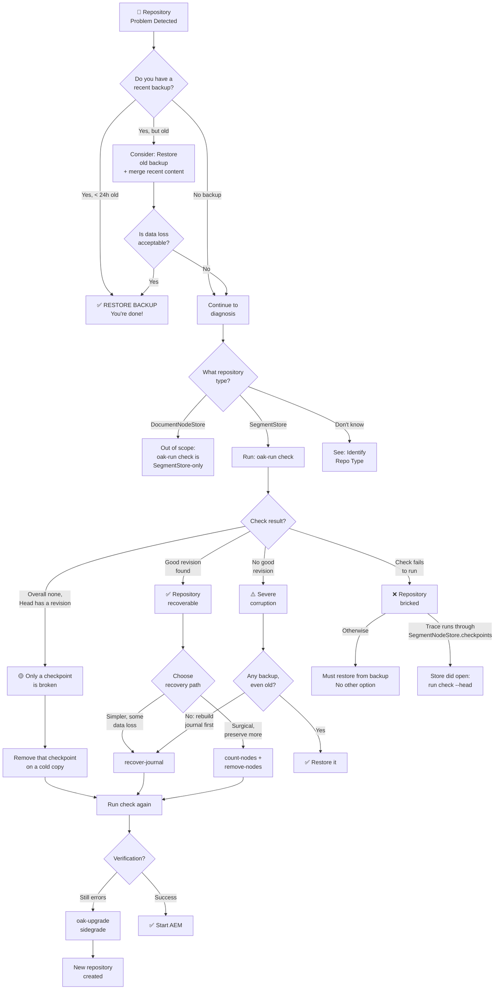

# 🌳 Recovery Decision Tree

::: info 🎯 Scope
SegmentStore (TarMK) • Oak 1.22.x – 2.4.0 ([version scope](/reference/oak-versions))  
**Not for AEMaaCS**
:::

Follow this flowchart to determine your recovery path.

Before the first box: stop AEM, or if it must keep running, pause GC (JMX → `SegmentRevisionGarbageCollection` → `PausedCompaction = true`). Every GC run deletes older generations *before* it compacts, and those are the copies recovery needs ([Crisis Checklist, Step 0](/crisis/#🛑-step-0-stop-the-bleeding)).

```mermaid
flowchart TD
    START[🚨 Repository<br/>Problem Detected] --> BACKUP{Do you have a<br/>recent backup?}
    
    BACKUP -->|Yes, < 24h old| RESTORE[✅ RESTORE BACKUP<br/>You're done!]
    BACKUP -->|Yes, but old| OLD_BACKUP[Consider: Restore<br/>old backup<br/>+ merge recent content]
    BACKUP -->|No backup| NO_BACKUP[Continue to<br/>diagnosis]
    
    OLD_BACKUP --> ACCEPTABLE{Is data loss<br/>acceptable?}
    ACCEPTABLE -->|Yes| RESTORE
    ACCEPTABLE -->|No| NO_BACKUP
    
    NO_BACKUP --> IDENTIFY{What repository<br/>type?}
    
    IDENTIFY -->|DocumentNodeStore| CHECK_DOC[Out of scope:<br/>oak-run check is<br/>SegmentStore-only]
    IDENTIFY -->|SegmentStore| CHECK_SEG[Run: oak-run check]
    IDENTIFY -->|Don't know| IDENTIFY_HELP[See: Identify<br/>Repo Type]
    
    CHECK_SEG --> CHECK_RESULT{Check result?}
    
    CHECK_RESULT -->|Good revision<br/>found| GOOD_REV[✅ Repository<br/>recoverable]
    CHECK_RESULT -->|No good<br/>revision| NO_REV[⚠️ Severe<br/>corruption]
    CHECK_RESULT -->|Check fails<br/>to run| BRICKED[❌ Repository<br/>bricked]
    CHECK_RESULT -->|Overall none,<br/>Head has a revision| CP_BROKEN[🟡 Only a checkpoint<br/>is broken]
    CP_BROKEN --> CP_RM[Remove that checkpoint<br/>on a cold copy]
    CP_RM --> VERIFY
    
    GOOD_REV --> RECOVERY_PATH{Choose<br/>recovery path}
    
    RECOVERY_PATH -->|Simpler, some<br/>data loss| RECOVER_JOURNAL[recover-journal]
    RECOVERY_PATH -->|Surgical,<br/>preserve more| SURGICAL[count-nodes +<br/>remove-nodes]
    
    NO_REV --> LAST_RESORT{Any backup,<br/>even old?}
    
    LAST_RESORT -->|Yes| RESTORE_OLD[✅ Restore it]
    LAST_RESORT -->|No: rebuild<br/>journal first| RECOVER_JOURNAL
    
    BRICKED -->|Otherwise| MUST_RESTORE[Must restore from backup<br/>No other option]
    BRICKED -->|Trace runs through<br/>SegmentNodeStore.checkpoints| HEAD_ONLY["Store did open:<br/>run check --head"]
    
    RECOVER_JOURNAL --> VERIFY[Run check again]
    SURGICAL --> VERIFY
    SIDEGRADE[oak-upgrade<br/>sidegrade] --> NEW_REPO[New repository<br/>created]
    
    VERIFY --> VERIFY_RESULT{Verification?}
    VERIFY_RESULT -->|Success| DONE[✅ Start AEM]
    VERIFY_RESULT -->|Still errors| SIDEGRADE
```

## Decision Points Explained

### 1. Backup Assessment

**Recent backup (< 24 hours)**:
- ✅ Fastest recovery
- ✅ Known good state
- ✅ Predictable data loss
- **Action**: Restore immediately. Move the damaged `segmentstore/` aside instead of deleting it: you'll want it to find out what happened

**Old backup (days/weeks)**:
- Consider restoring, then using `oak-upgrade --merge-paths` to pull recent accessible content from corrupted repo ([Merge with Old Backup](/recovery/sidegrade#merge-with-old-backup); it stops at the first unreadable node, like any sidegrade)
- Trade-off: Some data loss vs. uncertain recovery

**No backup**:
- You're committed to recovery procedures
- Prepare for potential total data loss

### 2. Repository Type

**SegmentStore (TarMK)**:
- Most common for AEM on-premise
- Uses `segmentstore/` directory with TAR files
- Commands: `check`, `recover-journal`, `compact` (`compact` is not a repair: never on a store `check` hasn't passed — [why](/recovery/compaction#compaction-and-corruption))

**DocumentNodeStore (MongoDB/RDB)**:
- Used for AEM clustering
- Config file in `crx-quickstart/install/`
- Different recovery procedures (`oak-run recovery`; `check`/`recover-journal` are SegmentStore-only) — out of scope for this guide

Don't know which one you have? [Identify Your Repository Type](/crisis/identify-repo).

### 3. Check Results

Run it with AEM stopped and keep the output: `java -jar oak-run-*.jar check /path/to/segmentstore 2>&1 | tee check.log` ([oak-run check](/recovery/check)). Read the **Overall** line, not the exit code.

**Good revision found**:
- Repository is recoverable
- Choose between fast rollback or surgical removal

**Overall says `none from unknown time`, but the Head line shows a revision** (exit code `0`):
- The content is intact; only a checkpoint is broken
- Remove that checkpoint on a cold copy, then run `check` again: [Only a checkpoint is broken](/architecture/bricked#only-a-checkpoint-is-broken)
- Head shows `none` too? Treat it as **No good revision**

**No good revision**:
- Severe corruption, partially recoverable at best
- Reconsider any backup, even an old one
- Otherwise run `recover-journal` and check again; if it aborts or check still finds none, sidegrade

**Check fails to run**:
- Critical segments missing: the store can't be opened at all. A TAR file can't be opened (`Failed to open tar file …`), no journal entry points at a head segment that still exists (`Cannot start readonly store from empty journal`), or the directory/manifest isn't a valid segment store
- Must restore from backup
- One exception: if the stack trace runs through `SegmentNodeStore.checkpoints`, the store did open and only listing its checkpoints failed. Run `check --head` ([details](/architecture/bricked#what-makes-check-fail-before-printing-anything))
- Never start AEM on a store `check` can't open: it can rewind silently or write a new, empty repository over it ([why](/architecture/bricked#path-4-starting-aem-on-a-store-check-can-t-open))

### 4. Recovery Paths

Before either path, copy `segmentstore/` somewhere safe (e.g. `rsync -a`): `recover-journal` rewrites `journal.log`, and `remove-nodes` has no undo.

**recover-journal** (Simpler) — [Journal Recovery](/recovery/journal):
- Rebuilds journal by traversing all segments
- May lose recent changes
- Keeps the old journal as `journal.log.bak.NNN`. AEM stays stopped: `recover-journal` takes no lock
- ⏱️ **Time scales with repository size**: Must traverse entire segment store
  - Small repos (< 100GB): ~30 minutes
  - Medium repos (100-500GB): 1-4 hours
  - Large repos (500GB-1TB): 4-12 hours
  - Very large repos (> 1TB): 12-48+ hours

**Surgical removal** (Preserve more) — [Surgical Removal](/recovery/surgical):

::: warning ⚠️ Not in Apache Oak
`:count-nodes` and `:remove-nodes` are not part of Apache Jackrabbit Oak (any version). They come from a community fork. See [Fork-only console commands](/reference/oak-versions#fork-only-console-commands) for how to get a build that matches your Oak version.
:::

- Find corrupted paths with `count-nodes`
- Remove only affected content (`console --read-write`; `:remove-nodes … dry-run` first)
- ⏱️ Additional 2-4 hours on top of diagnosis time

**Sidegrade** (Last resort) — [Sidegrade](/recovery/sidegrade):
- Extract all accessible content to new repo. It does **not** skip unreadable nodes: the first one aborts the run (`Failed to copy content`), so leave known-corrupt paths out with `--exclude-paths`
- Loses corrupted paths (the ones you exclude)
- ⏱️ Time scales with content volume (typically 4-12+ hours)

::: info 📅 Last Updated
Content last reviewed: October 2026 • Verified against Oak 1.22.24 (AEM 6.5) and Oak 2.4.0 (AEM 6.5 LTS SP3)
:::
