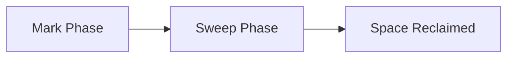

# 🗑️ DataStore Garbage Collection

DataStore GC removes unreferenced blobs (binaries) to reclaim storage space. It's separate from SegmentStore GC.

## Two-Phase Process

DataStore GC uses a mark-and-sweep approach:



### Why Two Phases?

A normal run does both phases back to back (`markOnly=false`); mark-only exists for **shared** DataStores:
- **Mark**: Records all referenced blobs (on a shared DataStore also stored as a `references-<repositoryId>_…` record)
- **Sweep**: Deletes blobs that are not referenced **and** were last modified more than `maxAge` before the mark started (default 86400 s = 24 h) - this window is what protects in-flight uploads
- **Shared DataStore**: every repository runs mark-only first; the sweep refuses to run (`Not all repositories have marked references available`) until each registered `repository-<id>` has references

## Mark Phase

```bash
# Via JMX (AEM running)
# org.apache.jackrabbit.oak:type=BlobGarbageCollection → startBlobGC(markOnly=true)

# Via oak-run
$ java -jar oak-run-*.jar datastore --collect-garbage true \
    --s3ds /path/to/S3DataStore.config \
    /path/to/segmentstore
```

## Sweep Phase

There is no sweep-only operation: `markOnly=false` runs **mark + sweep** (on a shared DataStore, after all other repositories have marked):

```bash
# Via JMX (AEM running)
# org.apache.jackrabbit.oak:type=BlobGarbageCollection → startBlobGC(markOnly=false)

# Via oak-run
$ java -jar oak-run-*.jar datastore --collect-garbage \
    --s3ds /path/to/S3DataStore.config \
    /path/to/segmentstore
```

oak-run options (both 1.22 and 2.4): `--collect-garbage [markOnly]`, `--max-age <sec>` (default 86400), `--check-consistency-gc` (consistency check right after GC), `--batch` (default 2048), `--work-dir` (default `temp`), `--out-dir` (default `datastore-out`), `--verbose`. Oak 2.4 adds `--sweep-only-refs-past-retention` *(since Oak 1.28 — not in AEM 6.5; see [which LTS SP has which Oak](/reference/oak-versions))*.

## Time Estimates

| DataStore Size | Mark Time | Sweep Time |
|----------------|-----------|------------|
| 100 GB | ~30 min | ~1 hour |
| 500 GB | ~2 hours | ~4 hours |
| 1 TB | ~4 hours | ~8 hours |

## Configuration

### FileDataStore

```
# org.apache.jackrabbit.oak.plugins.blob.datastore.FileDataStore.config
path=/path/to/datastore
minRecordLength=4096
```

### S3 DataStore

```
# org.apache.jackrabbit.oak.plugins.blob.datastore.S3DataStore.config
accessKey=xxx
secretKey=xxx
s3Bucket=my-bucket
s3Region=us-east-1
```

## Best Practices

::: tip DataStore GC Tips
1. **Run SegmentStore GC first** - Removes references to deleted content
2. **Keep `maxAge` at ≥ 24 h** (default 86400 s) - Blobs newer than that are never swept, which protects in-flight uploads
3. **Run during low-traffic periods** - Reduces risk of conflicts
4. **Verify with consistency check** - After GC, ensure no missing blobs
:::

## Common Issues

### Blobs Deleted Too Soon

**Symptom**: Missing binaries after GC

**Cause**: `maxAge` set too low, or (shared DataStore) a repository's references missing/stale when the sweep ran

**Prevention**: Keep the default 24 h `maxAge`; make sure every sharing repository has marked

### GC Not Reclaiming Space

**Causes**:
- SegmentStore GC not run first
- Checkpoints pinning old references
- Replication keeping references

**Solution**:
1. Run SegmentStore compaction
2. Remove orphaned checkpoints
3. Then run DataStore GC

## Key Takeaways

::: tip Remember
1. **Two phases** - Mark, then sweep (blobs younger than `maxAge`, default 24 h, are kept)
2. **Run SegmentStore GC first** - Remove stale references
3. **Verify after** - Run consistency check
4. **Separate from SegmentStore GC** - Different process, different storage
:::
