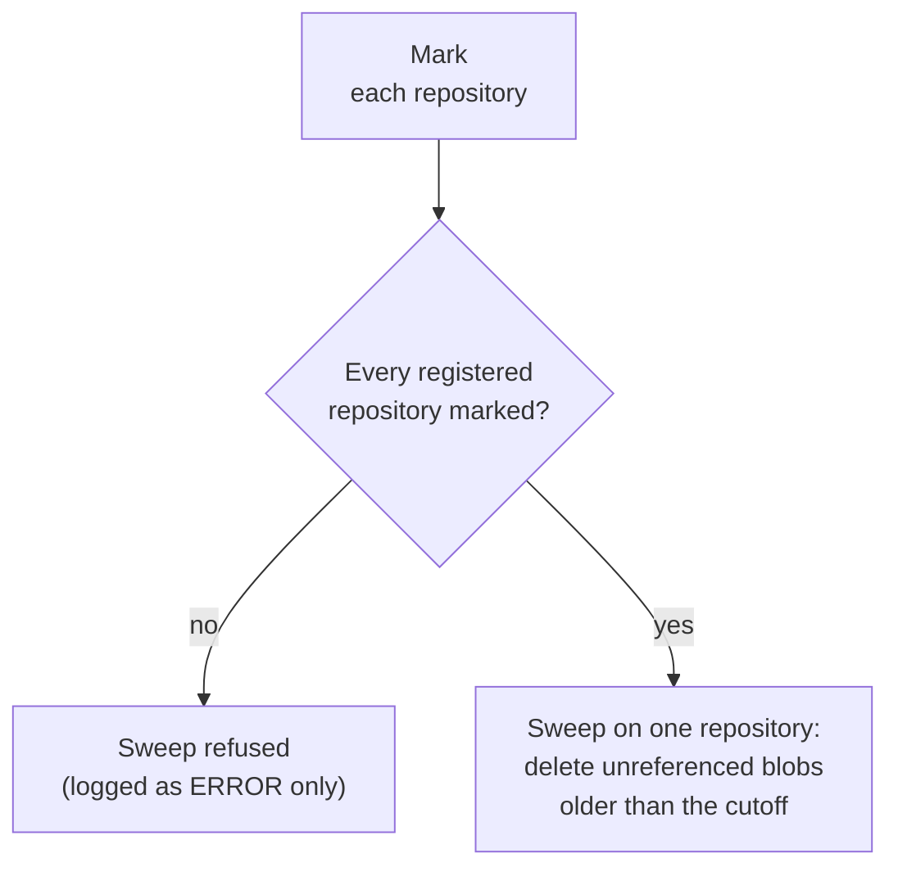

# 🗑️ DataStore Garbage Collection

::: info 🎯 Scope
SegmentStore (TarMK) with an external DataStore (File, S3, Azure) • Oak 1.22.x – 2.4.0 ([version scope](/reference/oak-versions))  
**Not for AEMaaCS**
:::

DataStore GC deletes the blobs that nothing references any more. It is the only DataStore operation that deletes binaries, and everything it deletes is gone: Oak keeps no recycle bin. It is separate from revision GC (compaction), and it depends on it: a blob can't be collected while any segment the store still keeps references it.

::: danger 🧬 Cloned an environment and pointed it at the same DataStore?
Read [Cloned Environments Sharing a DataStore](#cloned-environments) before the next Sunday 1:00 AM. Every AEM 6.5 instance with an external DataStore runs a full DataStore GC in its weekly maintenance window, and a clone carries its source's repository ID.
:::

## ⚙️ How It Works {#how-it-works}



### Mark

Mark collects every blob ID the repository references. On TarMK it doesn't walk the content tree: it reads the binary-reference index of every TAR file in the retained GC generations. That covers HEAD, checkpoints, and older revisions that revision GC has not reclaimed yet. The result goes into the DataStore as two records, `references-<repository id>_<run-uuid>` and an empty `markedTimestamp-<repository id>_<run-uuid>`. Oak treats every FileDataStore, S3 and Azure DataStore as shared, even with a single repository, so these records are always written.

### Sweep

1. **Check every repository has marked.** Each `repository-<id>` marker in the DataStore needs at least one `references-<id>_*` record. Otherwise the sweep stops with `Not all repositories have marked references available`.
2. **Union** the `references-*` records of all repositories.
3. **List every blob ID** in the DataStore, or read them from the blob ID tracker (see [Running It](#running-it)).
4. **Candidates** = listed IDs minus the union, written to `gccand-<ts>`.
5. **Delete** each candidate whose last-modified time is before the [cutoff](#the-cutoff): one metadata request and one delete per blob.
6. **Delete every `references-*` and `markedTimestamp-*` record**, for all repositories. The next sweep needs fresh marks from everyone.

A normal run does mark and sweep back to back. Mark-only runs exist so that several repositories can mark before one of them sweeps.

### The Cutoff {#the-cutoff}

```
cutoff = min(earliest mark start of any repository, oldest checkpoint) − maxAge
```

- **`maxAge`** defaults to 24 hours (`blobGcMaxAgeInSecs` online, `--max-age` in oak-run, both 86400 s). It is the only protection for binaries that exist in the DataStore but aren't referenced *yet*: uploads in flight, direct binary uploads waiting for their node, binaries held in an unsaved session.
- **The oldest checkpoint** counts online only; oak-run has no checkpoint MBean. A months-old checkpoint therefore keeps an online sweep from deleting anything newer than that checkpoint.
- **`--max-age 0`** deletes every unreferenced blob regardless of age, uploads in flight included. Oak's own javadoc calls it "for testing purposes only".

## 🧬 Cloned Environments Sharing a DataStore {#cloned-environments}

The setup is common and cheap: clone production's segment store to build a stage or a pre-prod, and point the clone at production's S3 bucket or FileDataStore instead of copying terabytes of binaries ([why copying hurts](/datastore/#binary-io)). It is a common managed-provider pattern. Author and publish instances that share a DataStore for binary-less replication are the same arrangement. Oak supports it, but only if every repository marks before anyone sweeps, and AEM's defaults don't do that.

### What Oak Sees

The clone's segment store contains production's cluster ID (`/:clusterConfig/:clusterId`), which is also its repository ID. Unless someone resets it, production and the clone register **one** `repository-<id>` marker between them. Oak can't tell them apart: either one's references satisfy the "has every repository marked?" check.

### What AEM Runs on Every Instance by Default

| Maintenance task | Window | On a shared DataStore |
|------------------|--------|-----------------------|
| **Data Store Garbage Collection** | Weekly, Sunday 1:00–2:00 | A full mark + sweep, always: the task calls `startDataStoreGC(false)` with `false` hard-coded (AEM 6.5.23 and 6.5 LTS SP3) |
| **Lucene Binaries Cleanup** | Daily, 2:00–5:00 | Deletes the blobs of discarded Lucene index files directly, at least a day after the index drops them, without checking whether another repository references them |

The weekly task is defined at `/libs/settings/granite/operations/maintenance/granite_weekly/granite_MongoDataStoreGarbageCollectionTask`. Despite "Mongo" in the name, it is active on TarMK too: its conditions are the `crx3` run mode and a `BlobGarbageCollection` MBean, which every external DataStore setup has.

### What Goes Wrong

**Same repository ID (the default after a clone): silent data loss, both directions.**

```
Day 0        Clone prod → stage; stage points at prod's S3 bucket.
             Both carry clusterId aaaa-1111 → ONE marker: repository-aaaa-1111
Days 1–6     Authors upload to prod (P blobs) and to stage (S blobs)
Sunday 1:00  Stage's weekly task: marks (stage's references only)
             → repository-aaaa-1111 has references → sweep allowed
             → deletes the P blobs older than ~24 h: prod's new uploads
             Prod's run, before or after, does the same to the S blobs
```

Nothing reports an error. The loss shows up later, as `DataStoreException: Record … does not exist` when someone opens an asset uploaded after the clone.

**Different repository IDs: GC stops, and the status lies.** Each weekly run marks itself, finds the other instance's marker without references (unless that instance happened to mark first), and refuses to sweep. The refusal is an `ERROR` line in the log; the MBean status still reads `Blob garbage collection succeeded`, and the DataStore grows week after week. The tempting fix, deleting the other instance's `repository-*` marker, removes the only thing protecting its blobs.

**Lucene Binaries Cleanup, either way.** Right after the clone, both instances' Lucene indexes point at the same index-file blobs. When production's index rewrites a file, production's daily cleanup deletes that file's blob, which the clone's copy of the index still uses (and the other way round). The affected index fails with missing blobs under `/oak:index/<name>/:data` and needs a reindex.

### Run It Safely When Sharing

1. **Find out who shares the DataStore.** List the `repository-*` markers ([where they live](/datastore/consistency#repository-ids)), and read the cluster ID of every instance pointing at the DataStore (offline: `console`, `cd /:clusterConfig`, `pn`). Two instances with the same ID count as one marker, so the marker list alone can't reveal a clone. The `BlobGarbageCollection` MBean's `getGlobalMarkStats()` lists one row per registered repository.
2. **Reset the clone's cluster ID before it first starts against the shared DataStore** (`oak-run resetclusterid`, [how](/datastore/consistency#fix)). It then registers its own marker. Refreshing the clone from production copies the ID again: reset it after every refresh.
3. **Take Data Store Garbage Collection out of the weekly window on every sharing instance.** Run it deliberately instead: mark-only on every instance (`startDataStoreGC(true)`), then one full run on one instance. Each sweep clears all marks, so every round starts with fresh marks from everyone.
4. **Turn off Lucene active deletion on every sharing instance:** `deletedBlobsCollectionEnabled=false` on `org.apache.jackrabbit.oak.plugins.index.lucene.LuceneIndexProviderService`. Discarded index files then become ordinary orphans for the coordinated GC.
5. **Never delete the marker of an instance that still exists**, stopped or not. When an instance is decommissioned for good, delete its marker by hand, or every sweep stays blocked. *(Since Oak 1.26 — not in AEM 6.5:* a short-lived clone started with `-Doak.datastore.sharedTransient=true` removes its own marker on clean shutdown; its blobs are unprotected from then on.)
6. **Check after every sweep**, on every sharing instance ([consistency check](/datastore/consistency)).

A separate DataStore per environment is the only setup that needs none of this.

## 🐌 Why Deleted Content Doesn't Free Space {#why-deleted-content-doesnt-free-space}

Deleting an asset frees nothing in the DataStore by itself. Its blob stays marked while anything the store keeps still references it:

| Still referenced by | Released when |
|---------------------|---------------|
| Older revisions in retained TAR generations | Revision GC reclaims them: online, after two successful revision GC cycles ([when deleted content gets reclaimed](/architecture/gc#when-deleted-content-gets-reclaimed)); full compactions if the content had already survived one, since tail compactions don't rewrite the base. Offline, one `oak-run compact` removed the old TAR files in our tests |
| A checkpoint taken before the delete | The checkpoint is removed **and** the store compacted |
| Versions in `/jcr:system/jcr:versionStorage` | The versions are purged |
| Packages, launches, or any other copy in HEAD | That copy is deleted too |

Then DataStore GC has to run, and the blob has to be older than the [cutoff](#the-cutoff). The order that frees space: delete, purge versions, remove stale checkpoints, revision GC (full), then DataStore GC.

## ▶️ Running It {#running-it}

### Online (AEM Running)

| Way | Call | Notes |
|-----|------|-------|
| Weekly maintenance window | Data Store Garbage Collection task | Full mark + sweep, Sundays 1:00 by default. [Not on a shared DataStore](#cloned-environments) |
| JMX: Repository Manager | `org.apache.jackrabbit.oak:type=RepositoryManagement` → `startDataStoreGC(boolean markOnly)`, `getDataStoreGCStatus()` | What the maintenance task calls |
| JMX: BlobGarbageCollection | `startBlobGC(markOnly)`, `startBlobGC(markOnly, forceBlobIdRetrieve)`, `getBlobGCStatus()`, `getGlobalMarkStats()` | `forceBlobIdRetrieve=true` lists the DataStore instead of trusting the blob ID tracker |

A start while a run is in progress is ignored and returns the running status. Online work files go to the JVM temp directory.

**Configuration that matters** (`org.apache.jackrabbit.oak.segment.SegmentNodeStoreService`):

| Property | Default | Effect |
|----------|---------|--------|
| `blobGcMaxAgeInSecs` | 86400 | `maxAge` for the [cutoff](#the-cutoff) |
| `blobTrackSnapshotIntervalInSecs` | Oak 1.22: 43200 (12 h). **Oak 2.4.0: 0, tracking off** *(changed in Oak 2.4.0)* | The blob ID tracker records every blob this repository writes, so a sweep can skip listing the whole DataStore. Off, every sweep lists every blob, which on S3 or Azure is one list request per page of IDs |

With the tracker off, the BlobGarbageCollection MBean's online `checkConsistency()` always reports 0 missing blobs on Oak 2.4.0 ([details](/datastore/consistency#online-check)). The sweep itself is unaffected.

### Offline (oak-run)

```bash
# Mark only: writes this repository's references, deletes nothing
$ java -jar oak-run-*.jar datastore --collect-garbage true \
    --fds-path /path/to/datastore \
    /path/to/segmentstore

# Mark + sweep: --ds-read-write is what allows it to delete
$ java -jar oak-run-*.jar datastore --collect-garbage --ds-read-write \
    --fds-path /path/to/datastore \
    --out-dir /path/to/gc-out --work-dir /path/to/gc-work \
    /path/to/segmentstore
```

::: danger Three flags that change everything
- **Without `--ds-read-write`**, oak-run opens the DataStore read-only. The sweep finds its candidates, fails every delete (`Readonly BlobStore - Cannot invoked …countDeleteChunks`, logged as WARN), reports `Deleted only [0] blobs entries from the [N] candidates identified`, exits `0`, and still deletes every repository's `references-*` records.
- **`--read-write`** is not the same flag: on TarMK it crashes the run with a `NullPointerException` during mark (exit `1`) and leaves a `markedTimestamp-*` record behind.
- **`--verbose`** makes mark walk HEAD from `/` instead of reading the TAR indexes, so blobs that only checkpoints and older revisions reference are **not marked** and get swept. Never combine it with `--collect-garbage`.
:::

Options, the same in Oak 1.22 and 2.4 unless marked:

| Option | Default | Meaning |
|--------|---------|---------|
| `--collect-garbage [markOnly]` | `false` | Bare: mark + sweep. `true`: mark only |
| `--max-age <s>` | 86400 | `maxAge` for the cutoff. `0` deletes regardless of age |
| `--ds-read-write` | off | Needed for the sweep to delete |
| `--out-dir`, `--work-dir` | `datastore-out`, `temp` | **Emptied at the start of every `datastore` run.** Use new directories per run |
| `--batch` | 2048 | Delete batch size |
| `--check-consistency-gc true` | `false` | Consistency check right after the sweep. The bare flag does nothing: it needs `true` |
| `--sweep-only-refs-past-retention true` | `false` | *(Since Oak 1.28 — not in AEM 6.5)* Sweep only if every repository also has a references record older than `maxAge`, so marks must have aged before anything is deleted |

oak-run never uses the blob ID tracker: it always lists the DataStore. It keeps `gcworkdir-<ts>/` after every run: `marked-`, `avail-` and `gccand-` files with one `<hash>#<length>` per line, or only `marked-` after a mark-only or refused run.

## 📜 Reading the Log {#reading-the-log}

The status and the exit code don't tell you whether anything was deleted. The log does:

| Line | Meaning |
|------|---------|
| `Starting Blob garbage collection with markOnly [false]` | Start (`… for repositoryId [<id>]` since Oak 1.40) |
| `Number of valid blob references marked under mark phase of Blob garbage collection [N]` | Mark done |
| `Repositories registered […]`, `Repositories with unavailable references […]` | Shared check, since Oak 1.40 |
| `Not all repositories have marked references available : [<ids>]` | **Sweep refused.** No `completed` line follows, yet the MBean says "succeeded" and oak-run exits `0`. Oak 1.28+ adds `or older than retention time: […]` |
| `Number of blobs present in BlobStore : [N]` | The DataStore was listed (no tracker) |
| `Deleted blobs [<ids>]` | Actual deletions, up to 512 IDs per line |
| `Deleted only [x] blobs entries from the [y] candidates identified. This may happen if blob modified time is > than the max deleted time (…)` | Candidates newer than the cutoff were kept, or (offline) `--ds-read-write` is missing |
| `Estimated size recovered for N deleted blobs is …` | Space freed |
| `Blob garbage collection completed in … Number of blobs deleted [N] with max modification time of […]` | Finished. The printed time ignores other repositories' earlier marks, so the cutoff actually used can be earlier |
| `Error occurred while deleting blob with id […]` | One delete failed; the sweep continues |

## 💥 How DataStore GC Loses Data {#how-it-loses-data}

| Cause | What gets deleted | Guard |
|-------|-------------------|-------|
| Clone sharing the DataStore with the same repository ID | The other side's blobs added since the clone | [Reset the cluster ID, coordinate GC](#cloned-environments) |
| A live instance's `repository-*` marker deleted | Everything only that instance references, older than the cutoff | Delete markers only for instances that are gone |
| `maxAge` lowered, or `--max-age 0` | Uploads in flight, direct binary uploads, unsaved binaries | Keep 24 h or more |
| `--verbose` with `--collect-garbage` | Blobs only checkpoints and older revisions reference | Never combine them |
| Restoring a segment store backup older than the last sweep | Blobs that only the restored revisions reference: GC already deleted them | Back up the segment store **before** the DataStore, and restore both from the same backup set |
| Lucene active deletion on a shared DataStore | Index-file blobs the other repository's indexes still use | `deletedBlobsCollectionEnabled=false` on sharing instances |

None of these logs an error at the time. They surface later as missing blobs: see [DataStore Consistency](/datastore/consistency).

## ⏱️ What It Costs {#what-it-costs}

- **Mark** reads the TAR files' binary-reference indexes: it scales with the segment store, not with the DataStore.
- **Sweep** lists every blob ID (unless the tracker supplies them), then sends one metadata request and one delete per candidate. On S3 or Azure, a DataStore of millions of blobs means thousands of list requests, plus a request pair per orphan. See [Reading Binaries Is the Expensive Part](/datastore/#binary-io).

## ✅ Key Takeaways {#key-takeaways}

::: tip Remember
1. **A clone sharing a DataStore is a data-loss setup by default** - Same repository ID, plus a hard-coded full GC every Sunday and a daily Lucene cleanup with no reference check
2. **Mark everywhere, sweep once** - Every repository marks; one sweeps; each sweep clears all marks
3. **Read the log, not the status** - A refused sweep reports "succeeded" and exits `0`
4. **oak-run deletes nothing without `--ds-read-write`** - And never use `--verbose` or `--read-write` with `--collect-garbage`
5. **Deleted content isn't free yet** - Versions, checkpoints and retained generations keep its blobs marked until revision GC and purges release them
6. **Keep `maxAge` at 24 h or more** - It is the only protection for binaries not yet referenced
7. **Back up the segment store before the DataStore** - A restored older segment store can reference blobs GC already deleted
8. **Oak 2.4.0 turned the blob ID tracker off** - Sweeps list the whole DataStore, and the online consistency check reports 0 missing
:::

::: info 📅 Last Updated
Content last reviewed: October 2026 • Verified against Oak 1.22.24 (AEM 6.5) and Oak 2.4.0 (AEM 6.5 LTS SP3)
:::
