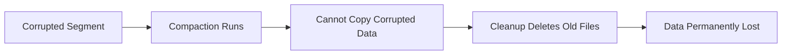

# 🗜️ Compaction

Compaction (garbage collection) reclaims disk space by removing unreachable segments. **Never run it on a corrupted repository.**

## ⚠️ Critical Warning

::: danger NEVER run compact if:
- `oak-run check` shows ANY errors
- You suspect corruption
- You haven't verified repository health

Compaction **permanently deletes** segments. If those segments contain your only copy of data, it's gone forever.
:::

## When to Use Compaction

✅ **Safe to compact**:
- `oak-run check` passes with no errors
- Repository is healthy
- You want to reclaim disk space
- Regular maintenance

❌ **Do NOT compact**:
- Any corruption detected
- Before running `check`
- During recovery procedures

## Offline Compaction

```bash
# Stop AEM first!
$ java -jar oak-run-*.jar compact /path/to/segmentstore
```

### What It Does

1. **Marks live segments** - Traverses from HEAD and checkpoints
2. **Copies live data** - Creates new generation TAR files
3. **Deletes old files** - Removes unreachable segments

### Time Estimates

| Repository Size | Approximate Time |
|-----------------|------------------|
| 10 GB | ~15 minutes |
| 50 GB | ~45 minutes |
| 100 GB | ~1.5 hours |
| 500 GB | ~6-8 hours |

## Online vs Offline

| Aspect | Online (AEM running) | Offline (AEM stopped) |
|--------|---------------------|----------------------|
| **Speed** | Slower | Faster |
| **Risk** | Higher (concurrent writes) | Lower |
| **Disk space** | Needs 2x during compaction | Needs 2x during compaction |
| **Downtime** | None | Required |

## Tail vs Full Compaction

### Tail Compaction (Default Online)

- Compacts only **recent segments**
- Faster, less resource intensive
- Doesn't clean old garbage

### Full Compaction

- Compacts **all generations**
- Maximum space reclamation
- Very resource intensive

```bash
# Full offline compaction
$ java -jar oak-run-*.jar compact /path/to/segmentstore --force
```

## Compaction and Corruption

### The Danger



If corruption exists:
1. Compaction tries to copy corrupted segment
2. Copy fails (can't read corrupted data)
3. Cleanup phase deletes old TAR files
4. **Corrupted data is now GONE** (not just corrupted)

### Safe Sequence

```bash
# 1. Always check first
$ java -jar oak-run-*.jar check /path/to/segmentstore

# 2. Only if check passes clean:
$ java -jar oak-run-*.jar compact /path/to/segmentstore

# 3. Verify after
$ java -jar oak-run-*.jar check /path/to/segmentstore
```

## Disk Space Requirements

Compaction needs **approximately 2x** current repository size:

```
Current: 100 GB
During compaction: ~200 GB (old + new)
After cleanup: ~70 GB (compacted)
```

::: warning
If disk fills during compaction, you may end up with a corrupted repository!
:::

## Monitoring Compaction

Watch the logs:

```bash
$ tail -f /path/to/segmentstore/../logs/compaction.log
```

Look for:
- "Compaction started"
- "Compaction completed"
- Any errors or exceptions

## Key Takeaways

::: tip Remember
1. **Check before compact** - Always verify health first
2. **Never compact corruption** - Makes data loss permanent
3. **Need 2x disk space** - Plan for temporary growth
4. **Offline is safer** - Stop AEM for maintenance compaction
5. **Verify after** - Run check to confirm success
:::
