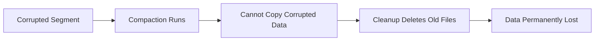

# 🗜️ Compaction

Compaction (garbage collection) reclaims disk space by removing unreachable segments. **Never run it on a corrupted repository.**

## ⚠️ Critical Warning

::: danger NEVER run compact if:
- `oak-run check` shows ANY errors
- You suspect corruption
- You haven't verified repository health

Compaction **permanently deletes** segments. If those segments contain your only copy of data, it's gone forever.
:::

## When to Use Compaction

✅ **Safe to compact**:
- `oak-run check` passes with no errors
- Repository is healthy
- You want to reclaim disk space
- Regular maintenance

❌ **Do NOT compact**:
- Any corruption detected
- Before running `check`
- During recovery procedures

## Offline Compaction

```bash
# Stop AEM first!
$ java -jar oak-run-*.jar compact /path/to/segmentstore
```

### What It Does

1. **Marks live segments** - Traverses from HEAD and checkpoints
2. **Copies live data** - Creates new generation TAR files
3. **Deletes old files** - Removes unreachable segments

### Time Estimates

| Repository Size | Approximate Time |
|-----------------|------------------|
| 10 GB | ~15 minutes |
| 50 GB | ~45 minutes |
| 100 GB | ~1.5 hours |
| 500 GB | ~6-8 hours |
| 1 TB+ | ~12-24 hours |

::: warning ⚠️ Time Estimates Scale
These times are **I/O bound** and scale with repository size. A 1TB repository can take **10-20x longer** than a 100GB repository. **There is no way to speed up these operations.**
:::

## Online vs Offline

| Aspect | Online (AEM running) | Offline (AEM stopped) |
|--------|---------------------|----------------------|
| **Speed** | Slower | Faster |
| **Risk** | Higher (concurrent writes) | Lower |
| **Disk space** | Needs 2x during compaction | Needs 2x during compaction |
| **Downtime** | None | Required |
| **Journal history** | ✅ Preserved | ❌ **TRUNCATED** |

## 🔥 CRITICAL: Offline Compact Truncates journal.log

::: danger Journal History Eraser
The offline `compact` command **truncates journal.log** to a single entry:

**Before compaction:**
```
journal.log:
rev5 abc123 root 1696350000000
rev4 def456 root 1696340000000
rev3 ghi789 root 1696330000000
...200 more entries...
```

**After compaction:**
```
journal.log:
rev5 xyz999 root 1696360000000  ← NEW compacted revision, history GONE
```

**Impact:**
- ✅ Repository still works (head is valid)
- ❌ Can't use `oak-run recover-journal` to roll back
- ❌ Can't use `oak-run check` to find historical good revisions
- ❌ Lose audit trail of repository state changes
:::

**Why this matters for corruption:**
- If compaction succeeds but introduced subtle corruption, you can't roll back
- If you discover corruption post-compaction, journal.log won't help
- This is why **check MUST run before compact**

**Recommendation**: Prefer **online GC via JMX** for production systems - it preserves journal history. Use **offline compact** only for:
- Initial repository setup (known clean state)
- Major cleanups after migrations (with full backup)
- Offline maintenance windows (with validated health check)

## Tail vs Full Compaction

### Tail Compaction (Default Online)

- Compacts only **recent segments**
- Faster, less resource intensive
- Doesn't clean old garbage

### Full Compaction

- Compacts **all generations**
- Maximum space reclamation
- Very resource intensive

```bash
# Full offline compaction
$ java -jar oak-run-*.jar compact /path/to/segmentstore --force
```

## Compaction and Corruption

### The Danger



If corruption exists:
1. Compaction tries to copy corrupted segment
2. Copy fails (can't read corrupted data)
3. Cleanup phase deletes old TAR files
4. **Corrupted data is now GONE** (not just corrupted)

### The "Timeline of Death"

```
Initial Corrupt State:
tar files:   data00005a.tar [segmentA, segmentX (missing!), segmentC]
journal.log: rev3 → segmentA (has path to segmentX)
             rev2 → segmentB (no corruption)  ← GOOD REVISION
             rev1 → segmentOld

Compaction Attempts to Read:
1. Start from HEAD (rev3, segmentA)
2. Traverse nodes:
   - /content/good → OK (in segmentA)
   - /content/bad → ERROR! (needs segmentX, which is missing)
3. Compaction treats missing segment as "node doesn't exist"
4. Creates new segment WITHOUT /content/bad:
   tar files: data00006a.tar [segmentD (compacted, gen=1)]
                              ↓
                         Contains: /content/good ✓
                                   /content/bad ✗ (omitted due to error)

Cleanup Deletes Old Tars:
tar files:   data00006a.tar [segmentD]
             ← data00005a.tar DELETED (contained segmentX)
journal.log: HEAD → segmentD
             rev2 LOST! (was in data00005a.tar)

Result:
- Can't access /content/bad (compaction omitted it)
- Can't roll back to rev2 (old tar deleted)
- Repository "bricked" - no recovery path
```

### What Should Have Happened

```
1. Run oak-run check BEFORE compaction
2. Check finds: "Last good revision: rev2"
3. Options:
   A. Rollback journal.log to rev2 (lose rev3, keep all segments)
   B. Run count-nodes, remove /content/bad, then compact from rev3
```

### Safe Sequence

```bash
# 1. Always check first
$ java -jar oak-run-*.jar check /path/to/segmentstore

# 2. Only if check passes clean:
$ java -jar oak-run-*.jar compact /path/to/segmentstore

# 3. Verify after
$ java -jar oak-run-*.jar check /path/to/segmentstore
```

## Disk Space Requirements

Compaction needs **approximately 2x** current repository size:

```
Current: 100 GB
During compaction: ~200 GB (old + new)
After cleanup: ~70 GB (compacted)
```

::: warning
If disk fills during compaction, you may end up with a corrupted repository!
:::

## Built-in Safety Mechanisms (and Their Limitations)

### What Oak Does Check

**Tail Compaction** has a safety check:
- Validates previous compacted root is accessible
- If inaccessible → Tail compaction **ABORTS**

**Disk Space Check**:
- Cancels if disk/memory runs out during execution

### What Oak Does NOT Check (Critical Gap)

**Full Compaction** has **NO** pre-flight validation:
- No validation that HEAD is fully readable before starting
- Corruption is discovered **during** compaction, not before
- Corrupted nodes are **silently omitted** from new generation

**Checkpoint Accessibility**:
- No pre-flight check that checkpoints are readable

**Why This Matters:**
```
Scenario: Full compaction with corruption

1. HEAD has SegmentNotFoundException somewhere in /content/corrupted
2. Full compaction starts (no validation)
3. Compaction traverses from HEAD:
   - /content/good → OK, copied to new segment
   - /content/corrupted → ERROR! Silently skips
   - /apps → OK, copied to new segment
4. New head created WITHOUT /content/corrupted
5. Cleanup deletes old tars (containing the corrupted path's history)
6. Journal.log truncated
7. Result: Content silently lost, no rollback possible
```

## When Compaction is NOT Safe

❌ **NEVER run compaction if**:
1. `oak-run check` reports "No good revision found"
2. You have **ANY** undiagnosed `SegmentNotFoundException` errors in logs
3. You haven't verified HEAD is **fully accessible**
4. Disk space < 2x current repository size
5. You don't have a **recent, tested backup**
6. **ANY doubt exists** about repository integrity
7. You're in a crisis scenario (corruption suspected but not analyzed)

✅ **Safe to run compaction ONLY after**:
1. `oak-run check` confirms good revision at HEAD **with zero errors**
2. `count-nodes` detects **no segment-level corruption**
3. Sufficient disk space confirmed (2x+ repo size)
4. **Backup completed AND tested** (restore dry-run successful)
5. Maintenance window scheduled with rollback plan
6. **100% confidence** in repository health

## Monitoring Compaction

Watch the logs:

```bash
$ tail -f /path/to/segmentstore/../logs/compaction.log
```

Look for:
- "Compaction started"
- "Compaction completed"
- Any errors or exceptions

## Compaction Failure Modes

| Failure | Cause | Recovery |
|---------|-------|----------|
| **Compaction cancelled** | Out of disk space, memory, or time | Safe - old tars still intact |
| **Cleanup failed** | I/O error, permissions | Partial - new tars created but old not removed |
| **Journal truncate failed** | File system error | Dangerous - may need manual journal recovery |
| **Compacted over corruption** | Corruption undiagnosed | **Catastrophic** - restore from backup |

## Key Takeaways

::: tip Remember
1. **Check before compact** - Always verify health first
2. **Never compact corruption** - Makes data loss permanent
3. **Need 2x disk space** - Plan for temporary growth
4. **Offline truncates journal** - Lose rollback capability
5. **Online preserves journal** - Prefer for production
6. **Verify after** - Run check to confirm success
7. **Full compaction has NO pre-flight check** - You must validate manually
:::
