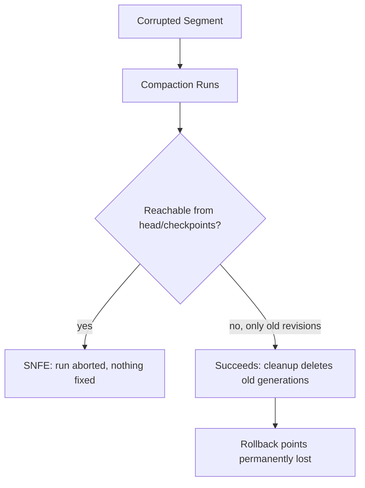

# 🗜️ Compaction

::: info 🎯 Scope
SegmentStore (TarMK) • Oak 1.22.x – 2.4.0 ([version scope](/reference/oak-versions))  
**Not for AEMaaCS**
:::

Compaction (garbage collection) reclaims disk space by removing unreachable segments. **Never run it on a corrupted repository.**

## 🔍 Signals That Lead Here

```
Disk usage growing despite content deletion
TAR files accumulating (data00050a.tar, data00051a.tar...)
"TarMK GC #3: compaction cancelled: not enough disk space."
Online GC not reclaiming expected space
```

## ⚠️ Critical Warning

::: danger NEVER run compact if:
- `oak-run check` shows ANY errors
- You suspect corruption
- You haven't verified repository health

Compaction **permanently deletes** segments. If those segments contain your only copy of data, it's gone forever.
:::

## When to Use Compaction

✅ **Safe to compact**:
- `oak-run check` passes with no errors
- Repository is healthy
- You want to reclaim disk space
- Regular maintenance

❌ **Do NOT compact**:
- Any corruption detected
- Before running `check`
- During recovery procedures

## Offline Compaction

```bash
# Stop AEM first!
$ java -jar oak-run-*.jar compact /path/to/segmentstore
```

### What It Does

1. **Copies live data** - Rewrites HEAD and all checkpoints into a new generation (new TAR files)
2. **Deletes old files** - Cleanup removes the old generation (offline compaction retains 1 generation)
3. **Rewrites journal.log** - Truncates it to the newest revision (see below)

### Options

::: info Oak 1.22 vs 2.4
- **AEM 6.5 (Oak 1.22.x):** only `--mmap [true|false]` and `--force[=true]`. Offline compaction is always **full**. Note that `--force` takes a boolean: a bare `--force` is read as `false` - use `--force=true`.
- **AEM 6.5 LTS SP3 (Oak 2.4.0):** `--mmap`, `--force` (plain flag *(since Oak 1.60)*), `--tail` (tail instead of full compaction *(since Oak 1.60)*), `--compactor classic|diff|parallel` *(since Oak 1.28; `parallel` added and made the default in Oak 1.58)*, `--threads <n>` (parallel compactor only, default 1 *(since Oak 1.58)*). `--target-path`, `--persistent-cache-*` and `--garbage-threshold-*` only apply to Azure (`az:`) stores.
- See [which LTS SP has which Oak](/reference/oak-versions).
:::

`--force` does **not** mean "full compaction": it ignores a non-matching segment store version and **upgrades the store to the oak-run's format**, which older Oak versions cannot read.

Output ends with `Compaction succeeded in …` (exit 0), `Compaction cancelled after …` (exit 1; no cleanup, journal.log untouched) or `Compaction failed after …` (exit 1, exception).

### Time Estimates

| Repository Size | Approximate Time |
|-----------------|------------------|
| 10 GB | ~15 minutes |
| 50 GB | ~45 minutes |
| 100 GB | ~1.5 hours |
| 500 GB | ~6-8 hours |
| 1 TB | ~12-24 hours |
| 2 TB | ~48-72 hours (multi-day) |
| 3 TB+ | ~72-120 hours (week-scale) |

::: warning ⚠️ Time Estimates Scale With Repository Size
These times are **I/O bound** - compaction must read every reachable segment and write new TAR files. There is no way to parallelize or speed up these operations.

**Production reality**: On-premise AEM installations commonly accumulate **500GB-2TB** segment stores. A 2TB compaction is a **multi-day operation** requiring significant maintenance window planning.
:::

## Online vs Offline

| Aspect | Online (AEM running) | Offline (AEM stopped) |
|--------|---------------------|----------------------|
| **Speed** | Slower | Faster |
| **Risk** | Higher (concurrent writes) | Lower |
| **Disk space** | Needs 2x during compaction | Needs 2x during compaction |
| **Downtime** | None | Required |
| **Journal history** | ✅ Preserved | ❌ **TRUNCATED** |

## 🔥 CRITICAL: Offline Compact Truncates journal.log

::: danger Journal History Eraser
The offline `compact` command **truncates journal.log** to a single entry:

**Before compaction:**
```
journal.log:
abc123…:261920 root 1696350000000   ← rev5
def456…:198544 root 1696340000000   ← rev4
ghi789…:173872 root 1696330000000   ← rev3
...200 more entries...
```

**After compaction:**
```
journal.log:
xyz999…:4096 root 1696360000000  ← newest (compacted) revision, history GONE
```

**Impact:**
- ✅ Repository still works (head is valid)
- ❌ Can't use `oak-run recover-journal` to roll back
- ❌ Can't use `oak-run check` to find historical good revisions
- ❌ Lose audit trail of repository state changes
:::

**Why this matters for corruption:**
- If compaction succeeds but introduced subtle corruption, you can't roll back
- If you discover corruption post-compaction, journal.log won't help
- This is why **check MUST run before compact**

**Recommendation**: Prefer **online GC via JMX** for production systems - it preserves journal history. Use **offline compact** only for:
- Initial repository setup (known clean state)
- Major cleanups after migrations (with full backup)
- Offline maintenance windows (with validated health check)

## Tail vs Full Compaction

### Tail Compaction

::: info Default type
Oak's own default (`SegmentGCOptions`) is **FULL** in both 1.22 and 2.4. Online runs use tail only when the `SegmentRevisionGarbageCollection` MBean attribute `GCType` is set to `TAIL` (or the scheduler, e.g. AEM's Revision Clean Up task, selects it). Offline `compact` gains `--tail` in Oak 1.60.
:::

- Compacts only **recent segments**
- Faster, less resource intensive
- Doesn't clean old garbage

### Full Compaction

- Compacts **all generations**
- Maximum space reclamation
- Very resource intensive

```bash
# Full offline compaction (the default in both 1.22 and 2.4)
$ java -jar oak-run-*.jar compact /path/to/segmentstore

# Tail offline compaction (Oak 1.60+ only)
$ java -jar oak-run-*.jar compact --tail /path/to/segmentstore
```

## Compaction and Corruption

### The Danger


```mermaid
flowchart TD
    A[Corrupted Segment] --> B[Compaction Runs]
    B --> C{Reachable from head/checkpoints?}
    C -->|yes| D[SNFE: run aborted, nothing fixed]
    C -->|no, only old revisions| E[Succeeds: cleanup deletes old generations]
    E --> F[Rollback points permanently lost]
```

If corruption exists:
1. Compaction reads every node of head and every checkpoint (not external DataStore binaries)
2. If it hits a missing segment, the run is **aborted** (`compaction encountered an error`); the old TAR files stay (online cleanup removes only the half-written new generation; offline `compact` skips cleanup)
3. If the damage is only in older revisions, compaction **succeeds** and cleanup deletes the older generations
4. **Those older revisions are now GONE** - you can no longer roll back to them

### The "Timeline of Death"

```
Initial Corrupt State:
tar files:   data00005a.tar [segmentA, segmentX (missing!), segmentC]
journal.log: rev3 → segmentA (has path to segmentX)
             rev2 → segmentB (no corruption)  ← GOOD REVISION
             rev1 → segmentOld

Compaction Attempts to Read:
1. Start from HEAD (rev3, segmentA)
2. Traverse nodes:
   - /content/good → OK (in segmentA)
   - /content/bad → ERROR! (needs segmentX, which is missing)
3. SegmentNotFoundException propagates:
   "TarMK GC #N: compaction encountered an error"
4. Run aborted - no new head; data00005a.tar is kept
   (online: cleanup reclaims only the half-written new generation;
    offline: "Compaction cancelled after …", exit 1, no cleanup,
    journal.log untouched)

Result:
- /content/bad still broken (compaction fixes nothing)
- rev2 still reachable - journal rollback still works
- Online GC will fail the same way on every run

The dangerous variant: once the head is repaired or rolled back so that
compaction SUCCEEDS, cleanup deletes the old generations (offline also
truncates journal.log) - any revision you had not yet rescued is gone.
```

### What Should Have Happened

::: warning ⚠️ Not in Apache Oak
`:count-nodes` is not part of Apache Jackrabbit Oak (any version). It comes from a community fork. See [Fork-only console commands](/reference/oak-versions#fork-only-console-commands) for how to get a build that matches your Oak version.
:::

```
1. Run oak-run check BEFORE compaction
2. Check finds: "Last good revision: rev2"
3. Options:
   A. Rollback journal.log to rev2 (lose rev3, keep all segments)
   B. Run count-nodes, remove /content/bad, then compact from rev3
```

### Safe Sequence

```bash
# 1. Always check first
$ java -jar oak-run-*.jar check /path/to/segmentstore

# 2. Only if check passes clean:
$ java -jar oak-run-*.jar compact /path/to/segmentstore

# 3. Verify after
$ java -jar oak-run-*.jar check /path/to/segmentstore
```

## Disk Space Requirements

Compaction needs **approximately 2x** current repository size:

```
Current: 100 GB
During compaction: ~200 GB (old + new)
After cleanup: ~70 GB (compacted)
```

::: warning
If disk fills during compaction, you may end up with a corrupted repository!
:::

## Built-in Safety Mechanisms (and Their Limitations)

### What Oak Does Check

**Tail Compaction** has a safety check:
- Validates previous compacted root (from `gc.log`) is accessible
- If inaccessible → `base state … is not accessible` → tail compaction is **not applicable** and Oak **falls back to full compaction** (not a stop)

**Disk Space / Memory Check**:
- Cancels (`compaction cancelled: not enough disk space.` / `not enough memory.`) when free disk drops to ≤ 25% of the repository size or heap runs low (memory threshold default 15%)

### What Oak Does NOT Check (Critical Gap)

**Full Compaction** has **NO** pre-flight validation:
- No validation that HEAD is fully readable before starting
- Corruption is discovered **during** compaction, not before - and aborts the run (unreadable nodes are not silently skipped)
- Missing **DataStore** binaries are never noticed (only their IDs are copied)

**Checkpoint Accessibility**:
- No pre-flight check that checkpoints are readable

**Why This Matters:**
```
Scenario: Full compaction with corruption

1. HEAD has SegmentNotFoundException somewhere in /content/corrupted
2. Full compaction starts (no validation)
3. Compaction traverses from HEAD:
   - /content/good → OK, copied to new segment
   - /content/corrupted → ERROR! Run aborted
4. Hours of I/O and up to a full copy of disk space wasted; nothing repaired
5. Repeated attempts (online schedule) keep failing
6. After someone "fixes" it by removing nodes and compaction finally succeeds,
   cleanup deletes the old generations and offline compact truncates journal.log
7. Result: no rollback to pre-fix revisions possible
```

## When Compaction is NOT Safe

❌ **NEVER run compaction if**:
1. `oak-run check` reports "No good revision found"
2. You have **ANY** undiagnosed `SegmentNotFoundException` errors in logs
3. You haven't verified HEAD is **fully accessible**
4. Disk space < 2x current repository size
5. You don't have a **recent, tested backup**
6. **ANY doubt exists** about repository integrity
7. You're in a crisis scenario (corruption suspected but not analyzed)

✅ **Safe to run compaction ONLY after**:
1. `oak-run check` confirms good revision at HEAD **with zero errors**
2. `count-nodes` detects **no segment-level corruption**
3. Sufficient disk space confirmed (2x+ repo size)
4. **Backup completed AND tested** (restore dry-run successful)
5. Maintenance window scheduled with rollback plan
6. **100% confidence** in repository health

## Monitoring Compaction

Watch the logs. Oak writes no separate compaction log. Online GC logs through logger `org.apache.jackrabbit.oak.segment.file.FileStore` (in AEM: `crx-quickstart/logs/error.log`); offline `compact` prints to the console.

```bash
$ tail -f crx-quickstart/logs/error.log | grep "TarMK GC"
```

Look for:
- "TarMK GC #N: started"
- "TarMK GC #N: compaction succeeded in …" / "cleanup completed in …"
- "compaction cancelled: …", "compaction encountered an error", "cleaning up after failed compaction"

## Compaction Failure Modes

| Failure | Cause | Recovery |
|---------|-------|----------|
| **Compaction cancelled / failed** | Out of disk space or memory, cancelled, or SNFE | Safe - old tars still intact |
| **Cleanup failed** | I/O error, permissions | Partial - new tars created but old not removed |
| **Journal truncate failed** | File system error | Dangerous - may need manual journal recovery |
| **Compacted after corruption was masked** | Damage only in old revisions, or head "fixed" first | **Catastrophic** for rollback - old generations deleted; restore from backup |

## Key Takeaways

::: tip Remember
1. **Check before compact** - Always verify health first
2. **Never compact corruption** - It aborts on SNFE, and a later successful run deletes your rollback points
3. **Need 2x disk space** - Plan for temporary growth
4. **Offline truncates journal** - Lose rollback capability
5. **Online preserves journal** - Prefer for production
6. **Verify after** - Run check to confirm success
7. **Full compaction has NO pre-flight check** - You must validate manually
:::
