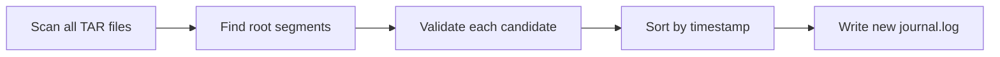

# 📜 Journal Recovery

The `recover-journal` command rebuilds the journal by scanning all segments. It's often the fastest path to recovery.

## When to Use

- Journal file is corrupted or missing
- `oak-run check` shows journal points to bad segments
- After unexpected shutdown with corruption

## Basic Usage

```bash
$ java -jar oak-run-*.jar recover-journal /path/to/segmentstore
```

## What It Does



1. **Scans every segment** in every TAR file
2. **Identifies root candidates** - segments with "checkpoints" and "root" children
3. **Validates each** using consistency checker
4. **Builds new journal** with only valid revisions

## Example Output

```
Recovering journal entries from segments...
Scanning data00000a.tar... found 1247 segments
Scanning data00001a.tar... found 1189 segments
Scanning data00002a.tar... found 892 segments

Found 247 candidate root nodes
Validating candidates...
  - 2025-01-13 10:30:00: VALID ✓
  - 2025-01-13 10:25:00: VALID ✓
  - 2025-01-13 10:20:00: INVALID (SegmentNotFoundException)
  - 2025-01-13 10:15:00: VALID ✓
  ...

Found 124 valid journal entries
Old journal backed up at journal.log.bak.0
New journal.log written with 124 entries
```

## After Recovery

Always verify with check:

```bash
$ java -jar oak-run-*.jar check /path/to/segmentstore
```

If check passes:
```bash
# Start AEM
$ ./crx-quickstart/bin/start
```

## Time Estimates

| Repository Size | Approximate Time |
|-----------------|------------------|
| 10 GB | ~10 minutes |
| 50 GB | ~20 minutes |
| 100 GB | ~30-45 minutes |
| 500 GB | ~2-3 hours |

## Limitations

`recover-journal` **cannot**:
- Recover deleted segments
- Fix corrupted segment data
- Restore content from before compaction cleanup

It **can only** rebuild the journal from **existing** segments.

## If Recovery Fails

If `recover-journal` doesn't find any valid revisions:

1. **Try sidegrade** - Extract accessible content to new repo
2. **Restore from backup** - If available
3. **Contact support** - For AEM customers

## Manual Journal Truncation

::: danger Expert Only
This is a "riverboat gambler" approach for when you know the exact good revision.
:::

If `oak-run check` showed a specific good revision:

```bash
# 1. Backup current journal
$ cp journal.log journal.log.backup

# 2. Find the good revision in journal
$ grep "f4cgd771" journal.log
f4cgd771-h8i9-0123-jklm-nopqrstuvwxy root 1704963300000

# 3. Keep only entries up to and including good revision
# (Journal is newest-first, so good revision should be near top after corruption)
$ head -n [LINE_NUMBER] journal.log > journal.log.new
$ mv journal.log.new journal.log

# 4. Verify
$ java -jar oak-run-*.jar check /path/to/segmentstore
```

## Key Takeaways

::: tip Remember
1. **Safe operation** - Creates backup of old journal
2. **Scans everything** - Finds all valid revisions in segments
3. **May lose recent changes** - Rolls back to last valid state
4. **Always verify** - Run `check` after recovery
:::
