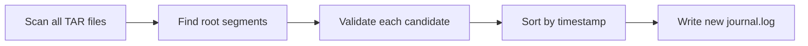

# 📜 Journal Recovery

The `recover-journal` command rebuilds the journal by scanning all segments. It's often the fastest path to recovery.

## When to Use

- Journal file is corrupted or missing
- `oak-run check` shows journal points to bad segments
- After unexpected shutdown with corruption

## Basic Usage

```bash
$ java -jar oak-run-*.jar recover-journal /path/to/segmentstore
```

## What It Does



1. **Scans every segment** in every TAR file
2. **Identifies root candidates** - segments with "checkpoints" and "root" children
3. **Validates each** using consistency checker
4. **Builds new journal** with only valid revisions

## Example Output

```
Recovering journal entries from segments...
Scanning data00000a.tar... found 1247 segments
Scanning data00001a.tar... found 1189 segments
Scanning data00002a.tar... found 892 segments

Found 247 candidate root nodes
Validating candidates...
  - 2025-01-13 10:30:00: VALID ✓
  - 2025-01-13 10:25:00: VALID ✓
  - 2025-01-13 10:20:00: INVALID (SegmentNotFoundException)
  - 2025-01-13 10:15:00: VALID ✓
  ...

Found 124 valid journal entries
Old journal backed up at journal.log.bak.0
New journal.log written with 124 entries
```

## After Recovery

Always verify with check:

```bash
$ java -jar oak-run-*.jar check /path/to/segmentstore
```

If check passes:
```bash
# Start AEM
$ ./crx-quickstart/bin/start
```

## Time Estimates

| Repository Size | Approximate Time |
|-----------------|------------------|
| 10 GB | ~10 minutes |
| 50 GB | ~20 minutes |
| 100 GB | ~30-45 minutes |
| 500 GB | ~2-3 hours |
| 1 TB+ | ~6-12 hours |

::: warning ⚠️ Time Estimates Scale
These times are **I/O bound** and scale with repository size. A 1TB repository can take **10-20x longer** than a 100GB repository. **There is no way to speed up these operations.**
:::

## Limitations

`recover-journal` **cannot**:
- Recover deleted segments
- Fix corrupted segment data
- Restore content from before compaction cleanup

It **can only** rebuild the journal from **existing** segments.

## If Recovery Fails

If `recover-journal` doesn't find any valid revisions:

1. **Try sidegrade** - Extract accessible content to new repo
2. **Restore from backup** - If available
3. **Contact support** - For AEM customers

## Manual Journal Truncation ("Riverboat Gambler" Approach)

::: danger Expert Only
This is a "riverboat gambler" approach for when you know the exact good revision and need to recover FAST.
:::

### When to Use Manual Truncation

**✅ Use manual truncation when:**
- You're experienced with Oak internals
- Time is critical (P1 incident, business down)
- You have exact good revision from `check`
- You're comfortable with vi/text editing under pressure
- You have a backup of journal.log
- Repository is massive (recovery scan would take too long)

**❌ Don't use manual truncation when:**
- You're not 100% confident in the good revision
- You're unfamiliar with journal.log format
- You have time to run automated recovery
- You're in a panic state (easy to make mistakes)
- No backup of journal.log exists

### Manual Truncation vs oak-run recover-journal

| Aspect | Manual Truncation | `oak-run recover-journal` |
|--------|------------------|-------------------|
| **Speed** | ⚡ Instant (seconds) | 🐌 Slow (minutes to hours) |
| **Complexity** | 🔧 Requires understanding journal format | 🤖 Automated, no expertise needed |
| **Safety** | ⚠️ "Riverboat gambler" - if you mess up, you make things worse | ✅ Built-in rollback, backs up old journal |
| **What you need** | Exact good revision from `check` | Just the segmentstore path |
| **Risk** | 🎲 High if you truncate wrong line | 🛡️ Low - tool validates everything |
| **Undo** | Manual restore from backup | Automatic backup at `journal.log.bak.000` |

### How to Manually Truncate journal.log

**Step 1: Run check to find last good revision**
```bash
$ java -jar oak-run-*.jar check /path/to/segmentstore

# Output:
Latest good revision for path / is 28c7e87c-1379-4ebb-94c7-0d0372b30a05 from 2025-10-03 10:23:45
```

**Step 2: Backup current journal**
```bash
$ cd /path/to/segmentstore
$ cp journal.log journal.log.backup-$(date +%Y%m%d-%H%M%S)
```

**Step 3: Find the line with the good revision**
```bash
$ grep "28c7e87c-1379-4ebb-94c7-0d0372b30a05" journal.log

# Output (example):
28c7e87c-1379-4ebb-94c7-0d0372b30a05 root 1696334625000
```

**Step 4: Truncate journal to keep only entries UP TO and INCLUDING good revision**
```bash
# Option A: Using sed (find line number first)
$ grep -n "28c7e87c-1379-4ebb-94c7-0d0372b30a05" journal.log
# Output: 1247:28c7e87c-1379-4ebb-94c7-0d0372b30a05 root 1696334625000

$ head -1247 journal.log > journal.log.truncated
$ mv journal.log.truncated journal.log

# Option B: Manual edit (safer for nervous operators)
$ vi journal.log
# Delete all lines AFTER the good revision
# Save and exit

# Verify: Check last line is the good revision
$ tail -1 journal.log
28c7e87c-1379-4ebb-94c7-0d0372b30a05 root 1696334625000  # ✓ Correct
```

**Step 5: Verify before starting AEM**
```bash
# Quick sanity check: does journal parse correctly?
$ wc -l journal.log
1247 journal.log  # Should be the line number you kept

# Optional: Run check again to confirm
$ java -jar oak-run-*.jar check /path/to/segmentstore
# Should report no corruption now
```

**Step 6: Start AEM**
```bash
$ ./crx-quickstart/bin/start
# Monitor error.log for startup
```

### Common Mistakes with Manual Truncation

**Mistake #1: Truncating to AFTER the good revision**
```bash
# WRONG: Kept lines after the corruption
$ tail -1 journal.log
46116fda-7a72-4dbc-af88-a09322a7753a root 1696334999000  # ✗ This is AFTER the good revision

# RIGHT: Last line IS the good revision
$ tail -1 journal.log
28c7e87c-1379-4ebb-94c7-0d0372b30a05 root 1696334625000  # ✓ Correct
```

**Mistake #2: Truncating BEFORE the good revision**
```bash
# WRONG: Removed the good revision itself
$ grep "28c7e87c-1379-4ebb-94c7-0d0372b30a05" journal.log
# (no output - you deleted it!)

# This will cause AEM to start from an even older state, losing more data
```

**Mistake #3: Not backing up first**
```bash
# If you mess up without a backup, you have to run oak-run recover-journal anyway
# Always: cp journal.log journal.log.backup FIRST
```

**Mistake #4: Editing on Windows (line endings)**
```bash
# Windows editors can add \r\n line endings, corrupting journal.log
# Oak expects Unix line endings (\n only)
# Use: dos2unix journal.log (if you accidentally edited on Windows)
```

### Real-World Decision Example

```
Scenario: 500GB repository, AEM down for 2 hours, business losing $10K/hour

Option A: Run oak-run recover-journal
- Time: 3-4 hours to scan all segments
- Risk: Low (automated)
- Cost: $30-40K additional downtime
- Confidence: High (tool validates everything)

Option B: Manual journal truncation
- Time: 5 minutes (find revision, edit, restart)
- Risk: Medium (human error possible)
- Cost: Minimal additional downtime
- Confidence: High IF you know what you're doing

Decision: If you're experienced → Manual truncation saves $30K
          If you're not sure → Pay the $30K for safety
```

## Key Takeaways

::: tip Remember
1. **Safe operation** - Creates backup of old journal
2. **Scans everything** - Finds all valid revisions in segments
3. **May lose recent changes** - Rolls back to last valid state
4. **Always verify** - Run `check` after recovery
5. **Manual truncation** - Fast but risky, for experts only
6. **Time scales with size** - 1TB = 10-20x longer than 100GB
:::
