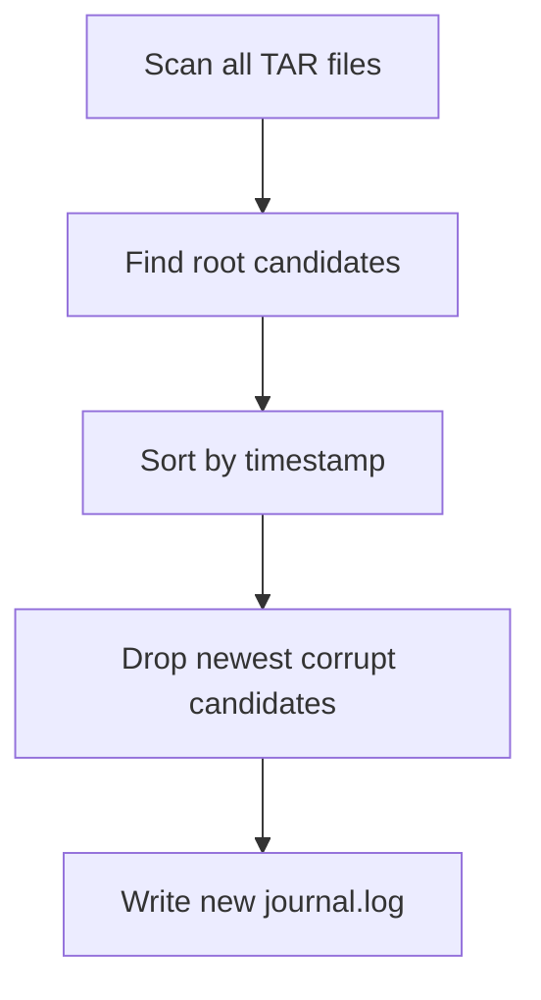

# 📜 Journal Recovery

::: info 🎯 Scope
SegmentStore (TarMK) • Oak 1.22.x – 2.4.0 ([version scope](/reference/oak-versions))  
**Not for AEMaaCS**
:::

The `recover-journal` command rebuilds the journal by scanning all segments. It's often the fastest path to recovery.

## When to Use

- Journal file points at corrupted revisions (`journal.log` must still exist and contain at least one entry whose segment is present - otherwise the read-only store cannot open: `Cannot start readonly store from empty journal`; with no `journal.log` at all: `Invalid FileStore directory <path>`)
- `oak-run check` shows journal points to bad segments
- After unexpected shutdown with corruption

::: tip What Oak already does without it
On every start, Oak walks `journal.log` from the newest entry back and takes the first one whose head segment exists. It logs `Unable to access revision …, rewinding...` for each entry it skips. If the newest entries point at *missing* segments, the journal fixes itself that way, as long as an older entry is still usable. `recover-journal` is for heads whose segment exists but whose tree or checkpoints are broken (Oak 1.22 and 2.4: `FileStoreUtil.findPersistedRecordId`).
:::

## Basic Usage

```bash
$ java -jar oak-run-*.jar recover-journal /path/to/segmentstore
```

::: warning Stop AEM first
`recover-journal` opens the store read-only and takes **no** `repo.lock`, yet it moves and rewrites `journal.log`. In a lab test (Oak 2.4.0) it ran while another process held the lock and swapped the journal underneath it.
:::

## What It Does


```mermaid
flowchart TD
    A[Scan all TAR files] --> B[Find root candidates]
    B --> C[Sort by timestamp]
    C --> D[Drop newest corrupt candidates]
    D --> E[Write new journal.log]
```

1. **Scans every data segment** in every TAR file
2. **Identifies root candidates** - node records with "checkpoints" and "root" children, timestamped from the segment info (bulk segments are skipped; revisions written before the store's first checkpoint have no `checkpoints` child and are not candidates. A store that never had a checkpoint gives `No valid journal entries found, aborting` even when it's healthy. AEM repositories always have checkpoints)
3. **Sorts them oldest → newest**, then **validates from the newest backwards** (full head tree incl. segment binaries, then every checkpoint) and drops each corrupt candidate until the first fully consistent one - older candidates are kept unvalidated
4. **Moves the old journal** to `journal.log.bak.000` (next free `.001`, `.002`, …) and writes the new `journal.log`

## Example Output

```
Skipping revision 4f2a9c1e-7b3d-4e8a-9c2f-1a2b3c4d5e6f.0003fe40, corrupted path in head: /content/dam/broken
Skipping revision 4f2a9c1e-7b3d-4e8a-9c2f-1a2b3c4d5e6f.0003fd10, found unreachable checkpoint 59e3b73e-9c3c-45e3-b6d9-156d7a6e5c52
Old journal backed up at journal.log.bak.000
Journal recovered
```

Failure messages: `No valid journal entries found, aborting`, `Unable to recover the journal entries, aborting`, `Too many journal backups, please cleanup` (after `.bak.999`). Exit code `0` on success, `1` otherwise. The only option is `-h/--help`.

Rarer ones: `Segment Store path not specified` / `Too many Segment Store paths specified` (argument errors), `Unable to backup old journal, aborting`, and `Unable to write the recovered journal, rolling back` → `Old journal rolled back` (still exit `1`).

::: warning What the Oak code actually does (Oak 1.22 and 2.4)
- **Revision IDs in the output** use the record-id form with a hex offset (`ee46e58d-….0000000a`). `journal.log` uses a decimal offset (`ee46e58d-…:10`). Keep that in mind when you grep one for the other.
- **Missing segments during the scan** print a `SegmentNotFoundException` stack trace on stderr, once per segment, and the scan continues.
- **The current head has to be readable**. After the scan and before validating, the tool builds a node store on the newest journal entry whose segment exists. If a record that this head needs is in a missing segment, the run aborts with `Unable to recover the journal entries, aborting` and nothing is written. That record can be the super-root's template, which later revisions share. Lab test on both versions: we deleted the TAR file that held the template and the `checkpoints` node. The run aborted, and cutting `journal.log` back to an older line only changed the result to `No valid journal entries found, aborting`. Such a store is past `recover-journal` ([why](/architecture/bricked#why-nothing-can-bring-it-back)).
- **A damaged journal tail is fine**: a half-written last line (`Skipping invalid journal entry: …`) or garbage lines (`Skipping invalid record id …`) are skipped, and the run succeeds (lab, both versions).
:::

## After Recovery

Always verify with check:

```bash
$ java -jar oak-run-*.jar check /path/to/segmentstore
```

If check passes:
```bash
# Start AEM
$ ./crx-quickstart/bin/start
```

## Time Estimates

| Repository Size | Approximate Time |
|-----------------|------------------|
| 10 GB | ~10 minutes |
| 50 GB | ~20 minutes |
| 100 GB | ~30-45 minutes |
| 500 GB | ~2-4 hours |
| 1 TB | ~6-12 hours |
| 2 TB | ~24-48 hours |
| 3 TB+ | ~48-96 hours (multi-day) |

::: warning ⚠️ Time Estimates Scale With Repository Size
These times are **I/O bound** - the operation must traverse every segment in every TAR file. There is no way to parallelize or speed up these operations.

**Production reality**: On-premise AEM installations commonly accumulate **500GB-2TB** segment stores over years of operation. A 2TB repository recovery is a **multi-day operation** - plan maintenance windows accordingly.
:::

## Limitations

`recover-journal` **cannot**:
- Recover deleted segments
- Fix corrupted segment data
- Restore content from before compaction cleanup

It **can only** rebuild the journal from **existing** segments.

## If Recovery Fails

If `recover-journal` doesn't find any valid revisions (`No valid journal entries found, aborting`):

1. **Restore from backup** - If available, even an old one
2. **Try sidegrade** - Extract accessible content to new repo
3. **Contact support** - For AEM customers

## Manual Journal Truncation ("Riverboat Gambler" Approach)

::: danger Expert Only
This is a "riverboat gambler" approach for when you know the exact good revision and need to recover FAST.
:::

### When to Use Manual Truncation

**✅ Use manual truncation when:**
- You're experienced with Oak internals
- Time is critical (P1 incident, business down)
- You have exact good revision from `check`
- You're comfortable with vi/text editing under pressure
- You have a backup of journal.log
- Repository is massive (recovery scan would take too long)

**❌ Don't use manual truncation when:**
- You're not 100% confident in the good revision
- You're unfamiliar with journal.log format
- You have time to run automated recovery
- You're in a panic state (easy to make mistakes)
- No backup of journal.log exists

### Manual Truncation vs oak-run recover-journal

| Aspect | Manual Truncation | `oak-run recover-journal` |
|--------|------------------|-------------------|
| **Speed** | ⚡ Instant (seconds) | 🐌 Slow (minutes to hours) |
| **Complexity** | 🔧 Requires understanding journal format | 🤖 Automated, no expertise needed |
| **Safety** | ⚠️ "Riverboat gambler" - if you mess up, you make things worse | ✅ Built-in rollback, backs up old journal |
| **What you need** | Exact good revision from `check` | Just the segmentstore path |
| **Risk** | 🎲 High if you truncate wrong line | 🛡️ Low - tool validates the newest revisions until one is consistent |
| **Undo** | Manual restore from backup | Automatic backup at `journal.log.bak.000` |

### How to Manually Truncate journal.log

**Step 1: Run check to find last good revision**
```bash
$ java -jar oak-run-*.jar check /path/to/segmentstore

# Output:
Latest good revision for path / is 28c7e87c-1379-4ebb-94c7-0d0372b30a05:261920 from Oct 3, 2025, 10:23:45 AM
```

**Step 2: Backup current journal**
```bash
$ cd /path/to/segmentstore
$ cp journal.log journal.log.backup-$(date +%Y%m%d-%H%M%S)
```

**Step 3: Find the line with the good revision**
```bash
$ grep "28c7e87c-1379-4ebb-94c7-0d0372b30a05" journal.log

# Output (example):
28c7e87c-1379-4ebb-94c7-0d0372b30a05:261920 root 1696334625000
```

**Step 4: Truncate journal to keep only entries UP TO and INCLUDING good revision**
```bash
# Option A: Using sed (find line number first)
$ grep -n "28c7e87c-1379-4ebb-94c7-0d0372b30a05" journal.log
# Output: 1247:28c7e87c-1379-4ebb-94c7-0d0372b30a05:261920 root 1696334625000

$ head -1247 journal.log > journal.log.truncated
$ mv journal.log.truncated journal.log

# Option B: Manual edit (safer for nervous operators)
$ vi journal.log
# Delete all lines AFTER the good revision
# Save and exit

# Verify: Check last line is the good revision
$ tail -1 journal.log
28c7e87c-1379-4ebb-94c7-0d0372b30a05:261920 root 1696334625000  # ✓ Correct
```

**Step 5: Verify before starting AEM**
```bash
# Quick sanity check: does journal parse correctly?
$ wc -l journal.log
1247 journal.log  # Should be the line number you kept

# Optional: Run check again to confirm
$ java -jar oak-run-*.jar check /path/to/segmentstore
# Should report no corruption now
```

**Step 6: Start AEM**
```bash
$ ./crx-quickstart/bin/start
# Monitor error.log for startup
```

### Common Mistakes with Manual Truncation

**Mistake #1: Truncating to AFTER the good revision**
```bash
# WRONG: Kept lines after the corruption
$ tail -1 journal.log
46116fda-7a72-4dbc-af88-a09322a7753a:254016 root 1696334999000  # ✗ This is AFTER the good revision

# RIGHT: Last line IS the good revision
$ tail -1 journal.log
28c7e87c-1379-4ebb-94c7-0d0372b30a05:261920 root 1696334625000  # ✓ Correct
```

**Mistake #2: Truncating BEFORE the good revision**
```bash
# WRONG: Removed the good revision itself
$ grep "28c7e87c-1379-4ebb-94c7-0d0372b30a05" journal.log
# (no output - you deleted it!)

# This will cause AEM to start from an even older state, losing more data
```

::: danger If no line is left that Oak can use
If you cut so much that no remaining line points at an existing segment (or you empty the file), AEM does **not** refuse to start. Read-only tools stop with `Cannot start readonly store from empty journal`. The read-write store, though, writes a **new, empty root** and appends it to `journal.log` ([why](/architecture/bricked#path-4-starting-aem-on-a-store-check-can-t-open)). Lab, both versions: after a read-write open with an empty journal, `/` had no children. In the lab, `recover-journal` brought the old head back afterwards: the empty root has no `checkpoints` child, so it isn't a candidate. After a real AEM start on such a store, AEM's own new revisions would be the newest candidates. That case wasn't tested.
:::

**Mistake #3: Not backing up first**
```bash
# If you mess up without a backup, you have to run oak-run recover-journal anyway
# Always: cp journal.log journal.log.backup FIRST
```

**Mistake #4: Editing on Windows (line endings)**
```bash
# Windows editors can add \r\n line endings
# Oak writes Unix line endings (\n only) - keep journal.log exactly as Oak writes it
# Use: dos2unix journal.log (if you accidentally edited on Windows)
```

In a lab test, Oak 1.22.24 and 2.4.0 read a `\r\n` journal without a warning (it is read with commons-io `ReversedLinesFileReader`), so `dos2unix` is hygiene, not a rescue. Do **keep the final newline**: Oak appends `<revision> root <timestamp>\n` at the end of the file without checking, so a missing newline glues the next entry onto your last line (`LocalJournalFile.writeLine`).

### Real-World Decision Example

```
Scenario: 500GB repository, AEM down for 2 hours, business losing $10K/hour

Option A: Run oak-run recover-journal
- Time: 3-4 hours to scan all segments
- Risk: Low (automated)
- Cost: $30-40K additional downtime
- Confidence: High (tool validates head + checkpoints)

Option B: Manual journal truncation
- Time: 5 minutes (find revision, edit, restart)
- Risk: Medium (human error possible)
- Cost: Minimal additional downtime
- Confidence: High IF you know what you're doing

Decision: If you're experienced → Manual truncation saves $30K
          If you're not sure → Pay the $30K for safety
```

## Key Takeaways

::: tip Remember
1. **Safe operation** - Creates backup of old journal
2. **Scans everything** - Finds all root candidates in segments, keeps them up to the newest consistent one
3. **May lose recent changes** - Rolls back to last valid state
4. **Always verify** - Run `check` after recovery
5. **Manual truncation** - Fast but risky, for experts only
6. **Time scales with size** - 1TB = 10-20x longer than 100GB
:::

::: info 📅 Last Updated
Content last reviewed: October 2026 • Verified against Oak 1.22.24 (AEM 6.5) and Oak 2.4.0 (AEM 6.5 LTS SP3)
:::
