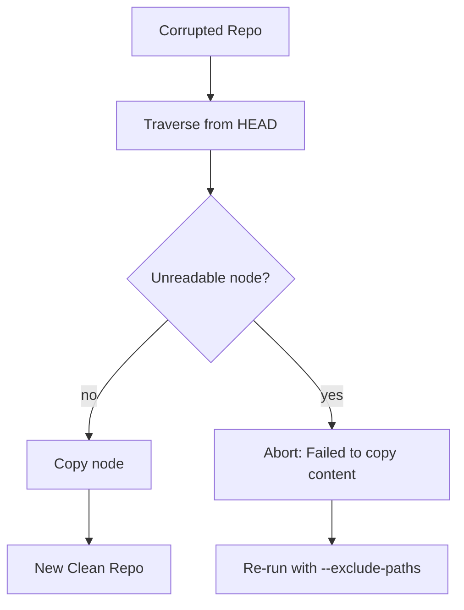

# 🔄 Sidegrade (oak-upgrade)

Sidegrade uses `oak-upgrade` to extract accessible content from a corrupted repository into a new, clean repository. This is the **last resort** when other recovery options fail.

## When to Use

- `oak-run check` finds no good revision
- `oak-run recover-journal` fails
- Critical paths are corrupted (can't use surgical removal)
- You need to salvage whatever content is accessible

## Basic Usage

```bash
$ java -jar oak-upgrade-<oak-version>.jar \
    /path/to/corrupted/crx-quickstart/repository \
    /path/to/new/repository
```

Source and destination are **positional** and point at the **repository directory that contains `segmentstore/`** — oak-upgrade appends `segmentstore` itself. Do not pass the `segmentstore` directory, and do not add an `upgrade` sub-command (the tool's own help banner prints `java -jar oak-upgrade-*.jar upgrade`, but a third positional argument fails with `Too much node store arguments`).

::: warning Different JAR
This uses `oak-upgrade-*.jar`, NOT `oak-run-*.jar`. They are separate tools (`oak-run upgrade` only prints "This command was moved to the oak-upgrade module"). Use the standalone `oak-upgrade` release that matches your oak-core version (`oak-upgrade-1.22.x.jar` on AEM 6.5, `oak-upgrade-2.4.0.jar` on AEM 6.5 LTS SP3) — the AEM 6.5 LTS release notes say crx2oak is not supported there. See [which LTS SP has which Oak](/reference/oak-versions).
:::

## What It Does


```mermaid
flowchart TD
    A[Corrupted Repo] --> B[Traverse from HEAD]
    B --> C{Unreadable node?}
    C -->|no| D[Copy node]
    C -->|yes| X[Abort: Failed to copy content]
    D --> E[New Clean Repo]
    X --> F[Re-run with --exclude-paths]
```

1. **Attempts to traverse from HEAD** (on a full segment→segment copy it first copies the checkpoints, then applies the diff to HEAD)
2. **Copies every node it is asked to copy** to the new repository
3. **Does NOT skip unreadable nodes** — a `SegmentNotFoundException` anywhere in the copied tree aborts the whole run with `Failed to copy content`. Leave known-corrupt paths out with `--exclude-paths` (find them first with `oak-run check` or `:count-nodes`)
4. **Results in a new, smaller repository** with only recoverable content

## Example

```bash
$ java -jar oak-upgrade-<oak-version>.jar \
    --exclude-paths=/content/corrupted \
    /path/to/corrupted/crx-quickstart/repository /path/to/recovered/repository

... paths to exclude: [/content/corrupted]
... Source: SEGMENT_TAR[/path/to/corrupted/crx-quickstart/repository]
... Destination: SEGMENT_TAR[/path/to/recovered/repository]
... Only blob references will be copied
... Checkpoints won't be migrated because of the specified paths
... Copying node #10000: /content/...
... Copying node #20000: /apps/...
...
```

Progress is logged every 10,000 nodes (`-Doak.upgrade.logNodeCopy=<n>` to change). If a corrupted node is hit, the run ends with `javax.jcr.RepositoryException: Failed to copy content` — add that path to `--exclude-paths` and start over with an empty destination.

## Options

### Essential Options

| Option | Description |
|--------|-------------|
| `--copy-binaries` | Copy binary content instead of only references. Without a target DataStore option the binaries get embedded in the new segment store |
| `--include-paths` | Only migrate specific paths (comma-separated) |
| `--exclude-paths` | Skip specific paths (comma-separated) |
| `--merge-paths` | Paths to merge with the existing destination content instead of replacing it (comma-separated) |

::: tip Binaries: references vs copies
If the source uses an external DataStore and you pass no DataStore options, only **blob references** are copied — the new repository must keep using the same DataStore. Pass `--src-datastore` (plus `--datastore` to copy into a new FileDataStore, or `--copy-binaries` to embed them) to actually move binaries. When the source has external binaries, `--copy-binaries` or a target DataStore option *without* a source DataStore option is rejected ("This combination of data- and node-stores is not supported").
:::

### Recovery-Specific Options

| Option | Description |
|--------|-------------|
| `--fail-on-error` | Only affects JCR2 (CRX2) → Oak upgrades. A segment→segment sidegrade never skips unreadable nodes, with or without this flag |
| `--ignore-missing-binaries` | Proceed even if binaries are missing from the **source** DataStore (only takes effect with a source DataStore option: `--src-datastore`, `--src-s3datastore` or `--src-azuredatastore`) |
| `--skip-checkpoints` | Don't copy checkpoints on a full segment→segment migration (checkpoints are already skipped when include/exclude/merge paths or version options are used) |
| `--copy-versions` | Copy version storage: `true`, `false`, or `yyyy-mm-dd` cutoff (default: true) |
| `--copy-orphaned-versions` | Copy orphaned versions: `true`, `false`, or `yyyy-mm-dd` cutoff (default: true) |

### Performance Options

| Option | Description |
|--------|-------------|
| `--cache <MB>` | Cache size in MB (default: 256). Increase for large repos. |
| `--disable-mmap` | Disable memory-mapped file access (use if running into memory issues) |

### DataStore Options

| Option | Description |
|--------|-------------|
| `--src-datastore <path>` | Source FileDataStore directory |
| `--datastore <path>` | Target FileDataStore directory |
| `--src-s3datastore <path>` | Source S3 DataStore directory (local cache dir) |
| `--src-s3config <file>` | Source S3 configuration file |
| `--s3datastore <path>` | Target S3 DataStore directory (local cache dir) |
| `--s3config <file>` | Target S3 configuration file |

`--fds-path` is an **oak-run** option; oak-upgrade does not accept it — use `--src-datastore` / `--datastore`.

### Source/Destination Formats

For TarMK there is no prefix — pass the plain repository directory:

```bash
# Local segment-tar: the directory that CONTAINS segmentstore/
/path/to/crx-quickstart/repository
```

(oak-upgrade also accepts `az:`, `mongodb://` and `jdbc:` descriptors, but Azure segment stores and DocumentNodeStore are outside the scope of this guide. There is no `segment-tar:` prefix and no `--src=` / `--dst=` option.)

### Selective Migration

```bash
# Only migrate /content and /apps
$ java -jar oak-upgrade-<oak-version>.jar \
    --include-paths=/content,/apps \
    /path/to/corrupted/crx-quickstart/repository /path/to/new/repository
```

### Merge with Old Backup

If you have an old backup and want to merge recent accessible content:

```bash
# 1. Restore old backup first
# (DevOps restore operation)

# 2. Merge accessible recent content from corrupted repo
$ java -jar oak-upgrade-<oak-version>.jar \
    --include-paths=/content,/home \
    --merge-paths=/content,/home \
    /path/to/corrupted/crx-quickstart/repository \
    /path/to/restored/crx-quickstart/repository

# Result: Old backup + recent changes (minus corrupted paths)
```

### Recovery with Missing Binaries

If DataStore has missing blobs but you want to salvage the repository structure:

```bash
# Proceed even if binaries are missing
$ java -jar oak-upgrade-<oak-version>.jar \
    --ignore-missing-binaries \
    --src-datastore=/path/to/corrupted/datastore \
    --datastore=/path/to/new/datastore \
    /path/to/corrupted/crx-quickstart/repository /path/to/new/repository

# Result: Repository structure intact; each missing binary is logged
# ("No blob found for id [...]") and read as an empty stream
# You'll need to re-upload missing assets later
```

### Skip Old Versions (Faster Recovery)

Version storage can be huge. Skip it to speed up recovery:

```bash
# Skip all version history
$ java -jar oak-upgrade-<oak-version>.jar \
    --copy-versions=false \
    --copy-orphaned-versions=false \
    /path/to/corrupted/crx-quickstart/repository /path/to/new/repository

# Or only copy versions from last 30 days
$ java -jar oak-upgrade-<oak-version>.jar \
    --copy-versions=2025-12-15 \
    /path/to/corrupted/crx-quickstart/repository /path/to/new/repository
```

## Standby Recovery: Why It Rarely Works

::: danger ⚠️ REALITY CHECK
Standby recovery is **rarely viable** in practice.
:::

### The Problem with Cold Standby

- Cold standbys typically **replicate corruption** from primary
- By the time corruption is discovered, standby already has it
- Standby sync happens continuously (usually every few seconds)
- Corruption on primary → quickly replicated to standby

### When Standby MIGHT Work (Extremely Rare)

1. **Standby sync was disabled/broken** before corruption occurred
   - Network failure prevented sync for extended period
   - Standby deliberately paused for maintenance (hours/days)
   - **Reality**: Operations teams notice and fix sync issues immediately

2. **Very recent corruption** detected within seconds
   - Corruption just happened seconds ago
   - Standby hasn't synced yet (sync interval typically 5-30 seconds)
   - **Reality**: Corruption detection takes minutes/hours, standby already has it

3. **"Standby" from different time period**
   - Old standby that was intentionally kept out of sync
   - **Reality**: This is a backup, not a standby - use backup restore procedures

### Bottom Line

In **99.9% of real-world scenarios**, standby has the same corruption as primary. **Plan for backup restore, not standby recovery.**

## Success Conditions

- ✅ At least some content is accessible
- ✅ Corruption is localized (e.g., only `/content/dam/corrupted`)
- ✅ Critical paths (`/apps`, `/libs`, `/content`) are mostly intact

## Failure Modes

- ❌ If HEAD itself is inaccessible (can't even start traversal)
- ❌ If corruption affects most of the repository
- ❌ Content loss is likely - you get what you get

## Time Estimates

| Repository Size | Approximate Time |
|-----------------|------------------|
| 10 GB | ~30 minutes |
| 50 GB | ~1-2 hours |
| 100 GB | ~4-6 hours |
| 500 GB | ~12-24 hours |
| 1 TB | ~24-48 hours |
| 2 TB | ~48-96 hours (multi-day) |
| 3 TB+ | ~96-168 hours (week-scale) |

::: warning ⚠️ Time Estimates Scale With Repository Size
These times are **I/O bound** - sidegrade must read every accessible node from the source and write to the destination. There is no way to parallelize or speed up these operations.

**Production reality**: On-premise AEM installations commonly accumulate **500GB-2TB** segment stores. A 2TB sidegrade is a **multi-day to week-scale operation**.

**First-time operators** without deep Oak knowledge should expect the **upper end** of timeline estimates.
:::

## After Sidegrade

1. **Verify new repository**
   ```bash
   $ java -jar oak-run-*.jar check /path/to/new/repository/segmentstore
   ```

2. **Assess what was lost**
   - Compare node counts
   - Check critical paths
   - Verify functionality

3. **Replace old repository**
   ```bash
   $ mv /path/to/old/segmentstore /path/to/old/segmentstore.corrupted
   $ mv /path/to/new/repository/segmentstore /path/to/old/segmentstore
   ```

4. **Start AEM**
   ```bash
   $ ./crx-quickstart/bin/start
   ```

## Backup Timing: The #1 DevOps Mistake

::: danger ⚠️ CRITICAL: Stop AEM Before Backup
Taking backups/snapshots while AEM is running captures **inconsistent state**.
:::

### WRONG: Backup While Running

```bash
# AEM is running, actively writing to disk
$ tar -czf aem-backup.tar.gz crx-quickstart/repository/
# OR
$ aws ec2 create-snapshot --volume-id vol-xxx  # VM still running
```

**Why this fails:**
- ❌ Backup captures **partial TAR files** (mid-write)
- ❌ Backup captures **inconsistent state** (some TARs updated, others not)
- ❌ Backup contains **corrupted journal.log** (truncated mid-write)
- ❌ Restore will fail with SegmentNotFoundException

### RIGHT: Stop AEM, Then Backup

```bash
# 1. Stop AEM cleanly
$ ./crx-quickstart/bin/stop
# Wait for process to fully terminate

# 2. VERIFY AEM is stopped
$ ps aux | grep java
# No AEM process should be running

# 3. NOW take backup (filesystem is quiescent)
$ tar -czf aem-backup.tar.gz crx-quickstart/repository/
# OR
$ aws ec2 create-snapshot --volume-id vol-xxx
```

### Test Your Backup BEFORE You Need It

```bash
# Don't wait for a P1 to discover your backup is corrupt
$ java -jar oak-run-*.jar check /path/to/backup/segmentstore

# ✅ "Latest good revision..." = Backup is good
# ❌ SegmentNotFoundException = Backup is corrupt (was taken while running)
```

### Backup Validation Checklist

1. ✅ AEM was stopped when backup taken
2. ✅ Backup timestamp is AFTER AEM stop time
3. ✅ `oak-run check` passes on backup segmentstore
4. ✅ Backup restore tested successfully (at least once)

## If Sidegrade Fails

If sidegrade can't extract any content:

1. **Restore from backup** - Even an old backup is better than nothing
2. **Accept total data loss** - Rebuild from scratch
3. **Document everything** - Root cause analysis for prevention

::: danger Total Data Loss
If you're in this scenario with no backup, there is **no Oak magic** that will save you. The data is gone.

**Your only options:**
1. Accept the loss - Rebuild from scratch
2. Communicate upward immediately
3. Implement backup strategy so this never happens again
:::

## Key Takeaways

::: tip Remember
1. **Last resort** - Use only when other recovery fails
2. **Content loss likely** - You get what's accessible
3. **Different JAR** - Uses `oak-upgrade`, not `oak-run`
4. **Standby rarely helps** - It usually has the same corruption
5. **Stop AEM before backup** - Running backups capture inconsistent state
6. **Test backups** - Run `oak-run check` on backup before you need it
7. **Time scales with size** - 1TB = 10-20x longer than 100GB
:::
