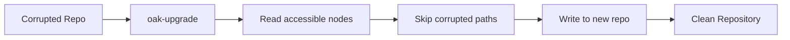

# 🔄 Sidegrade (oak-upgrade)

Sidegrade extracts all **accessible content** from a corrupted repository into a fresh, clean repository. It's the last resort when other recovery methods fail.

## When to Use

- `recover-journal` found no valid revisions
- Critical paths are corrupted (can't use surgical removal)
- You want to salvage whatever is accessible
- Other recovery methods have failed

## Basic Usage

```bash
$ java -jar oak-upgrade-*.jar \
    --copy-binaries \
    /path/to/corrupted/segmentstore \
    /path/to/new/segmentstore
```

## What It Does



1. **Opens source** - Corrupted repository (read-only)
2. **Traverses tree** - Reads all accessible nodes
3. **Skips corruption** - Logs and skips unreadable paths
4. **Writes to target** - Creates clean new repository

## Command Options

```bash
# Basic sidegrade
oak-upgrade --copy-binaries src dst

# Include specific paths only
oak-upgrade --copy-binaries \
    --include-paths /content,/apps,/conf \
    src dst

# Exclude paths
oak-upgrade --copy-binaries \
    --exclude-paths /var/audit,/tmp \
    src dst

# Merge into existing repository
oak-upgrade --copy-binaries \
    --merge-paths /content \
    src dst
```

## Example Output

```
Starting migration...
Source: /path/to/corrupted/segmentstore
Target: /path/to/new/segmentstore

Migrating /content... OK
Migrating /content/dam... OK
Migrating /content/dam/2024... 
  WARNING: SegmentNotFoundException at /content/dam/2024/Q3
  Skipping corrupted subtree
Migrating /content/dam/2024/Q4... OK
Migrating /apps... OK
Migrating /conf... OK
...

Migration completed.
Migrated: 45,231 nodes
Skipped: 127 nodes (corrupted)
See migration.log for details
```

## Time Estimates

| Repository Size | Approximate Time |
|-----------------|------------------|
| 10 GB | ~30 minutes |
| 50 GB | ~2 hours |
| 100 GB | ~4-6 hours |
| 500 GB | ~12-24 hours |

## After Sidegrade

### 1. Verify New Repository

```bash
$ java -jar oak-run-*.jar check /path/to/new/segmentstore
```

### 2. Replace Old Repository

```bash
# Backup corrupted repo (just in case)
$ mv segmentstore segmentstore.corrupted

# Use new repo
$ mv new-segmentstore segmentstore
```

### 3. Rebuild Indexes

After sidegrade, Lucene indexes need rebuilding:

```bash
# Start AEM
# Go to: /system/console/jmx
# Find: IndexStatsMBean
# Execute: reindex
```

Or delete index files to trigger rebuild:

```bash
$ rm -rf crx-quickstart/repository/index/*
```

## Merge Paths

If you have an old backup and want to merge recent accessible content:

```bash
# 1. Restore old backup
# 2. Merge accessible recent content
$ java -jar oak-upgrade-*.jar \
    --copy-binaries \
    --merge-paths /content,/home \
    /path/to/corrupted \
    /path/to/restored-backup
```

## Limitations

Sidegrade **cannot**:
- Recover corrupted data (it's skipped)
- Preserve exact timestamps (some metadata may change)
- Migrate custom node types automatically
- Handle very large repositories quickly

## What Gets Lost

- **Corrupted paths** - Logged but not migrated
- **Unreachable content** - Anything under corrupted nodes
- **Some metadata** - Depending on corruption extent
- **Indexes** - Must be rebuilt

## Key Takeaways

::: tip Remember
1. **Last resort** - Use when other methods fail
2. **Extracts accessible content** - Skips corruption
3. **Creates clean repo** - Fresh start
4. **Rebuild indexes** - Required after migration
5. **Document losses** - Review migration log for skipped paths
:::
