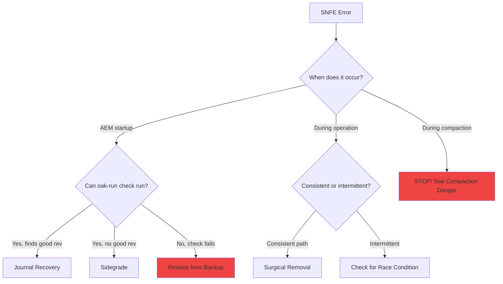

# 🚨 SegmentNotFoundException Playbook

::: info 🎯 Scope
SegmentStore (TarMK) • Oak 1.22+  
**Not for AEMaaCS**
:::

The `SegmentNotFoundException` (SNFE) is the most common and most feared error in Oak. This playbook helps you diagnose the cause and choose the right recovery path.

## 🔍 Signals

```
org.apache.jackrabbit.oak.segment.SegmentNotFoundException: 
  Segment 0a1b2c3d-4e5f-6789-abcd-ef0123456789 not found

java.lang.IllegalStateException: Segment not found: 0a1b2c3d-...

TarMK refuses to start: SegmentNotFoundException during initialization

oak-run check fails with: Segment xyz not found
```

## Quick Decision Tree



## SNFE Categories

| Category | Cause | Recovery Path |
|----------|-------|---------------|
| **Startup SNFE** | Corrupted HEAD revision | [Journal Recovery](/recovery/journal) or [Sidegrade](/recovery/sidegrade) |
| **Runtime SNFE** | Specific path corrupted | [Surgical Removal](/recovery/surgical) |
| **Compaction SNFE** | GC hit corruption | **STOP compaction immediately** |
| **Intermittent SNFE** | Long-lived sessions + tail GC | [GC Configuration](/architecture/gc#-critical-long-lived-sessions--tail-compaction--segmentnotfoundexception) |
| **Check SNFE** | Repository bricked | Restore from backup |

## Step 1: Stop and Assess

```bash
# STOP AEM if running
./crx-quickstart/bin/stop

# Check if this is a "bricked" scenario
java -jar oak-run-*.jar check /path/to/segmentstore
```

### Interpreting Check Results

**Scenario A: Check runs, finds good revision** ✅
```
Searched through 247 revisions and 3 checkpoints
Latest good revision for paths and checkpoints checked is abc123 from 2025-10-03
```
→ **Recoverable** — Use [Journal Recovery](/recovery/journal) or [Surgical Removal](/recovery/surgical)

**Scenario B: Check runs, no good revision** ⚠️
```
Searched through 247 revisions and 3 checkpoints
No good revision found
```
→ **Partially Recoverable** — Use [Sidegrade](/recovery/sidegrade) to extract what you can

**Scenario C: Check itself fails with SNFE** ❌
```
Exception in thread "main" org.apache.jackrabbit.oak.segment.SegmentNotFoundException:
Segment abc123def456 not found
    at org.apache.jackrabbit.oak.segment.file.FileStore.readSegment(FileStore.java:513)
```
→ **Unrecoverable** — Restore from backup. No Oak tools can help.

## Step 2: Choose Recovery Path

### Path A: Journal Recovery (Fastest)

**When to use**: Check found a good revision, you can accept losing recent changes.

```bash
java -jar oak-run-*.jar recover-journal /path/to/segmentstore
```

**What it does**: Rolls back to the last good revision in journal.log.

**Data loss**: Changes since the good revision timestamp.

### Path B: Surgical Removal (Preserve More)

**When to use**: Check found a good revision, but you want to keep recent changes and only remove corrupted paths.

```bash
# Find corrupted paths
java -jar oak-run-*.jar console --read-write /path/to/segmentstore
> :count-nodes deep analysis
# Review /tmp/count-nodes-snfe-*.log

# Remove corrupted paths (dry-run first!)
> :remove-nodes /tmp/count-nodes-snfe-*.log dry-run
> :remove-nodes /tmp/count-nodes-snfe-*.log
> :exit

# Verify
java -jar oak-run-*.jar check /path/to/segmentstore
```

**Data loss**: Only the corrupted paths.

### Path C: Sidegrade (Last Resort)

**When to use**: No good revision found, but check can still run.

```bash
java -jar oak-upgrade-*.jar upgrade --copy-binaries \
    /path/to/corrupted /path/to/new-repo
```

**Data loss**: Unknown — whatever can't be read is lost.

### Path D: Restore from Backup

**When to use**: Check itself fails with SNFE, or you have a recent backup.

**This is always the safest option if you have a backup.**

## Common SNFE Scenarios

### Scenario 1: Unclean Shutdown

**Symptoms**:
- SNFE on startup after power loss / kill -9 / OOM
- Recent TAR file may be incomplete

**Diagnosis**:
```bash
# Check TAR file integrity
ls -la /path/to/segmentstore/*.tar
# Look for very small recent TAR files (< 1KB)
```

**Recovery**: Usually [Journal Recovery](/recovery/journal) works.

### Scenario 2: Disk Full During Write

**Symptoms**:
- SNFE after disk 100% event
- Incomplete segment write

**Diagnosis**:
```bash
df -h /path/to/segmentstore
# Was disk full recently?
```

**Recovery**: Free disk space, then [Journal Recovery](/recovery/journal).

### Scenario 3: Long-Lived Sessions + Tail Compaction

**Symptoms**:
- Intermittent SNFE during workflows or scheduled jobs
- SNFE correlates with compaction timestamps
- "Fixes itself" after session refresh

**Diagnosis**:
```bash
# Check if SNFE correlates with compaction
grep "Tail compaction" error.log
grep "SegmentNotFoundException" error.log
# Compare timestamps
```

**Recovery**: This is a **race condition**, not corruption. See [GC documentation](/architecture/gc#-critical-long-lived-sessions--tail-compaction--segmentnotfoundexception).

**Prevention**: Increase `revisionGcMaxAgeInSecs` or fix long-lived sessions in application code.

### Scenario 4: Compaction Over Corruption

**Symptoms**:
- SNFE after compaction ran
- `oak-run check` now fails completely
- Journal.log has only one entry

**Diagnosis**:
```bash
# Check journal.log size
wc -l /path/to/segmentstore/journal.log
# If only 1 line, compaction truncated it
```

**Recovery**: **Restore from backup**. Compaction deleted the segments you need.

**Prevention**: ALWAYS run `oak-run check` before compaction.

### Scenario 5: Invisible Missing Blobs (Indexing Death Loop)

**Symptoms**:
- `datastorecheck` shows 0 missing blobs
- `count-nodes deep` finds no issues
- But indexing keeps failing with `DataStoreException`
- Checkpoints are months old

**Diagnosis**:
```bash
# Check checkpoint age
java -jar oak-run-*.jar checkpoints /path/to/segmentstore list
# Old checkpoints (months) = likely invisible blob problem
```

**Recovery**: [Checkpoint Advancement](/checkpoints/checkpoint-advancement)

## ✅ Do / ❌ Don't

| ✅ DO | ❌ DON'T |
|-------|----------|
| Stop AEM immediately | Keep AEM running hoping it fixes itself |
| Run `oak-run check` first | Run `compact` to "fix" the problem |
| Save all logs before recovery | Delete logs to "clean up" |
| Have a backup before any recovery | Attempt recovery without backup |
| Understand the cause before acting | Panic and run random commands |

## When to Hand Off

| Situation | Hand Off To |
|-----------|-------------|
| SNFE during indexing operations | Indexing team — may be index corruption |
| SNFE on author with DocumentNodeStore | Author persistence team — different recovery |
| SNFE after content migration | Migration team — may be source data issue |

## Time Estimates

| Operation | 100GB Repo | 500GB Repo | 1TB Repo |
|-----------|------------|------------|----------|
| `oak-run check` | 15 min | 45 min | 2 hours |
| `recover-journal` | 30 min | 1 hour | 2 hours |
| `count-nodes` | 2 hours | 8 hours | 24 hours |
| `remove-nodes` | 30 min | 1 hour | 2 hours |
| `oak-upgrade` sidegrade | 6 hours | 24 hours | 48+ hours |
| Backup restore | 1-2 hours | 4-6 hours | 12+ hours |

## Key Takeaways

::: tip Remember
1. **SNFE is a symptom, not a diagnosis** — Find the root cause
2. **Check before anything else** — Determines your recovery options
3. **Backup is always safest** — If you have one, use it
4. **Never compact corruption** — Makes it permanent
5. **Intermittent SNFE ≠ corruption** — May be GC race condition
6. **"0 missing blobs" can still fail** — See [Checkpoint Advancement](/checkpoints/checkpoint-advancement)
:::

::: info 📅 Last Updated
Content last reviewed: January 2026 • Oak 1.22.x / AEM 6.5.x (also applicable to AEM 6.5 LTS)
:::
