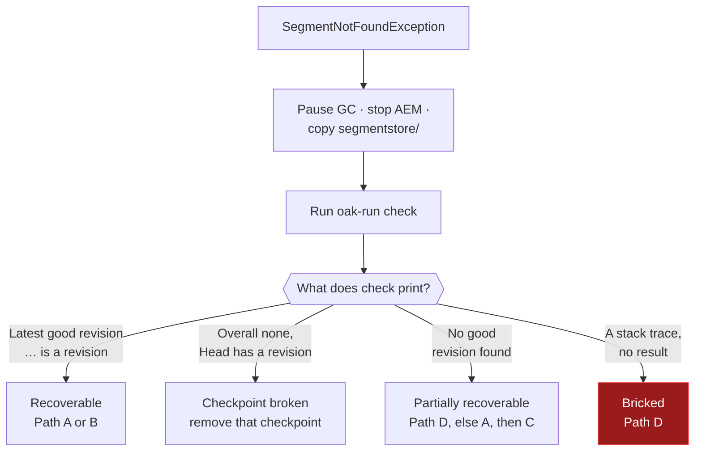

# 🚨 SegmentNotFoundException Playbook

::: info 🎯 Scope
SegmentStore (TarMK) • Oak 1.22.x – 2.4.0 ([version scope](/reference/oak-versions))  
**Not for AEMaaCS**
:::

The `SegmentNotFoundException` (SNFE) is the most common and most feared error in Oak. This playbook helps you diagnose the cause and choose the right recovery path.

## 🔍 Signals

```
org.apache.jackrabbit.oak.segment.SegmentNotFoundException: 
  Segment 0a1b2c3d-4e5f-6789-abcd-ef0123456789 not found

*ERROR* [...] org.apache.jackrabbit.oak.segment.SegmentNotFoundExceptionListener Segment not found: 0a1b2c3d-4e5f-6789-abcd-ef0123456789. SegmentId age=123456ms

TarMK refuses to start: SegmentNotFoundException during initialization

oak-run check fails with: Segment xyz not found
```

## Quick Decision Tree

Every SNFE starts the same way: stop GC from deleting anything, take a copy, and let `oak-run check` decide. What it prints picks the path.


```mermaid
flowchart TD
    A["SegmentNotFoundException"] --> B["Pause GC · stop AEM ·<br/>copy segmentstore/"]
    B --> C["Run oak-run check"]
    C --> D{{"What does check print?"}}
    D -->|"Latest good revision<br/>… is a revision"| E["Recoverable<br/>Path A or B"]
    D -->|"Overall none,<br/>Head has a revision"| F["Checkpoint broken<br/>remove that checkpoint"]
    D -->|"No good<br/>revision found"| G["Partially recoverable<br/>Path D, else A, then C"]
    D -->|"A stack trace,<br/>no result"| H["Bricked<br/>Path D"]

    style H fill:#991b1b,stroke:#ef4444,color:#fff
```

The paths are in [Step 2](#step-2-choose-recovery-path). One exception to the last branch: if the stack trace runs through `SegmentNodeStore.checkpoints`, the store did open and only listing its checkpoints failed. Run `check --head` ([details](/recovery/check#🚨-critical-bricked-vs-recoverable-distinction)).

## Where You Saw It

The place an SNFE shows up doesn't change the first moves, but it tells you what has already happened:

| Where | What it tells you |
|-------|-------------------|
| `error.log` during normal operation | A read reached a missing segment, usually damage under the path being read. Damage stays silent for paths nobody reads, so an SNFE that appears only now and then is not noise ([why](/architecture/bricked#_1-a-missing-segment-is-silent-until-something-reads-it)) |
| AEM startup | Something read during startup is missing. The head's own segment exists, otherwise Oak would have rewound to an older revision (`Unable to access revision …, rewinding...`) |
| A GC run: `compaction encountered an error` | Compaction read a missing segment. That run's pre-compaction cleanup had **already** deleted older generations ([why](/architecture/bricked#_4-cleanup-deletes-by-generation-and-by-default-it-runs-first)) |
| `oak-run check` output | Per-path lines name the corrupt paths; a stack trace means `check` couldn't finish (see the tree) |
| A `Segment not found` line ending in a GC tag: `…ms,[pre-compaction cleanup]` or `…ms,gc-count=…` | GC in this JVM deleted a segment that a reader was still holding. Not storage damage: see [Scenario 3](#scenario-3-a-reader-outlived-its-gc-cycle-rare) |

## Step 1: Stop and Assess

```bash
# 1. Pause GC: JMX → SegmentRevisionGarbageCollection → PausedCompaction = true
#    (and cancelRevisionGC if a run is in progress)

# 2. Stop AEM
./crx-quickstart/bin/stop

# 3. Copy the store before anything writes to it
rsync -a crx-quickstart/repository/segmentstore/ /safe/place/segmentstore-copy/

# 4. Let check decide (it opens the store read-only)
java -jar oak-run-*.jar check /path/to/segmentstore 2>&1 | tee check.log
```

Pausing comes first because every GC run that isn't skipped deletes older generations *before* it compacts, whether or not its compaction then succeeds ([Why Repositories Get Bricked](/architecture/bricked)).

### Interpreting Check Results

**Recoverable** ✅
```
Searched through 247 revisions and 3 checkpoints
...
Overall
Latest good revision for paths and checkpoints checked is 28c7e87c-…:261920 from Oct 3, 2025, 10:23:45 AM
```
→ Use [Journal Recovery](/recovery/journal) (Path A) or [Surgical Removal](/recovery/surgical) (Path B)

**Checkpoint broken** 🟡
```
Head
Latest good revision for path / is 28c7e87c-…:261920 from Oct 3, 2025, 10:23:45 AM

Checkpoints
- 59e3b73e-9c3c-45e3-b6d9-156d7a6e5c52
  Latest good revision for path / is none from unknown time

Overall
Latest good revision for paths and checkpoints checked is none from unknown time
```
→ The content is intact; one checkpoint is not. `check` exits `0` here, so read the lines, not the exit code. Remove that checkpoint on a copy ([how](/architecture/bricked#only-a-checkpoint-is-broken))

**Partially recoverable** ⚠️
```
Searched through 247 revisions and 3 checkpoints
No good revision found
```
→ Restore a backup if you have one, even an old one (Path D). Otherwise try [Journal Recovery](/recovery/journal) first (Path A: it scans every segment, not just the revisions in `journal.log`), then [Sidegrade](/recovery/sidegrade) (Path C) to extract what you can

**Bricked** ❌
```
org.apache.jackrabbit.oak.segment.SegmentNotFoundException: Segment 0a1b2c3d-4e5f-6789-abcd-ef0123456789 not found
    at org.apache.jackrabbit.oak.segment.file.ReadOnlyFileStore.readSegment(ReadOnlyFileStore.java:...)
```
→ Restore from backup (Path D). No Oak tool can help, unless the trace runs through `SegmentNodeStore.checkpoints` (see above)

## Step 2: Choose Recovery Path

### Path A: Journal Recovery (Fastest)

**When to use**: Check found a good revision, you can accept losing recent changes. Also the first thing to try when check finds no good revision and you have no backup: it scans root records the journal doesn't list.

```bash
java -jar oak-run-*.jar recover-journal /path/to/segmentstore
```

**What it does**: Rebuilds `journal.log` from the root records found in the TAR files, dropping the newest revisions whose head or checkpoints are corrupted, so the last good revision becomes HEAD. The old journal is kept as `journal.log.bak.NNN`.

**Data loss**: Changes since the good revision timestamp.

### Path B: Surgical Removal (Preserve More)

**When to use**: Check found a good revision, but you want to keep recent changes and only remove corrupted paths.

::: warning ⚠️ Not in Apache Oak
`:count-nodes`, `:remove-nodes` and `:remove-node` are not part of Apache Jackrabbit Oak (any version). They come from a community fork. See [Fork-only console commands](/reference/oak-versions#fork-only-console-commands) for how to get a build that matches your Oak version.
:::

```bash
# Find corrupted paths
java -jar oak-run-*.jar console --read-write /path/to/segmentstore
> :count-nodes deep analysis
# Review ./count-nodes-snfe-yyyyMMdd-HHmmss.log (written to the current directory)

# Missing-segment paths: remove one by one (no dry-run); a :remove-nodes report prints each command
> :remove-node /content/dam/2024/Q3

# Missing-blob lines: remove-nodes (dry-run first!, exact file name, no wildcard)
> :remove-nodes count-nodes-snfe-20240111-093500.log dry-run
> :remove-nodes count-nodes-snfe-20240111-093500.log
> :exit

# Verify
java -jar oak-run-*.jar check /path/to/segmentstore
```

**Data loss**: Only the corrupted paths.

`:remove-nodes` never deletes `Warning: Missing segment at …` lines — it only counts them as `[WARN]`. See [Surgical Removal](/recovery/surgical).

### Path C: Sidegrade (Last Resort)

**When to use**: No good revision found, and `recover-journal` aborted or check still finds none after it, but check can still run.

```bash
# positional args = repository dirs that contain segmentstore/
java -jar oak-upgrade-<oak-version>.jar \
    /path/to/corrupted/crx-quickstart/repository /path/to/new/repository
```

**Data loss**: Unknown — the sidegrade aborts on the first unreadable node, so known-corrupt paths must be left out with `--exclude-paths`. See [Sidegrade](/recovery/sidegrade).

### Path D: Restore from Backup

**When to use**: Check itself fails with SNFE, or you have a recent backup.

**This is always the safest option if you have a backup.**

## Common SNFE Scenarios

### Scenario 1: Unclean Shutdown

**Symptoms**:
- SNFE on startup after power loss / kill -9 / OOM
- Recent TAR file may be incomplete

**Diagnosis**:
```bash
# Check TAR file integrity
ls -la /path/to/segmentstore/*.tar
# Look for very small recent TAR files (< 1KB)
```

**Recovery**: Usually [Journal Recovery](/recovery/journal) works.

### Scenario 2: Disk Full During Write

**Symptoms**:
- SNFE after disk 100% event
- Incomplete segment write

**Diagnosis**:
```bash
df -h /path/to/segmentstore
# Was disk full recently?
```

**Recovery**: Free disk space, then [Journal Recovery](/recovery/journal).

### Scenario 3: A Reader Outlived Its GC Cycle (rare)

**Symptoms**:
- The `Segment not found` line carries a GC tag after the age: `SegmentId age=…ms,[pre-compaction cleanup]` or `SegmentId age=…ms,gc-count=…`
- `oak-run check` finds the store intact
- Typically inside a long-running job (workflow, bulk import, traversal) that started before the GC run

**Diagnosis**:
```bash
# Only tagged lines point to this scenario
grep "Segment not found" error.log | grep -E "pre-compaction cleanup|gc-count="
```

**What happened**: GC deletes by generation, not by what is still being read. A session kept reading an old revision across a GC run and reached a segment that run had just deleted. The tag is Oak's record that it reclaimed that segment in this JVM.

**Recovery**: Not corruption. Refresh or reopen the session and rerun the job. See [GC documentation](/architecture/gc#long-lived-sessions-tail-compaction).

**Prevention**: Fix long-lived sessions in application code, or schedule GC around long jobs. `compaction.retainedGenerations` can't be raised: it is fixed at 2 ([GC](/architecture/gc#long-lived-sessions-tail-compaction)).

::: warning No tag, no race
Without a GC tag, the segment is missing from storage. An SNFE that shows up only now and then is still corruption: damage stays quiet until something reads the damaged path.
:::

### Scenario 4: Compaction Over Corruption

**Symptoms**:
- SNFE first seen days or weeks ago, while online GC kept running
- `compaction encountered an error` in recent GC runs, or tail runs succeeding while a full run fails
- `oak-run check` finds no good revision, or `journal.log` has only one entry after an offline `compact`

**Diagnosis**:
```bash
# When did GC delete generations, and did compaction succeed?
grep -E "pre-compaction cleanup|compaction encountered an error|compaction succeeded" error.log
# Offline compact truncates journal.log to a single line
wc -l /path/to/segmentstore/journal.log
```

**Recovery**: **Restore from backup**, or [crisis Step 5](/crisis/#✅-step-5-last-resort-no-good-revision). GC deleted the generations that held the intact copies.

**Prevention**: On the first SNFE, pause compaction, stop AEM and copy the store. Each online GC run deletes older generations *before* it compacts, so a failing compaction doesn't protect them. See [Why Repositories Get Bricked](/architecture/bricked).

### Scenario 5: Invisible Missing Blobs (Indexing Death Loop)

**Symptoms**:
- `datastorecheck` shows 0 missing blobs
- `count-nodes deep` finds no issues
- But indexing keeps failing with `DataStoreException`
- Checkpoints are months old

**Diagnosis**:
```bash
# Check checkpoint age
java -jar oak-run-*.jar checkpoints /path/to/segmentstore list
# Old checkpoints (months) = likely invisible blob problem
```

**Recovery**: [Checkpoint Advancement](/checkpoints/checkpoint-advancement)

## ✅ Do / ❌ Don't

| ✅ DO | ❌ DON'T |
|-------|----------|
| Stop AEM immediately | Keep AEM running hoping it fixes itself |
| Run `oak-run check` first | Run `compact` to "fix" the problem |
| Save all logs before recovery | Delete logs to "clean up" |
| Have a backup before any recovery | Attempt recovery without backup |
| Understand the cause before acting | Panic and run random commands |

## Time Estimates

| Operation | 100GB Repo | 500GB Repo | 1TB Repo |
|-----------|------------|------------|----------|
| `oak-run check` | 15 min | 45 min | 2 hours |
| `recover-journal` | 30 min | 1 hour | 2 hours |
| `count-nodes` | 2 hours | 8 hours | 24 hours |
| `remove-nodes` | 30 min | 1 hour | 2 hours |
| `oak-upgrade` sidegrade | 6 hours | 24 hours | 48+ hours |
| Backup restore | 1-2 hours | 4-6 hours | 12+ hours |

## Key Takeaways

::: tip Remember
1. **SNFE is a symptom, not a diagnosis** — Find the root cause
2. **Check before anything else** — Determines your recovery options
3. **Backup is always safest** — If you have one, use it
4. **Never let GC run on corruption** — Every run deletes older generations before it compacts, whether or not the compaction then succeeds ([why](/architecture/bricked))
5. **Intermittent SNFE is still corruption** — Unless the log line carries a GC tag ([Scenario 3](#scenario-3-a-reader-outlived-its-gc-cycle-rare))
6. **"0 missing blobs" can still fail** — See [Checkpoint Advancement](/checkpoints/checkpoint-advancement)
:::

::: info 📅 Last Updated
Content last reviewed: October 2026 • Verified against Oak 1.22.24 (AEM 6.5) and Oak 2.4.0 (AEM 6.5 LTS SP3)
:::
