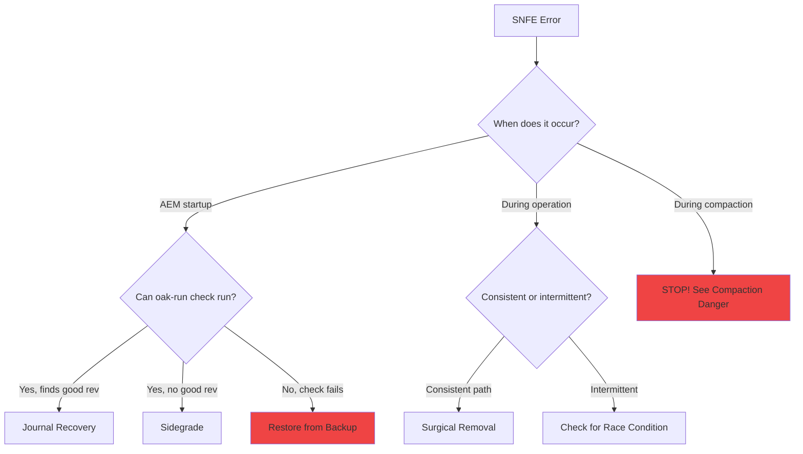

# 🚨 SegmentNotFoundException Playbook

::: info 🎯 Scope
SegmentStore (TarMK) • Oak 1.22.x – 2.4.0 ([version scope](/reference/oak-versions))  
**Not for AEMaaCS**
:::

The `SegmentNotFoundException` (SNFE) is the most common and most feared error in Oak. This playbook helps you diagnose the cause and choose the right recovery path.

## 🔍 Signals

```
org.apache.jackrabbit.oak.segment.SegmentNotFoundException: 
  Segment 0a1b2c3d-4e5f-6789-abcd-ef0123456789 not found

*ERROR* [...] org.apache.jackrabbit.oak.segment.SegmentNotFoundExceptionListener Segment not found: 0a1b2c3d-4e5f-6789-abcd-ef0123456789. SegmentId age=123456ms

TarMK refuses to start: SegmentNotFoundException during initialization

oak-run check fails with: Segment xyz not found
```

## Quick Decision Tree


```mermaid
flowchart TD
    A[SNFE Error] --> B{When does it occur?}
    B -->|AEM startup| C{Can oak-run check run?}
    B -->|During operation| D{Consistent or intermittent?}
    B -->|During compaction| E[STOP! See Compaction Danger]
    
    C -->|Yes, finds good rev| F[Journal Recovery]
    C -->|Yes, no good rev| G[Sidegrade]
    C -->|No, check fails| H[Restore from Backup]
    
    D -->|Consistent path| I[Surgical Removal]
    D -->|Intermittent| J[Check for Race Condition]
    
    style H fill:#ef4444
    style E fill:#ef4444
```

## SNFE Categories

| Category | Cause | Recovery Path |
|----------|-------|---------------|
| **Startup SNFE** | Corrupted HEAD revision | [Journal Recovery](/recovery/journal) or [Sidegrade](/recovery/sidegrade) |
| **Runtime SNFE** | Specific path corrupted | [Surgical Removal](/recovery/surgical) |
| **Compaction SNFE** | GC hit corruption | **STOP compaction immediately** |
| **Intermittent SNFE** | Long-lived sessions + tail GC | [GC Configuration](/architecture/gc#long-lived-sessions-tail-compaction) |
| **Check SNFE** | Repository bricked | Restore from backup |

## Step 1: Stop and Assess

```bash
# STOP AEM if running
./crx-quickstart/bin/stop

# Check if this is a "bricked" scenario
java -jar oak-run-*.jar check /path/to/segmentstore
```

### Interpreting Check Results

**Scenario A: Check runs, finds good revision** ✅
```
Searched through 247 revisions and 3 checkpoints
Latest good revision for paths and checkpoints checked is abc123 from 2025-10-03
```
→ **Recoverable** — Use [Journal Recovery](/recovery/journal) or [Surgical Removal](/recovery/surgical)

**Scenario B: Check runs, no good revision** ⚠️
```
Searched through 247 revisions and 3 checkpoints
No good revision found
```
→ **Partially Recoverable** — Use [Sidegrade](/recovery/sidegrade) to extract what you can

**Scenario C: Check itself fails with SNFE** ❌
```
org.apache.jackrabbit.oak.segment.SegmentNotFoundException: Segment 0a1b2c3d-4e5f-6789-abcd-ef0123456789 not found
    at org.apache.jackrabbit.oak.segment.file.ReadOnlyFileStore.readSegment(ReadOnlyFileStore.java:...)
```
→ **Unrecoverable** — Restore from backup. No Oak tools can help.

## Step 2: Choose Recovery Path

### Path A: Journal Recovery (Fastest)

**When to use**: Check found a good revision, you can accept losing recent changes.

```bash
java -jar oak-run-*.jar recover-journal /path/to/segmentstore
```

**What it does**: Rebuilds `journal.log` from the root records found in the TAR files, dropping the newest revisions whose head or checkpoints are corrupted, so the last good revision becomes HEAD. The old journal is kept as `journal.log.bak.NNN`.

**Data loss**: Changes since the good revision timestamp.

### Path B: Surgical Removal (Preserve More)

**When to use**: Check found a good revision, but you want to keep recent changes and only remove corrupted paths.

::: warning ⚠️ Not in Apache Oak
`:count-nodes`, `:remove-nodes` and `:remove-node` are not part of Apache Jackrabbit Oak (any version). They come from a community fork. See [Fork-only console commands](/reference/oak-versions#fork-only-console-commands) for how to get a build that matches your Oak version.
:::

```bash
# Find corrupted paths
java -jar oak-run-*.jar console --read-write /path/to/segmentstore
> :count-nodes deep analysis
# Review ./count-nodes-snfe-yyyyMMdd-HHmmss.log (written to the current directory)

# Missing-segment paths: remove one by one (no dry-run); a :remove-nodes report prints each command
> :remove-node /content/dam/2024/Q3

# Missing-blob lines: remove-nodes (dry-run first!, exact file name, no wildcard)
> :remove-nodes count-nodes-snfe-20240111-093500.log dry-run
> :remove-nodes count-nodes-snfe-20240111-093500.log
> :exit

# Verify
java -jar oak-run-*.jar check /path/to/segmentstore
```

**Data loss**: Only the corrupted paths.

`:remove-nodes` never deletes `Warning: Missing segment at …` lines — it only counts them as `[WARN]`. See [Surgical Removal](/recovery/surgical).

### Path C: Sidegrade (Last Resort)

**When to use**: No good revision found, but check can still run.

```bash
# positional args = repository dirs that contain segmentstore/
java -jar oak-upgrade-<oak-version>.jar \
    /path/to/corrupted/crx-quickstart/repository /path/to/new/repository
```

**Data loss**: Unknown — the sidegrade aborts on the first unreadable node, so known-corrupt paths must be left out with `--exclude-paths`. See [Sidegrade](/recovery/sidegrade).

### Path D: Restore from Backup

**When to use**: Check itself fails with SNFE, or you have a recent backup.

**This is always the safest option if you have a backup.**

## Common SNFE Scenarios

### Scenario 1: Unclean Shutdown

**Symptoms**:
- SNFE on startup after power loss / kill -9 / OOM
- Recent TAR file may be incomplete

**Diagnosis**:
```bash
# Check TAR file integrity
ls -la /path/to/segmentstore/*.tar
# Look for very small recent TAR files (< 1KB)
```

**Recovery**: Usually [Journal Recovery](/recovery/journal) works.

### Scenario 2: Disk Full During Write

**Symptoms**:
- SNFE after disk 100% event
- Incomplete segment write

**Diagnosis**:
```bash
df -h /path/to/segmentstore
# Was disk full recently?
```

**Recovery**: Free disk space, then [Journal Recovery](/recovery/journal).

### Scenario 3: Long-Lived Sessions + Tail Compaction

**Symptoms**:
- Intermittent SNFE during workflows or scheduled jobs
- SNFE correlates with compaction timestamps
- "Fixes itself" after session refresh

**Diagnosis**:
```bash
# Check if SNFE correlates with compaction
grep "running tail compaction" error.log
grep "SegmentNotFoundException" error.log
# Compare timestamps
```

**Recovery**: This is a **race condition**, not corruption. See [GC documentation](/architecture/gc#long-lived-sessions-tail-compaction).

**Prevention**: Increase `compaction.retainedGenerations` (default `2`, PID `org.apache.jackrabbit.oak.segment.SegmentNodeStoreService`) or fix long-lived sessions in application code.

### Scenario 4: Compaction Over Corruption

**Symptoms**:
- SNFE after compaction ran
- `oak-run check` now fails completely
- Journal.log has only one entry

**Diagnosis**:
```bash
# Check journal.log size
wc -l /path/to/segmentstore/journal.log
# If only 1 line, compaction truncated it
```

**Recovery**: **Restore from backup**. Compaction deleted the segments you need.

**Prevention**: ALWAYS run `oak-run check` before compaction.

### Scenario 5: Invisible Missing Blobs (Indexing Death Loop)

**Symptoms**:
- `datastorecheck` shows 0 missing blobs
- `count-nodes deep` finds no issues
- But indexing keeps failing with `DataStoreException`
- Checkpoints are months old

**Diagnosis**:
```bash
# Check checkpoint age
java -jar oak-run-*.jar checkpoints /path/to/segmentstore list
# Old checkpoints (months) = likely invisible blob problem
```

**Recovery**: [Checkpoint Advancement](/checkpoints/checkpoint-advancement)

## ✅ Do / ❌ Don't

| ✅ DO | ❌ DON'T |
|-------|----------|
| Stop AEM immediately | Keep AEM running hoping it fixes itself |
| Run `oak-run check` first | Run `compact` to "fix" the problem |
| Save all logs before recovery | Delete logs to "clean up" |
| Have a backup before any recovery | Attempt recovery without backup |
| Understand the cause before acting | Panic and run random commands |

## Time Estimates

| Operation | 100GB Repo | 500GB Repo | 1TB Repo |
|-----------|------------|------------|----------|
| `oak-run check` | 15 min | 45 min | 2 hours |
| `recover-journal` | 30 min | 1 hour | 2 hours |
| `count-nodes` | 2 hours | 8 hours | 24 hours |
| `remove-nodes` | 30 min | 1 hour | 2 hours |
| `oak-upgrade` sidegrade | 6 hours | 24 hours | 48+ hours |
| Backup restore | 1-2 hours | 4-6 hours | 12+ hours |

## Key Takeaways

::: tip Remember
1. **SNFE is a symptom, not a diagnosis** — Find the root cause
2. **Check before anything else** — Determines your recovery options
3. **Backup is always safest** — If you have one, use it
4. **Never compact corruption** — It fixes nothing, and a successful run deletes the older revisions you could roll back to
5. **Intermittent SNFE ≠ corruption** — May be GC race condition
6. **"0 missing blobs" can still fail** — See [Checkpoint Advancement](/checkpoints/checkpoint-advancement)
:::

::: info 📅 Last Updated
Content last reviewed: October 2026 • Verified against Oak 1.22.24 (AEM 6.5) and Oak 2.4.0 (AEM 6.5 LTS SP3)
:::
