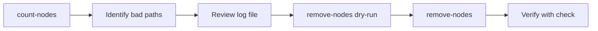

# 🔪 Surgical Removal

Surgical removal lets you **precisely remove corrupted paths** while preserving the rest of the repository. It's more work than journal recovery but can save more data.

## Overview



## Step 1: Find Corrupted Paths

Use the `count-nodes` command in oak-run console:

```bash
$ java -jar oak-run-*.jar console --read-write /path/to/segmentstore

# In the console:
> :count-nodes
```

### What count-nodes Does

- Traverses entire repository tree
- Tests accessibility of every node
- Logs `SegmentNotFoundException` errors to file
- Creates `/tmp/count-nodes-snfe-*.log`

### Example Output

```
Counting nodes...
/content - OK
/content/dam - OK
/content/dam/2024 - OK
/content/dam/2024/Q3 - SegmentNotFoundException!
  Logged to /tmp/count-nodes-snfe-1704963300000.log
/content/dam/2024/Q4 - OK
/apps - OK
...

Completed. Found 3 corrupted paths.
See /tmp/count-nodes-snfe-1704963300000.log
```

### Time Estimate

| Repository Size | Approximate Time |
|-----------------|------------------|
| 10 GB | ~30 minutes |
| 50 GB | ~1 hour |
| 100 GB | ~2 hours |
| 500 GB | ~6-8 hours |

## Step 2: Review the Log

```bash
$ cat /tmp/count-nodes-snfe-*.log

/content/dam/2024/Q3/corrupted-asset.pdf
/content/dam/2024/Q3/another-bad-file.jpg
/var/audit/2024/01/15/corrupted-entry
```

### Critical Path Check

::: danger ⚠️ STOP if you see these paths:
```
/oak:index/uuid
/oak:index/nodetype
/jcr:system
/rep:security
/home/users/system
/libs
```
These are **critical system paths**. Removing them will brick the repository.
If these are corrupted, you must restore from backup or use sidegrade.
:::

## Step 3: Dry Run

**Always** do a dry run first:

```bash
# In oak-run console:
> :remove-nodes /tmp/count-nodes-snfe-*.log dry-run
```

### Dry Run Output

```
DRY RUN - No changes will be made

Would remove:
  /content/dam/2024/Q3/corrupted-asset.pdf
  /content/dam/2024/Q3/another-bad-file.jpg
  /var/audit/2024/01/15/corrupted-entry

Total: 3 nodes would be removed
```

Review this carefully before proceeding.

## Step 4: Execute Removal

```bash
# In oak-run console:
> :remove-nodes /tmp/count-nodes-snfe-*.log

Removing nodes...
  Removed: /content/dam/2024/Q3/corrupted-asset.pdf
  Removed: /content/dam/2024/Q3/another-bad-file.jpg
  Removed: /var/audit/2024/01/15/corrupted-entry

Completed. Removed 3 nodes.

> :exit
```

## Step 5: Verify

```bash
$ java -jar oak-run-*.jar check /path/to/segmentstore
```

If check passes clean, start AEM.

## Single Node Removal

For removing a single known path:

```bash
# In oak-run console:
> :remove-node /content/dam/2024/Q3/corrupted-asset.pdf
```

## Best Practices

::: tip Surgical Removal Tips
1. **Always dry-run first** - No undo for remove-nodes
2. **Save the log file** - Document what was removed
3. **Check critical paths** - Never remove system nodes
4. **Verify after** - Run check to confirm success
5. **Backup first** - If possible, backup before removal
:::

## When Surgical Removal Won't Work

- **Critical paths corrupted** - Must restore or sidegrade
- **Too many paths** - Sidegrade might be faster
- **Root segments corrupted** - Journal recovery or sidegrade
- **Index corruption** - May need index rebuild after

## Key Takeaways

::: tip Remember
1. **count-nodes finds problems** - Logs corrupted paths
2. **remove-nodes fixes them** - Surgically removes bad nodes
3. **Always dry-run** - Review before executing
4. **Check critical paths** - Some paths cannot be removed
5. **Verify with check** - Confirm repository is healthy
:::
