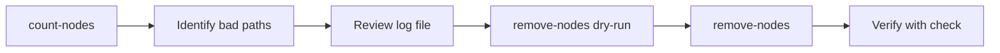

# 🔪 Surgical Removal

::: info 🎯 Scope
SegmentStore (TarMK) • Oak 1.22+  
**Not for AEMaaCS**
:::

Surgical removal lets you **precisely remove corrupted paths** while preserving the rest of the repository. It's more work than journal recovery but can save more data.

## 🔍 Signals That Lead Here

```
oak-run check found good revision but you want to preserve recent changes
SegmentNotFoundException for specific paths (not system-wide)
count-nodes identified isolated corrupted paths in /content or /var
Want to remove corrupted content rather than rolling back
```

## ✅ Do / ❌ Don't

| ✅ DO | ❌ DON'T |
|-------|----------|
| Run `oak-run check` first | Skip straight to removal |
| Review log file before removal | Remove without dry-run |
| Use `dry-run` flag first | Remove `/oak:index/uuid` or `/jcr:system` |
| Verify with `check` after removal | Assume removal fixed everything |

## Overview



## Step 1: Find Corrupted Paths

Use the `count-nodes` command in oak-run console:

```bash
$ java -jar oak-run-*.jar console --read-write /path/to/segmentstore

# In the console:
> :count-nodes deep analysis
```

### What count-nodes Does

- Traverses entire repository tree
- Tests accessibility of every node
- Logs `SegmentNotFoundException` errors to file
- Creates `/tmp/count-nodes-snfe-*.log`

### Example Output

```
Counting nodes...
/content - OK
/content/dam - OK
/content/dam/2024 - OK
/content/dam/2024/Q3 - SegmentNotFoundException!
  Logged to /tmp/count-nodes-snfe-1704963300000.log
/content/dam/2024/Q4 - OK
/apps - OK
...

Completed. Found 3 corrupted paths.
See /tmp/count-nodes-snfe-1704963300000.log
```

### Time Estimate

| Repository Size | Approximate Time |
|-----------------|------------------|
| 10 GB | ~30 minutes |
| 50 GB | ~1 hour |
| 100 GB | ~2 hours |
| 500 GB | ~6-8 hours |
| 1 TB | ~12-24 hours |
| 2 TB | ~24-48 hours (multi-day) |
| 3 TB+ | ~48-96 hours (week-scale) |

::: warning ⚠️ Time Estimates Scale With Repository Size
These times are **I/O bound** - `count-nodes` must traverse every node in the repository tree. There is no way to parallelize or speed up these operations.

**Production reality**: On-premise AEM installations commonly accumulate **500GB-2TB** segment stores. Running `count-nodes` on a 2TB repository is a **multi-day operation**.
:::

## Step 2: Review the Log

```bash
$ cat /tmp/count-nodes-snfe-*.log

/content/dam/2024/Q3/corrupted-asset.pdf
/content/dam/2024/Q3/another-bad-file.jpg
/var/audit/2024/01/15/corrupted-entry
```

## 🚨 CRITICAL: Surgical Removal Limitations

**`count-nodes` + `remove-nodes` is NOT a guarantee and NOT always viable!**

### When Surgical Removal Works ✅

Corrupted paths that are **non-critical and isolatable**:

| Path | Safe to Remove? | Notes |
|------|-----------------|-------|
| `/content/dam/corrupted-asset` | ✅ Yes | Individual DAM assets |
| `/content/site/corrupted-page` | ✅ Yes | Specific pages or subtrees |
| `/var/audit/corrupted-logs` | ✅ Yes | Audit logs, workflow instances |
| `/apps/myproject` | ✅ Yes | Custom code, redeploy via CI/CD |
| `/jcr:system/jcr:versionStorage/abc123` | ✅ Yes | Version history for one node only |
| `/home/users/a/ab/abc/user@example.com` | ✅ Yes | Regular user profile (non-system) |
| `/home/groups/g/gr/group/content-authors` | ✅ Yes | Regular group (non-system) |

### Lucene Index Nodes (CRITICAL DISTINCTION)

::: danger ⚠️ CRITICAL DISTINCTION - Lucene Index Nodes
- `/oak:index/damAssetLucene` **(index definition)** - **DO NOT DELETE** - Contains index configuration
- `/oak:index/damAssetLucene/:data` **(hidden index data)** - **Safe to delete** - Can be rebuilt
- `/oak:index/damAssetLucene/:suggest-data` **(hidden suggestion data)** - **Safe to delete** - Can be rebuilt
:::

| Path | Safe to Remove? | Notes |
|------|-----------------|-------|
| `/oak:index/damAssetLucene/:data` | ✅ Yes | Hidden index data, can be rebuilt |
| `/oak:index/cqPageLucene/:suggest-data` | ✅ Yes | Hidden suggestion data, can be rebuilt |
| `/oak:index/damAssetLucene` | ⚠️ **RISKY** | Index definition - deleting loses configuration |

### 🔥 CRITICAL WARNING - Full-Text Indexes (damAssetLucene, lucene)

::: danger Full-Text Index Re-indexing = WEEKS TO MONTHS of IO HELL
These indexes use **Apache Tika for binary text extraction** (PDFs, Word docs, videos, etc.)

**YES, you CAN remove `:data` nodes** - but at **MASSIVE IO COST**:
- Re-indexing from scratch = **WEEKS TO MONTHS** on large DAM repositories
- **Orders of magnitude slower** than simple property indexes (100x-1000x)
- **Example**: 500GB DAM with 100K PDFs = **2-4 weeks** of continuous re-indexing

**MANDATORY**: Use [pre-text extraction](/recovery/pre-text-extraction) to salvage existing indexed data from corrupted index. **DO NOT** just delete and re-index naively - you'll regret it for weeks.
:::

### When Surgical Removal FAILS ❌

Corrupted paths that are **critical to AEM/Oak operation**:

#### Property Indexes (Synchronous - AEM Won't Start if Corrupted)

Property indexes are **synchronous** - they update immediately on every write. Oak/AEM **validates these indexes on startup** and will **refuse to start** if they're corrupted or missing.

| Path | Why Critical | Impact |
|------|--------------|--------|
| `/oak:index/uuid` | Maps JCR UUIDs to node paths | AEM cannot start - UUID lookups fail |
| `/oak:index/nodetype` | Indexes `jcr:primaryType` and `jcr:mixinTypes` | AEM cannot start - node type validation fails |
| `/oak:index/counter` | Tracks global counters | May prevent AEM startup |

**Why Property Indexes are Critical:**
```
Property Index Characteristics:
1. Synchronous updates - every write immediately updates index
2. Validated on startup - Oak checks integrity before allowing access
3. Used by core Oak APIs - UUID lookups, node type queries
4. Cannot be disabled - required for JCR specification compliance

Startup Sequence:
1. Oak opens FileStore
2. Oak validates property indexes (uuid, nodetype, counter)
3. If validation fails → Oak refuses to start
4. If segments missing → validation fails → AEM won't start
```

**Contrast with Lucene Indexes (Asynchronous):**
- Lucene indexes (`/oak:index/damAssetLucene`, `/oak:index/cqPageLucene`) are **asynchronous**
- Updated in background by async indexing threads
- Corruption doesn't prevent AEM startup (indexing lane just fails)
- Can be deleted and rebuilt via re-indexing
- **NOT validated on startup** - AEM starts even if Lucene indexes corrupted

#### Other Critical Paths

| Path | Why Critical | Impact |
|------|--------------|--------|
| `/jcr:system/jcr:nodeTypes` | Node type definitions | Repository unusable |
| `/jcr:system/jcr:namespaces` | Namespace registry | Repository unusable |
| `/rep:security` | ACLs, users, groups, permissions | AEM cannot start |
| `/home/users/system/*/admin` | Admin user account | AEM unusable |
| `/home/users/system/*/authentication-service` | Authentication service user | Bundles fail to initialize |
| `/home/users/system/*/replication-service` | Replication service user | Replication fails |
| `/home/groups/*/administrators` | Administrators group | Admin access broken |

#### `/libs` Corruption - Special Case

If `/libs` paths are corrupted but AEM can still start:

**Option 1: Sidegrade from Vanilla Instance** (Recommended)
1. Instantiate clean vanilla AEM instance (no customizations)
2. Patch to **exact same service pack level** as affected instance
3. Use `oak-upgrade` to sidegrade **only** corrupted `/libs` paths:
   ```bash
   java -jar oak-upgrade-*.jar \
     --include-paths=/libs/granite/core,/libs/cq/core \
     --src=segment-tar:/path/to/vanilla/segmentstore \
     --dst=segment-tar:/path/to/affected/segmentstore
   ```
4. Restart affected AEM instance to verify

**Option 2: Content Package from Parallel Instance**
- Create content package of `/libs` (only corrupted paths)
- Install via Package Manager
- Requires AEM to start and Package Manager to be accessible

## Decision Matrix: Can I Use Surgical Removal?

| Corrupted Path | Surgical Removal Viable? | Why? |
|----------------|-------------------------|------|
| `/content/dam/asset123` | ✅ Yes | Isolated asset, non-critical |
| `/content/site/page456` | ✅ Yes | Isolated page, non-critical |
| `/home/users/a/ab/abc/user@example.com` | ✅ Yes | Regular user, recreatable |
| `/home/groups/g/gr/group/content-authors` | ✅ Yes | Regular group, recreatable |
| `/home/users/system/*/admin` | ❌ **NO** | **CRITICAL**: Admin user |
| `/home/users/system/*/authentication-service` | ❌ **NO** | **CRITICAL**: Service user |
| `/home/groups/*/administrators` | ❌ **NO** | **CRITICAL**: Administrators group |
| `/jcr:system/jcr:versionStorage/abc123` | ✅ Yes | Version history for one node |
| `/oak:index/damAssetLucene/:data` | ✅ Yes | Index data (hidden), **but MASSIVE IO cost to rebuild** |
| `/oak:index/damAssetLucene` | ⚠️ **RISKY** | Index definition - must recreate manually |
| `/oak:index/uuid` | ❌ **NO** | **CRITICAL**: Property index (sync), AEM won't start |
| `/oak:index/nodetype` | ❌ **NO** | **CRITICAL**: Property index (sync), AEM won't start |
| `/oak:index/counter` | ❌ **NO** | **CRITICAL**: Property index (sync), may prevent startup |
| `/jcr:system/jcr:nodeTypes` | ❌ **NO** | **CRITICAL**: Content model definitions |
| `/jcr:system/jcr:namespaces` | ❌ **NO** | **CRITICAL**: Namespace registry |
| `/rep:security` | ❌ **NO** | **CRITICAL**: Security/auth breaks |
| `/libs/*` | ⚠️ Maybe | May prevent startup, sidegrade from vanilla |
| `/apps/myproject` | ✅ Yes | Custom code, redeploy via CI/CD |

**Rule of Thumb**: If `count-nodes analysis` shows corruption in:
- `/oak:index` (especially `uuid`, `nodetype`, `counter`)
- `/jcr:system/jcr:nodeTypes` or `/jcr:system/jcr:namespaces`
- `/rep:security`
- `/home/users/system/*` or `/home/groups/*/administrators`

**Skip surgical removal and go directly to restore/sidegrade**.

## Step 3: Dry Run

**Always** do a dry run first:

```bash
# In oak-run console:
> :remove-nodes /tmp/count-nodes-snfe-*.log dry-run
```

### Dry Run Output

```
DRY RUN - No changes will be made

Would remove:
  /content/dam/2024/Q3/corrupted-asset.pdf
  /content/dam/2024/Q3/another-bad-file.jpg
  /var/audit/2024/01/15/corrupted-entry

Total: 3 nodes would be removed
```

Review this carefully before proceeding.

## Step 4: Execute Removal

```bash
# In oak-run console:
> :remove-nodes /tmp/count-nodes-snfe-*.log

Removing nodes...
  Removed: /content/dam/2024/Q3/corrupted-asset.pdf
  Removed: /content/dam/2024/Q3/another-bad-file.jpg
  Removed: /var/audit/2024/01/15/corrupted-entry

Completed. Removed 3 nodes.

> :exit
```

## Step 5: Verify

```bash
$ java -jar oak-run-*.jar check /path/to/segmentstore
```

If check passes clean, start AEM.

## Single Node Removal

For removing a single known path:

```bash
# In oak-run console:
> :remove-node /content/dam/2024/Q3/corrupted-asset.pdf
```

## Best Practices

::: tip Surgical Removal Tips
1. **Always dry-run first** - No undo for remove-nodes
2. **Save the log file** - Document what was removed
3. **Check critical paths** - Never remove system nodes
4. **Verify after** - Run check to confirm success
5. **Backup first** - If possible, backup before removal
6. **Understand index types** - Property indexes (sync) vs Lucene indexes (async)
:::

## When Surgical Removal Won't Work

- **Critical paths corrupted** - Must restore or sidegrade
- **Property indexes corrupted** - AEM won't start even after removal
- **Too many paths** - Sidegrade might be faster
- **Root segments corrupted** - Journal recovery or sidegrade
- **Full-text index corruption** - Removal works but re-indexing takes weeks

## Key Takeaways

::: tip Remember
1. **count-nodes finds problems** - Logs corrupted paths
2. **remove-nodes fixes them** - Surgically removes bad nodes
3. **Always dry-run** - Review before executing
4. **Check critical paths** - Some paths cannot be removed
5. **Property indexes are CRITICAL** - uuid, nodetype, counter cannot be removed
6. **Lucene indexes are EXPENSIVE** - Full-text re-indexing takes weeks
7. **Verify with check** - Confirm repository is healthy
:::
